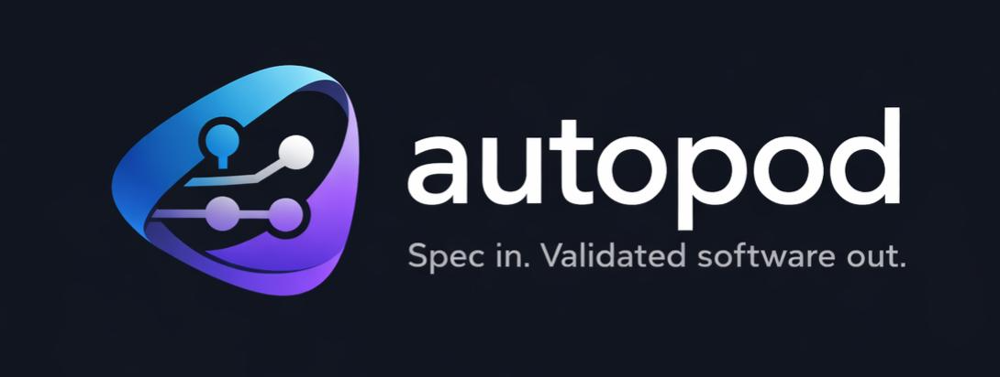

<p align="center">
  
</p>

<p align="center">
  
  
  
  
  
</p>

<p align="center">
  <b>Autonomous AI agent orchestration. Containerized. Validated. Human-approved.</b>
</p>

<p align="center">
  <a href="#getting-started">Getting Started</a> · <a href="#how-it-works">How It Works</a> · <a href="#cli-reference">CLI Reference</a> · <a href="#profile-deep-dive">Profile Config</a> · <a href="#deployment-azure">Deploy</a>
</p>

---

You describe a task. autopod spins up an isolated container, lets an AI agent work, validates the output in a real browser, and only bothers you when there's something worth reviewing. Run dozens of agents in parallel — across repos, models, and runtimes — without babysitting a single one.

```
$ ap run my-app "Add a dark mode toggle to the settings page" --model opus

  Session a1b2c3d4 created (profile: my-app, model: opus)
  Provisioning container...
  Agent running...

  # Go grab coffee. Come back to a Teams notification with screenshots.
```

---

## Why autopod?

AI coding agents are powerful, but running them is still a pain. You set up the environment, watch the agent work, manually check the output, restart when it goes sideways, and pray it didn't break something unrelated.

autopod flips the model: **agents are untrusted by default.** They run in locked-down containers with network isolation and firewall rules. When they say they're done, autopod doesn't take their word for it — it builds the project, runs your test suite, starts it up, opens a real browser, takes screenshots, and asks a separate AI reviewer: *"Does this actually look right?"*

If it doesn't pass, the agent gets structured feedback and tries again. If it does, you get a notification with screenshots and a diff. One command to approve, and it's merged.

**The human stays in the loop. The human just doesn't have to do the boring part.**

---

## How It Works

```
                    ┌───────────┐
                    │  ap run   │  You describe the task
                    └─────┬─────┘
                          │
                    ┌─────▼─────┐
                    │  Daemon   │  Orchestrates everything
                    └─────┬─────┘
                          │
              ┌───────────┼───────────┐
              │           │           │
        ┌─────▼─────┐ ┌──▼──┐ ┌─────▼─────┐
        │ Container  │ │ ... │ │ Container  │  Isolated pods per task
        │ (Agent)    │ │     │ │ (Agent)    │
        └─────┬─────┘ └──┬──┘ └─────┬─────┘
              │           │           │
        ┌─────▼─────┐    │     ┌─────▼─────┐
        │ Validate  │    │     │ Validate  │  Build → Test → Smoke → ACs → Review
        └─────┬─────┘    │     └─────┬─────┘
              │           │           │
        ┌─────▼─────┐    │     ┌─────▼─────┐
        │ AI Review │    │     │ AI Review │  "Does this match the task?"
        └─────┬─────┘    │     └─────┬─────┘
              │           │           │
              └───────────┼───────────┘
                          │
                    ┌─────▼─────┐
                    │  Notify   │  Screenshots + diff → Teams / CLI
                    └─────┬─────┘
                          │
                    ┌─────▼─────┐
                    │ ap approve│  One command to merge
                    └───────────┘
```

### Session Lifecycle

Every task follows a state machine:

```
queued → provisioning → running → validating → validated → approved → merging → complete
                           │            │
                           │            └─→ failed (retry with feedback, up to N attempts)
                           │
                           ├─→ paused (operator paused via ap pause / p key)
                           │      │
                           │      └─→ running (resumed via ap tell / nudge)
                           │
                           └─→ awaiting_input (agent escalated — needs help)
```

### Validation Pipeline

Validation is a multi-phase pipeline with two loops — each phase must pass before the next runs:

**Inner loop (agent self-validates):** While developing, the agent can use the `validate_in_browser` MCP tool to open a real browser in its container and verify work against acceptance criteria. This catches issues early, before the independent review.

**Outer loop (independent reviewer):**

| Phase | What happens | Configurable via |
|-------|-------------|------------------|
| **1. Build** | Runs your build command inside the container | `profile.build` |
| **2. Test** | Runs your test suite (skipped if not configured) | `profile.testCommand` |
| **3. Health check** | Starts the app and waits for HTTP 200 | `profile.start`, `profile.health` |
| **4. Smoke pages** | Playwright visits configured pages, checks assertions | `profile.smokePages` |
| **5. AC validation** | Reviewer generates browser checks from acceptance criteria, executed via Playwright | `session.acceptanceCriteria` |
| **6. AI task review** | A separate model reviews the diff against the original task | `profile.escalation.askAi.model` |

If any phase fails, the agent gets structured feedback (console errors, build output, screenshot diffs, AC failures, reviewer notes) and retries automatically.

Every validation attempt is stored with full results and screenshots. View the **validation report** (`GET /sessions/:id/report`) for a visual timeline of all attempts, or browse it from the TUI with `[w]`.

After validation, the container is **stopped** (not removed). Launch an on-demand **preview** to interact with the agent's work in a real browser before approving.

---

## Features

<table>
<tr><td>🔀</td><td><b>Multi-agent parallelism</b></td><td>Run 10, 20, 50 sessions across repos simultaneously</td></tr>
<tr><td>✅</td><td><b>Multi-phase validation</b></td><td>Build → Test → Health → Smoke pages → AC validation → AI review</td></tr>
<tr><td>🤖</td><td><b>Multi-runtime</b></td><td>Claude, Codex, or GitHub Copilot — swap with a flag</td></tr>
<tr><td>🔑</td><td><b>Multi-provider auth</b></td><td>Anthropic API, Claude MAX/PRO (OAuth), Azure Foundry, or Copilot tokens</td></tr>
<tr><td>🆘</td><td><b>Escalation via MCP</b></td><td>Agents can pause and ask for help (human or AI)</td></tr>
<tr><td>⏸️</td><td><b>Pause & nudge</b></td><td>Pause a running agent, send mid-flight instructions, resume without losing state</td></tr>
<tr><td>📋</td><td><b>Agent plan & progress</b></td><td>Agents report their implementation plan and phase progress in real time</td></tr>
<tr><td>🛡️</td><td><b>Action control plane</b></td><td>Read GitHub issues, ADO work items, and app logs — with PII stripping and prompt-injection quarantine</td></tr>
<tr><td>📦</td><td><b>Profile system</b></td><td>Pre-configured templates per repo with inheritance</td></tr>
<tr><td>🐳</td><td><b>Image warming</b></td><td>Pre-bake dependencies into Docker images for fast spin-up</td></tr>
<tr><td>📊</td><td><b>Real-time TUI</b></td><td><code>ap watch</code> — progress bars, plan panel, metrics, keyboard-driven control</td></tr>
<tr><td>💬</td><td><b>Teams notifications</b></td><td>Rich Adaptive Cards with inline screenshots</td></tr>
<tr><td>🔄</td><td><b>Correction loops</b></td><td>Reject with feedback, agent retries from where it left off</td></tr>
<tr><td>🌐</td><td><b>On-demand previews</b></td><td><code>ap open &lt;id&gt;</code> spins up a live preview of any session's work</td></tr>
<tr><td>🔌</td><td><b>Session injection</b></td><td>Plug in external MCP servers and CLAUDE.md content at daemon or profile level</td></tr>
<tr><td>🏗️</td><td><b>Git-native PRs</b></td><td>GitHub and Azure DevOps — every session gets its own branch</td></tr>
<tr><td>🧪</td><td><b>Workspace pods</b></td><td>Interactive containers for manual prep, then hand off to automated agents</td></tr>
<tr><td>🔐</td><td><b>Private registries</b></td><td>npm and NuGet feeds from Azure DevOps — credentials injected automatically</td></tr>
<tr><td>⚡</td><td><b>Skills injection</b></td><td>Custom slash commands from local files or GitHub repos, injected into agent containers</td></tr>
</table>

---

## Getting Started

### Prerequisites

- **Node.js 22+**
- **pnpm** (or use `npx pnpm` everywhere)
- **Docker** (for running agent containers locally)
- **Azure Entra ID app registration** (for auth — see [Auth Setup](#auth-setup))

### 1. Clone and install

```bash
git clone https://github.com/esbenwiberg/autopod.git
cd autopod
npx pnpm install
```

### 2. Build all packages

```bash
npx pnpm run build
```

### 3. Configure environment

```bash
cp .env.example .env
```

Edit `.env` with your values:

```bash
# Required — from your Entra ID app registration
ENTRA_CLIENT_ID=<application-client-id>
ENTRA_TENANT_ID=<directory-tenant-id>

# For AI agents (in dev, set directly; in prod, use Key Vault)
ANTHROPIC_API_KEY=sk-ant-...

# For private repos
GITHUB_PAT=ghp_...

# Optional: Teams notifications
TEAMS_WEBHOOK_URL=https://prod-xx.westeurope.logic.azure.com/workflows/...
```

### 4. Start the daemon

**Option A: Docker Compose (recommended)**

```bash
docker compose up -d
```

Starts the daemon at `http://localhost:3100` with hot-reload on source changes.

**Option B: Run directly**

```bash
npx pnpm --filter @autopod/daemon run dev
```

### 5. Connect the CLI

```bash
# Point CLI at your daemon
ap connect http://localhost:3100

# Authenticate
ap login
```

### 6. Create your first profile

A profile tells autopod how to build, run, and validate a specific repo.

```bash
ap profile create my-app \
  --repo owner/my-app \
  --template node22-pw \
  --build "npm ci && npm run build" \
  --start "npm run preview -- --host 0.0.0.0 --port \$PORT" \
  --health "/" \
  --test "npm test" \
  --model opus
```

Available templates:

| Template | Stack | Includes |
|----------|-------|----------|
| `node22` | Node.js 22 | npm/pnpm/yarn |
| `node22-pw` | Node.js 22 + Playwright | Chromium for browser validation |
| `dotnet9` | .NET 9 SDK | dotnet CLI |
| `dotnet10` | .NET 10 + Node.js 22 | Mixed stacks (dotnet + npm/pnpm/yarn) |
| `python312` | Python 3.12 | pip/poetry |
| `custom` | Bring your own | Custom Dockerfile |

### 7. Run your first session

```bash
ap run my-app "Add a contact form to the about page with name, email, and message fields"
```

That's it. The agent will work, autopod will validate, and you'll be notified when it's ready.

### 8. Review and approve

```bash
# Check status
ap ls

# See what the agent did
ap diff a1b2c3d4

# Look at the screenshots
ap screenshots a1b2c3d4

# Happy? Ship it.
ap approve a1b2c3d4

# Not happy? Tell the agent what's wrong.
ap reject a1b2c3d4 "The form needs client-side validation"
```

---

## CLI Reference

### Authentication

```bash
ap login                     # Interactive login (Entra ID)
ap login --device            # Device code flow (headless/SSH)
ap logout                    # Clear credentials
ap whoami                    # Current user + daemon status
```

### Daemon

```bash
ap connect <url>             # Connect CLI to a daemon
ap disconnect                # Disconnect
ap daemon start --local      # Run daemon locally
ap daemon stop               # Stop local daemon
```

### Profiles

```bash
ap profile create <name>     # Create a new profile
ap profile ls                # List all profiles
ap profile show <name>       # Show profile details
ap profile edit <name>       # Open in $EDITOR
ap profile delete <name>     # Delete a profile
ap profile warm <name>       # Pre-bake deps into Docker image (faster spin-up)
ap profile auth-copilot <n>  # Interactive Copilot OAuth setup
```

### Sessions

```bash
# Create
ap run <profile> "<task>"                   # Start a session
ap run <profile> "<task>" --model opus      # Override model
ap run <profile> "<task>" --runtime codex   # Use Codex runtime
ap run <profile> "<task>" --runtime copilot # Use Copilot runtime
ap run <profile> "<task>" --branch feat/x   # Custom branch name
ap run <profile> "<task>" --no-validate     # Skip auto-validation
ap run <profile> "<task>" --ac "criterion"  # Add acceptance criteria (repeatable)
ap run <profile> "<task>" --base-branch feat/plan  # Branch from a specific base (e.g. workspace output)
ap run <profile> "<task>" --ac-from specs/ac.md    # Load acceptance criteria from a file in the repo

# Monitor
ap ls                                       # List sessions
ap ls --status running                      # Filter by status
ap ls --json                                # JSON output (for scripting)
ap status <id>                              # Full session details
ap logs <id>                                # Stream agent activity
ap logs <id> --build                        # Build/validation logs

# Interact
ap tell <id> "<message>"                    # Send message (also resumes paused sessions)
ap tell <id> --file instructions.md         # Message from file
ap tell <id> --stdin                        # Pipe from stdin
ap pause <id>                               # Pause a running session
ap nudge <id> "<message>"                   # Send nudge (agent picks up async)

# Validate & Preview
ap validate <id>                            # Trigger validation manually
ap open <id>                                # Spin up live preview (restarts stopped container)
ap report <id>                              # Open validation report in browser
ap screenshots <id>                         # Show screenshot URLs
ap diff <id>                                # Show git diff
ap diff <id> --stat                         # Diff summary only

# Complete
ap approve <id>                             # Create PR and merge
ap approve <id> --squash                    # Squash merge
ap reject <id> "<feedback>"                 # Reject — agent retries with your feedback
ap kill <id>                                # Kill session, discard work

# Bulk operations
ap approve --all-validated                  # Approve everything that passed
ap kill --all-failed                        # Clean up all failures
```

### Workspace Pods

```bash
ap workspace <profile> [description]        # Spin up an interactive container (no agent)
ap workspace <profile> -b feat/plan-auth    # With explicit branch name
ap attach <id>                              # Shell into a workspace pod (auto-pushes on exit)
```

### Dashboard

```bash
ap watch                     # Launch TUI dashboard
```

Real-time session overview via WebSocket. Progress bars with phase-aware coloring, plan panel showing the agent's declared implementation steps, and a metrics bar tracking tool calls, file edits, lines changed, and elapsed time.

| Key | Action |
|-----|--------|
| `↑` `↓` | Navigate sessions |
| `t` | Tell / resume (send message to agent) |
| `p` | Pause running session |
| `u` | Nudge (send async message) |
| `a` | Approve session |
| `r` | Reject with feedback |
| `d` | View diff |
| `l` | View logs |
| `w` | Open validation report in browser |
| `o` | Launch preview / open preview URL / open PR (context-aware) |
| `<` `>` | Navigate validation attempts |
| `x` | Kill session |
| `v` | Trigger validation |
| `n` | Create new session |
| `/` | Filter sessions |
| `q` | Quit |

---

## Profile Deep Dive

Profiles define how autopod handles a specific repository. They support **inheritance** — define a `frontend-base` profile and extend it per-app.

### Full options

```bash
ap profile create my-app \
  --repo owner/my-app \
  --branch main \
  --template node22-pw \
  --build "npm ci && npm run build" \
  --start "npm run preview -- --host 0.0.0.0 --port \$PORT" \
  --test "npm test" \
  --health "/" \
  --health-timeout 30000 \
  --model opus \
  --runtime claude \
  --pr-provider github \
  --max-validation-attempts 3 \
  --instructions "Use TypeScript. Prefer Tailwind CSS. Keep it accessible." \
  --extends frontend-base
```

### PR providers

autopod supports creating pull requests on both GitHub and Azure DevOps:

```yaml
# GitHub (default)
prProvider: github

# Azure DevOps
prProvider: ado
adoPat: <your-ado-personal-access-token>  # encrypted at rest
```

ADO supports both URL formats:
- `https://dev.azure.com/{org}/{project}/_git/{repo}`
- `https://{org}.visualstudio.com/{project}/_git/{repo}`

### Smoke pages

Configure baseline pages to check on every validation run (infrastructure-level sanity):

```yaml
smokePages:
  - path: "/"
    assertions:
      - selector: ".dark-mode-toggle"
        type: exists
      - selector: "h1"
        type: text_contains
        value: "Welcome"
  - path: "/about"
    assertions:
      - selector: ".contact-form"
        type: visible
```

Assertion types: `exists`, `visible`, `text_contains`, `count`.

### Acceptance criteria

For task-specific validation, pass acceptance criteria when creating a session:

```bash
ap run my-app "Add dark mode" \
  --ac "Settings page has a dark mode toggle" \
  --ac "Toggle persists after page refresh" \
  --ac "Dark mode applies to all pages"
```

The validation engine independently verifies each criterion in a browser using a separate reviewer model. The agent also has access to a `validate_in_browser` MCP tool for self-checking during development.

### Test command

Add automated test execution to the validation pipeline:

```yaml
testCommand: "npm test"
```

Tests run after the build phase and before the health check. If tests fail, the agent gets the stdout/stderr output as feedback and retries.

### Private Registries

If your project pulls packages from private Azure DevOps feeds, autopod can inject the right auth config into containers automatically.

```yaml
privateRegistries:
  # npm feed (scoped or unscoped)
  - type: npm
    url: "https://pkgs.dev.azure.com/{org}/_packaging/{feed}/npm/registry/"
    scope: "@myorg"          # optional — for scoped packages

  # NuGet feed
  - type: nuget
    url: "https://pkgs.dev.azure.com/{org}/_packaging/{feed}/nuget/v3/index.json"

# PAT for authenticating (encrypted at rest)
registryPat: "<your-ado-pat>"
```

At session startup, autopod generates `.npmrc` and/or `NuGet.config` files in the container workspace with embedded auth tokens. Child profiles inherit and merge registries from parent profiles (deduped by URL).

### Network Policy

Control egress traffic from agent containers with iptables firewall rules. Disabled by default.

```yaml
networkPolicy:
  enabled: true

  # Mode controls the firewall behaviour:
  #   restricted  — (default) only allowedHosts are reachable
  #   deny-all    — block everything except loopback and DNS
  #   allow-all   — no outbound restrictions (useful for debug)
  mode: restricted

  # Hosts to allow. Wildcards strip the prefix and resolve the parent domain —
  # best-effort: works when all subdomains share the same IP block.
  allowedHosts:
    - "api.stripe.com"
    - "*.my-company.com"      # resolves my-company.com

  # Replace the built-in defaults (Anthropic, npm, GitHub, etc.) entirely.
  # Use this when you need a strict allowlist with no implicit hosts.
  replaceDefaults: false
```

**Built-in default hosts** (always allowed unless `replaceDefaults: true`):

`api.anthropic.com`, `api.openai.com`, `registry.npmjs.org`, `pypi.org`, `github.com`, `*.githubusercontent.com`, `pkgs.dev.azure.com`, `platform.claude.com`, GitHub Copilot endpoints.

**Live updates** — patching a profile's `networkPolicy` via the API immediately re-applies firewall rules to all running containers using that profile. No restart needed.

**MCP server hosts** are always allowed regardless of mode — the daemon injects them automatically.

### Escalation settings

Control how and when agents can ask for help:

```yaml
escalation:
  askHuman: true                  # Allow agent to pause and ask human
  askAi:
    enabled: true                 # Allow agent to ask cheaper model
    model: sonnet                 # Also used as the AI reviewer model in validation
    maxCalls: 5                   # Max AI-to-AI escalations per session
  autoPauseAfter: 3              # Auto-escalate after N consecutive failures
  humanResponseTimeout: 3600000  # 1 hour before auto-killing stalled session
```

> **Note:** `escalation.askAi.model` does double duty — it's both the model agents consult during work *and* the model that reviews their output in the AI task review validation phase.

### Multi-Provider Model Auth

Profiles can authenticate with different AI providers:

| Provider | Auth method | Use case |
|----------|-------------|----------|
| `anthropic` | API key (`ANTHROPIC_API_KEY`) | Default — direct Anthropic API |
| `max` | OAuth (access + refresh tokens) | Claude MAX/PRO consumer subscriptions |
| `foundry` | Managed identity + project config | Azure-hosted Foundry deployments |
| `copilot` | GitHub token (OAuth / fine-grained PAT) | GitHub Copilot runtime |

```yaml
# Set on profile
modelProvider: max          # anthropic | max | foundry | copilot

# Foundry-specific
foundryConfig:
  baseUrl: "https://your-foundry.azure.com"
  project: "my-project"
```

For **MAX/PRO**, the daemon handles OAuth token lifecycle automatically — pre-flight refresh before session start, post-session persistence of rotated tokens.

For **Copilot**, use `ap profile auth-copilot <name>` for interactive OAuth setup. Supported token types: OAuth (`gho_`), fine-grained PAT (`github_pat_`), and GitHub App (`ghu_`). Classic PATs (`ghp_`) are not supported.

### Session Injection (MCP Servers & CLAUDE.md)

Profiles can inject additional MCP servers and CLAUDE.md content sections into agent sessions. This is how you plug in external tools (like [Prism](https://github.com/esbenwiberg/prism) for codebase context) without modifying autopod itself.

Injections work at two tiers with merge semantics:

```
Daemon config (defaults for all sessions)
    ↓ merge
Profile config (repo-specific overrides/additions)
    ↓ result
Session receives the merged set
```

Profile entries override daemon entries with the same key (`name` for MCP servers, `heading` for sections).

#### MCP servers

```yaml
mcpServers:
  - name: prism
    url: "https://prism.internal/mcp"
    headers:
      Authorization: "Bearer ${PRISM_API_KEY}"
    description: "Codebase context powered by Prism."
    toolHints:
      - "Call get_file_context before modifying any file"
      - "Call get_related_files to find blast radius of your changes"
```

#### CLAUDE.md sections

```yaml
claudeMdSections:
  # Static section
  - heading: "Coding Standards"
    priority: 20
    content: "Always use TypeScript strict mode. Never use `any`."

  # Dynamic section — fetched from an API when the session starts
  - heading: "Codebase Architecture"
    priority: 10
    maxTokens: 4000
    fetch:
      url: "https://prism.internal/api/projects/org/my-app/context/arch"
      authorization: "Bearer prism_abc123"
      body: { "maxTokens": 4000 }
      timeoutMs: 10000
```

- **Priority** controls document order (lower = higher in CLAUDE.md, default: 50)
- **Dynamic sections** are fetched via POST at provisioning time; if the fetch fails, the section falls back to static `content` or is silently skipped
- **maxTokens** limits dynamic content length (~4 chars/token heuristic)

#### Daemon-level defaults

Set MCP servers and sections that apply to all sessions via environment variables:

```bash
DAEMON_MCP_SERVERS='[{"name":"prism","url":"https://prism.internal/mcp"}]'
DAEMON_CLAUDE_MD_SECTIONS='[{"heading":"Company Rules","content":"...","priority":5}]'
```

### Skills Injection

Inject custom slash commands into agent containers from local files or GitHub repos. Skills are markdown files that become available as `/commands` inside the agent's Claude session.

```yaml
skills:
  # Local skill — read from daemon host filesystem
  - name: review
    description: "Run a structured code review"
    source:
      type: local
      path: /opt/skills/review.md

  # GitHub skill — fetched from a repo at provisioning time
  - name: security-check
    description: "OWASP-aware security review"
    source:
      type: github
      repo: myorg/claude-skills
      path: security-check.md       # defaults to {name}.md
      ref: main                      # branch, tag, or SHA (default: main)
      token: "${GITHUB_TOKEN}"       # optional, for private repos
```

Skills merge the same way as MCP servers and CLAUDE.md sections: daemon-level defaults + profile-level overrides (matched by `name`). Failed skill resolutions (missing file, GitHub 404) are logged but don't block provisioning.

### Workspace Pods (Prep → Exec Handoff)

Workspace pods are interactive containers with no agent — same image, network, and credentials as agent pods, but you drive. Use them to explore, prototype, or write specs manually, then hand off to an automated agent that branches from your work.

```
main
  └── feat/plan-auth           ← workspace pod: you edit here, pushes on exit
        └── autopod/abc123     ← worker pod: --base-branch feat/plan-auth
                                              --ac-from specs/acceptance-criteria.md
```

**Workflow:**

```bash
# 1. Spin up a workspace
ap workspace my-app "Plan auth rewrite" -b feat/plan-auth

# 2. Shell in and do your thing
ap attach <id>
# ... edit files, write specs, prototype ...
# Exit the shell — branch auto-pushes to origin

# 3. Hand off to an agent, branching from your work
ap run my-app "Implement auth rewrite per spec" \
  --base-branch feat/plan-auth \
  --ac-from specs/acceptance-criteria.md
```

**AC file format** (`--ac-from`): one criterion per line, optional `- ` prefix, blank lines ignored.

```
- Login page renders email and password fields
- Invalid credentials show an error banner
- Successful login redirects to /dashboard
```

### Action Control Plane

Agents often need context from external systems — GitHub issues, Azure DevOps work items, application logs. The action control plane lets agents call these APIs in a controlled, sandboxed way.

```
Agent calls MCP tool (e.g. read_issue)
    → Daemon validates request against action policy
    → Backend handler executes (GitHub API, ADO, Azure Logs, generic HTTP)
    → Response pipeline:
        1. Prompt injection quarantine (score-based: block / warn / pass)
        2. PII sanitization (emails, API keys, AWS/Azure keys, IPs)
        3. Field whitelist (only configured fields pass through)
    → Clean result returned to agent
```

#### Built-in actions

| Group | Actions |
|-------|---------|
| **GitHub Issues** | `read_issue`, `search_issues`, `read_issue_comments` |
| **GitHub PRs** | `read_pr`, `search_prs`, `read_pr_comments` |
| **GitHub Code** | `search_code`, `read_file` |
| **Azure DevOps** | `query_work_items`, `read_work_item` |
| **Azure Logs** | `query_logs`, `read_app_insights`, `read_container_logs` |

#### Configuration

```yaml
actionPolicy:
  enabledGroups:
    - github-issues
    - github-prs
    - ado-workitems
  sanitization:
    preset: standard          # standard | strict | relaxed
  quarantine:
    enabled: true
    threshold: 0.5            # ≥0.8 block, ≥0.5 warn, <0.5 pass
  actionOverrides:
    - action: read_issue
      requiresApproval: false
      allowedResources:
        - "owner/repo1"
        - "owner/repo2"
```

Injected MCP servers are automatically proxied through the daemon. Auth headers are injected server-side, and responses pass through the same PII sanitization pipeline. Agents never see raw credentials or unsanitized data.

---

## Auth Setup

autopod uses Azure Entra ID for authentication.

1. Go to [Azure Portal](https://portal.azure.com) > **Entra ID** > **App registrations**
2. Create a new registration
3. Set redirect URI to `http://localhost` (for PKCE flow)
4. Enable **"Allow public client flows"** (for device code flow on headless machines)
5. Note the **Application (client) ID** and **Directory (tenant) ID**
6. Add them to your `.env`:

```bash
ENTRA_CLIENT_ID=<application-client-id>
ENTRA_TENANT_ID=<directory-tenant-id>
```

---

## Deployment (Azure)

autopod ships with full Azure infrastructure as code via Bicep.

### What gets deployed

| Resource | Purpose |
|----------|---------|
| **Container Apps Environment** | Runs the daemon + agent pods |
| **Container Registry (ACR)** | Stores Docker images |
| **Key Vault** | Holds API keys, PATs, webhook URLs |
| **Log Analytics** | Centralized structured logging |
| **Managed Identity** | No credentials in code, ever |

### Deploy

```bash
# Dev environment
az deployment sub create \
  --location westeurope \
  --template-file infra/main.bicep \
  --parameters infra/parameters/dev.bicepparam

# Production
az deployment sub create \
  --location westeurope \
  --template-file infra/main.bicep \
  --parameters infra/parameters/prod.bicepparam
```

CI/CD runs via GitHub Actions — see `.github/workflows/deploy.yml`.

---

## Development

### Project structure

```
autopod/
  packages/
    shared/            # Types, errors, constants, sanitization — the contract between packages
    daemon/            # Fastify server, session orchestration, SQLite state
      src/actions/     #   Action control plane (handlers, registry, audit)
      src/providers/   #   Multi-provider model auth (env builder, credential refresh)
      src/runtimes/    #   Runtime adapters (Claude, Codex, Copilot)
      src/validation/  #   Multi-phase validation pipeline (smoke, AC, AI review, reports)
      src/worktrees/   #   Git worktree + PR management (GitHub, ADO)
    cli/               # Commander CLI + Ink TUI dashboard
    escalation-mcp/    # MCP server injected into agent containers (escalation, actions, browser validation)
    validator/         # Playwright smoke tests + AI task review
  e2e/                 # End-to-end tests
  infra/               # Azure Bicep IaC
  templates/           # Base Dockerfiles per stack
  plans/               # Architecture docs and implementation plans
```

### Commands

```bash
npx pnpm install              # Install all dependencies
npx pnpm run build            # Build all packages (via Turborepo)
npx pnpm run dev              # Watch mode
npx pnpm run test             # Run all tests (Vitest)
npx pnpm run lint             # Check with Biome
npx pnpm run lint:fix         # Auto-fix
```

### Run tests for a single package

```bash
npx pnpm --filter @autopod/daemon test
npx pnpm --filter @autopod/cli test
npx pnpm --filter @autopod/shared test
```

### Tech stack

| Tool | Why |
|------|-----|
| **TypeScript 5.9** | Type safety from CLI to daemon to container |
| **Fastify 5** | Fast, schema-validated HTTP + WebSocket |
| **SQLite** (better-sqlite3) | Zero-config embedded state, ACID transactions |
| **Ink** (React for terminals) | Rich TUI dashboard |
| **Commander** | CLI argument parsing |
| **Playwright** | Real browser validation with screenshots |
| **MSAL** | Entra ID device code + PKCE auth flows |
| **Pino** | Structured JSON logging |
| **tsup** | Fast bundling via esbuild |
| **Vitest** | TypeScript-native test runner |
| **Turborepo** | Monorepo build orchestration with caching |
| **Biome** | Lint + format (replaces ESLint + Prettier) |
| **Bicep** | Azure infrastructure as code |

---

## FAQ

<details>
<summary><b>Can I use models other than Claude?</b></summary>

Yes. autopod supports multiple runtimes — set `--runtime codex` for OpenAI Codex, `--runtime copilot` for GitHub Copilot, or implement a custom runtime adapter. The runtime interface is pluggable.
</details>

<details>
<summary><b>Do I need Azure?</b></summary>

For production, yes — autopod is built around Azure Container Apps, ACR, and Key Vault. For local development, Docker Compose is all you need.
</details>

<details>
<summary><b>How much does it cost to run?</b></summary>

Agent pods are ephemeral — they spin up, do work, and die. You only pay for compute while agents are active. The daemon itself is lightweight (single container, SQLite). The main cost driver is AI API usage, not infrastructure.
</details>

<details>
<summary><b>What happens if the agent gets stuck?</b></summary>

It can escalate via MCP tools: `ask_human` pauses and notifies you, `ask_ai` gets a second opinion from a cheaper model, `report_blocker` declares a hard stop. You can also proactively pause a session (`ap pause`) and nudge the agent with new instructions (`ap nudge`) without killing its work.
</details>

<details>
<summary><b>Can agents access external data (issues, logs, etc.)?</b></summary>

Yes — the action control plane gives agents read access to GitHub issues/PRs, Azure DevOps work items, and Azure application logs. All responses are PII-stripped and scanned for prompt injection before reaching the agent.
</details>

<details>
<summary><b>Do I need an Anthropic API key?</b></summary>

Not necessarily. autopod supports four model providers: Anthropic API key, Claude MAX/PRO OAuth, Azure Foundry, and GitHub Copilot tokens. Set `modelProvider` on your profile.
</details>

<details>
<summary><b>Can I review before anything gets merged?</b></summary>

Always. Nothing merges without an explicit `ap approve`. The `validated` state means "autopod thinks it's good" — but you always have the final say.
</details>

<details>
<summary><b>Can I use this for non-web projects?</b></summary>

The validation layer (Playwright screenshots + AI review) is geared towards web apps. For non-web projects, use `--no-validate` to skip auto-validation and review diffs manually, or configure `testCommand` to run your test suite as the primary validation.
</details>

<details>
<summary><b>Can I use Azure DevOps instead of GitHub for PRs?</b></summary>

Yes. Set `prProvider: ado` on your profile and provide an ADO personal access token. autopod supports both `dev.azure.com` and `visualstudio.com` URL formats.
</details>

<details>
<summary><b>What are workspace pods for?</b></summary>

Workspace pods give you an interactive container (same image and setup as agent pods) without an AI agent. Use them to explore, prototype, or write acceptance criteria manually, then hand off to an automated agent with `--base-branch` and `--ac-from`. Think of it as the "prep" step before "exec".
</details>

<details>
<summary><b>Can agents use private npm/NuGet feeds?</b></summary>

Yes. Add `privateRegistries` to your profile with your Azure DevOps feed URLs and a `registryPat`. autopod generates `.npmrc` and `NuGet.config` files in the container at startup. The PAT is encrypted at rest.
</details>

---

## License

MIT

---

<p align="center">
  <sub>Built with mass amounts of mass-produced LLM tokens and mass-produced caffeine.</sub>
</p>
