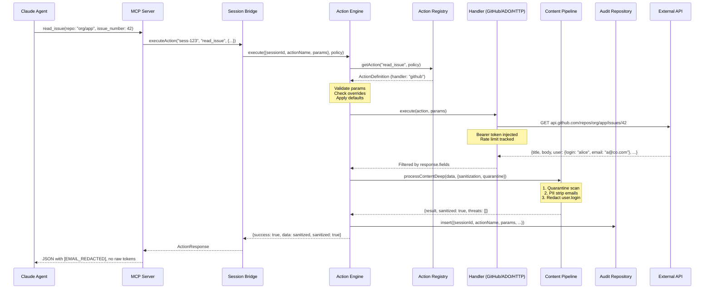
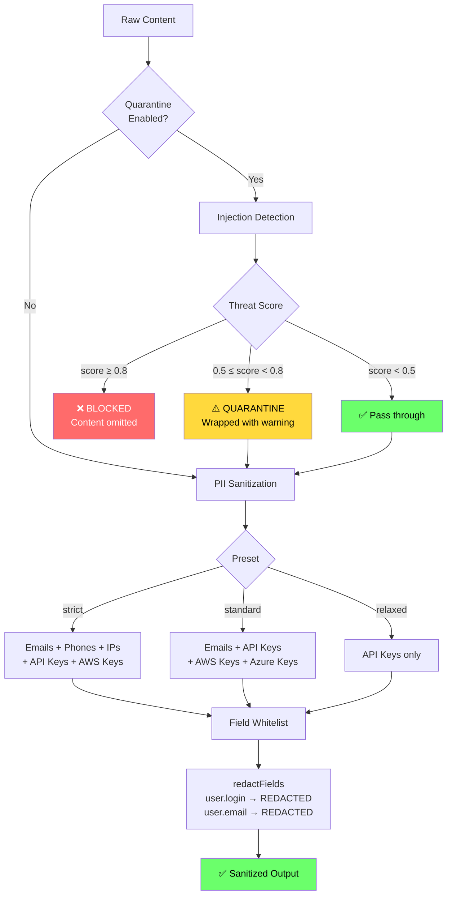
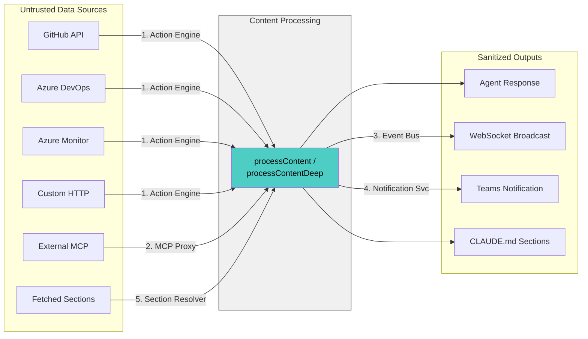

# Action Control Plane — Architecture & Workflow

## High-Level Architecture

```
┌─────────────────────────────────────────────────────────────────────┐
│                        SANDBOX CONTAINER                            │
│                                                                     │
│   ┌──────────┐    MCP calls    ┌──────────────────────────────┐    │
│   │  Claude   │───────────────▶│  Escalation MCP Server       │    │
│   │  Agent    │                │  (localhost:3100/mcp/{sid})   │    │
│   │          │◀───────────────│                              │    │
│   │          │   responses     │  Tools:                      │    │
│   │          │                │  ├── ask_human                │    │
│   └──────────┘                │  ├── report_plan              │    │
│       │                       │  ├── read_issue    ◀─ dynamic │    │
│       │ (blocked)             │  ├── search_issues ◀─ dynamic │    │
│       ▼                       │  ├── enrich_context◀─ dynamic │    │
│   ✗ No internet               │  └── ...                      │    │
│   ✗ No API tokens             └──────────┬───────────────────┘    │
│   ✗ No direct API access                 │                         │
└──────────────────────────────────────────│─────────────────────────┘
                                           │
                              JSON-RPC over HTTP
                                           │
┌──────────────────────────────────────────▼─────────────────────────┐
│                          DAEMON (Host)                              │
│                                                                     │
│  ┌──────────────────────────────────────────────────────────────┐  │
│  │                    Session Bridge                             │  │
│  │  executeAction(sessionId, name, params) ──┐                  │  │
│  │  getAvailableActions(sessionId)           │                  │  │
│  └───────────────────────────────────────────│──────────────────┘  │
│                                              │                      │
│  ┌───────────────────────────────────────────▼──────────────────┐  │
│  │                    Action Engine                              │  │
│  │                                                               │  │
│  │  1. Resolve action from registry                              │  │
│  │  2. Check overrides (approval, resources, disabled)           │  │
│  │  3. Validate params (required, type, enum)                    │  │
│  │  4. Apply defaults                                            │  │
│  │  5. Dispatch to handler ─────────────────────────┐            │  │
│  │  6. Process response (quarantine → PII)          │            │  │
│  │  7. Write audit trail                            │            │  │
│  └──────────────────────────────────────────────────│────────────┘  │
│                                                     │               │
│  ┌──────────────────────────────────────────────────▼────────────┐  │
│  │                    Handler Dispatch                            │  │
│  │                                                               │  │
│  │  ┌─────────┐  ┌─────────┐  ┌───────────┐  ┌──────────────┐  │  │
│  │  │ GitHub  │  │  ADO    │  │Azure Logs │  │ Generic HTTP │  │  │
│  │  │ Handler │  │ Handler │  │  Handler  │  │   Handler    │  │  │
│  │  │         │  │         │  │           │  │              │  │  │
│  │  │ Octokit │  │  WIQL   │  │   KQL     │  │  Template    │  │  │
│  │  │ Paging  │  │  Basic  │  │  Managed  │  │  Substitution│  │  │
│  │  │ RateLim │  │  Auth   │  │  Identity │  │  Any REST    │  │  │
│  │  └────┬────┘  └────┬────┘  └─────┬─────┘  └──────┬───────┘  │  │
│  │       │            │             │                │           │  │
│  └───────│────────────│─────────────│────────────────│───────────┘  │
│          │            │             │                │               │
│          ▼            ▼             ▼                ▼               │
│  ┌───────────────────────────────────────────────────────────────┐  │
│  │                External APIs (daemon has the tokens)           │  │
│  │  api.github.com    dev.azure.com    api.loganalytics.io  ... │  │
│  └───────────────────────────────────────────────────────────────┘  │
│                                                                     │
│  ┌───────────────────────────────────────────────────────────────┐  │
│  │                    Content Processing Pipeline                │  │
│  │                                                               │  │
│  │  ┌─────────────┐    ┌─────────────┐    ┌──────────────────┐  │  │
│  │  │ Quarantine  │───▶│ PII Sanitize│───▶│ Field Whitelist  │  │  │
│  │  │ (injection  │    │ (emails,    │    │ (only configured │  │  │
│  │  │  detection) │    │  API keys,  │    │  fields pass)    │  │  │
│  │  │             │    │  IPs, etc.) │    │                  │  │  │
│  │  │ score>0.8:  │    │             │    │ redactFields:    │  │  │
│  │  │  BLOCK      │    │ Presets:    │    │  user.login      │  │  │
│  │  │ score>0.5:  │    │  strict     │    │  user.email      │  │  │
│  │  │  QUARANTINE │    │  standard   │    │  assignee.login  │  │  │
│  │  │ score<0.5:  │    │  relaxed    │    │                  │  │  │
│  │  │  PASS       │    │             │    │                  │  │  │
│  │  └─────────────┘    └─────────────┘    └──────────────────┘  │  │
│  └───────────────────────────────────────────────────────────────┘  │
│                                                                     │
│  ┌────────────────┐  ┌──────────────┐  ┌──────────────────────┐    │
│  │  Audit Trail   │  │  Event Bus   │  │  Notifications       │    │
│  │  (SQLite)      │  │  (sanitized) │  │  (Teams, sanitized)  │    │
│  └────────────────┘  └──────────────┘  └──────────────────────┘    │
└─────────────────────────────────────────────────────────────────────┘
```

## MCP Proxy Flow

```
Agent in container                Daemon                    Real MCP Server
       │                            │                            │
       │  POST /mcp-proxy/          │                            │
       │  {serverName}/{sessionId}  │                            │
       │───────────────────────────▶│                            │
       │  (no auth headers)         │                            │
       │                            │  Look up server config     │
       │                            │  Inject auth headers       │
       │                            │                            │
       │                            │  POST {real-server-url}    │
       │                            │───────────────────────────▶│
       │                            │  Authorization: Bearer ... │
       │                            │                            │
       │                            │◀───────────────────────────│
       │                            │  Raw response              │
       │                            │                            │
       │                            │  PII sanitize response     │
       │                            │  Audit log                 │
       │                            │                            │
       │◀───────────────────────────│                            │
       │  Sanitized response        │                            │
       │  (no tokens visible)       │                            │
```

## Data Flow: Action Execution



## Content Processing Pipeline



## Integration Points (All 5 Wired)



## Profile Configuration: Coding vs Research Pod

```
┌─────────────────────────────────┐   ┌─────────────────────────────────┐
│       CODING POD                │   │       RESEARCH POD              │
│                                 │   │                                 │
│  networkPolicy:                 │   │  networkPolicy:                 │
│    enabled: true                │   │    enabled: true                │
│    allowedHosts: []             │   │    allowedHosts:                │
│    ▶ Internet BLOCKED           │   │      - *.github.com            │
│                                 │   │      - *.stackoverflow.com     │
│  actionPolicy:                  │   │      - arxiv.org               │
│    enabledGroups:               │   │    replaceDefaults: true        │
│      - github-issues            │   │    ▶ LIMITED internet           │
│      - github-prs              │   │                                 │
│      - azure-logs              │   │  actionPolicy:                  │
│      - custom                  │   │    enabledGroups:               │
│    sanitization:                │   │      - github-issues            │
│      preset: standard          │   │      - github-code             │
│    customActions:               │   │    sanitization:                │
│      - enrich_context          │   │      preset: standard          │
│      - get_feature_flags       │   │    quarantine:                  │
│                                 │   │      enabled: true              │
│  outputMode: pr                 │   │      threshold: 0.3            │
│    ▶ Build → Validate → PR     │   │      blockThreshold: 0.8       │
│                                 │   │                                 │
│  CLAUDE.md says:                │   │  outputMode: artifact           │
│    "Internet BLOCKED"           │   │    ▶ No build, no validation   │
│    "Push handled by system"     │   │    ▶ Output = research-output  │
│                                 │   │                                 │
└─────────────────────────────────┘   │  CLAUDE.md says:                │
                                      │    "LIMITED internet access"    │
                                      │    "Write to research-output"   │
                                      └─────────────────────────────────┘
```

## Package Structure

```
packages/
├── shared/src/
│   ├── types/actions.ts          ← ActionDefinition, ActionPolicy, ParamDef, AuthConfig
│   ├── schemas/action-definition.schema.ts  ← Zod validation
│   └── sanitize/
│       ├── patterns.ts           ← PII regex + injection detection patterns
│       ├── sanitize.ts           ← sanitize(), sanitizeDeep()
│       ├── quarantine.ts         ← quarantine(), threat scoring
│       ├── processor.ts          ← processContent(), processContentDeep()
│       └── processor.test.ts     ← 37 tests
│
├── daemon/src/
│   ├── actions/
│   │   ├── action-engine.ts      ← Orchestrator (validate → dispatch → sanitize → audit)
│   │   ├── action-registry.ts    ← Loads built-in + custom actions from profile
│   │   ├── audit-repository.ts   ← SQLite audit trail
│   │   ├── generic-http-handler.ts  ← Template substitution, any REST API
│   │   ├── handlers/
│   │   │   ├── handler.ts        ← Common interface, pickFields, fetchWithTimeout
│   │   │   ├── github-handler.ts ← REST API, pagination, rate limits
│   │   │   ├── ado-handler.ts    ← WIQL, Basic auth, batch fetch
│   │   │   └── azure-logs-handler.ts  ← KQL, managed identity, tabular→objects
│   │   ├── defaults/
│   │   │   ├── github-issues.json  (3 actions)
│   │   │   ├── github-prs.json    (3 actions)
│   │   │   ├── github-code.json   (2 actions)
│   │   │   ├── ado-workitems.json  (2 actions)
│   │   │   └── azure-logs.json    (3 actions)
│   │   ├── action-engine.test.ts        ← 9 unit tests
│   │   ├── action-registry.test.ts      ← 5 unit tests
│   │   ├── action-integration.test.ts   ← 6 integration tests (real DB + mock HTTP)
│   │   └── handlers/handler.test.ts     ← 9 utility tests
│   │
│   ├── api/
│   │   ├── mcp-handler.ts        ← Modified: passes available actions to MCP server
│   │   └── mcp-proxy-handler.ts  ← NEW: proxies injected MCP servers, strips PII
│   │
│   ├── sessions/
│   │   ├── session-bridge-impl.ts ← Extended: executeAction, getAvailableActions
│   │   ├── session-manager.ts     ← Modified: MCP URL rewrite, action resolution
│   │   ├── claude-md-generator.ts ← Extended: Operating Environment section
│   │   ├── event-bus.ts          ← Extended: sanitizing decorator on emit
│   │   └── section-resolver.ts   ← Extended: processContent on fetched sections
│   │
│   ├── notifications/
│   │   └── notification-service.ts ← Extended: sanitize card payloads
│   │
│   └── db/migrations/
│       └── 007_actions.sql        ← action_policy + output_mode + action_audit table
│
└── escalation-mcp/src/
    ├── session-bridge.ts          ← Extended: executeAction, getAvailableActions
    ├── server.ts                  ← Extended: dynamic action tool registration
    └── tools/actions.ts           ← NEW: generic action tool handler
```
