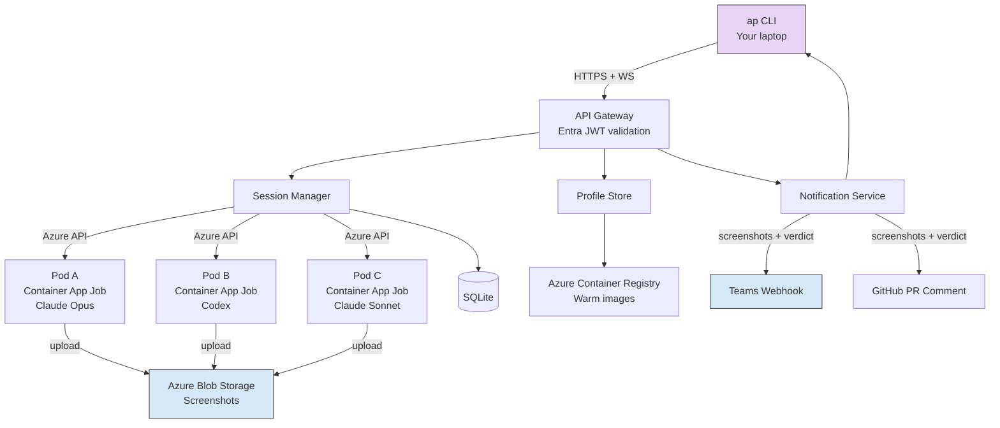
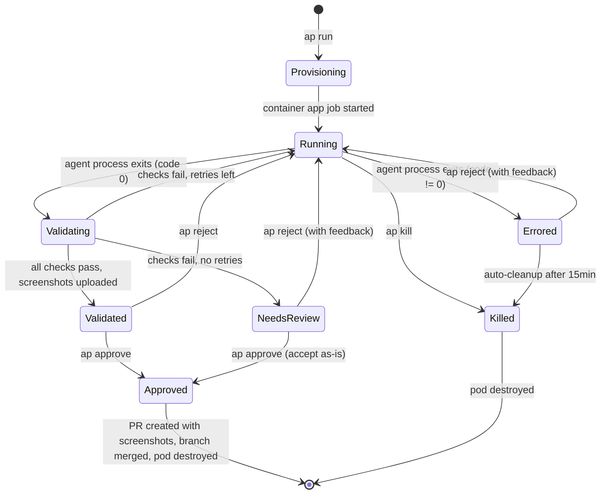
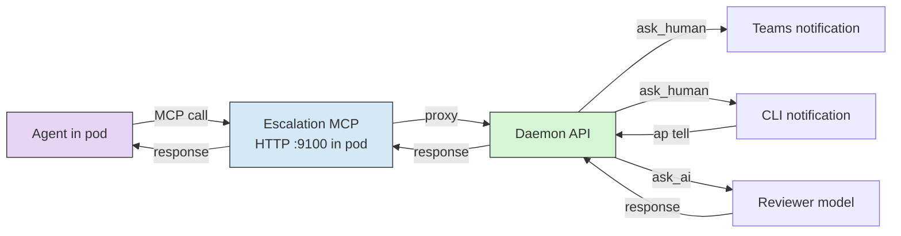

## System Overview

Autopod is a hybrid system: thin CLI on your machine, daemon running on Azure. The CLI is stateless — it connects, shows you what's happening, lets you interact, and can disconnect anytime. The daemon is the brain.

Pods run as **Azure Container App Jobs** — the daemon spawns them via the Azure API. No Docker-in-Docker, no socket mounting. Each pod is an ephemeral container that does agent work + validation, uploads screenshots, and dies.



## Monorepo Structure

```
apps/
  cli/                  # ap binary, Ink TUI
  daemon/               # Fastify server, session manager
libs/
  shared/               # @autopod/shared — types, interfaces, event schemas
  validator/            # Playwright smoke checks + AI task review
  mcp-escalation/       # HTTP MCP server injected into pods
  runtime-claude/       # Claude Code adapter
  runtime-codex/        # Codex adapter
```

All packages import types from `@autopod/shared`. It's the contract between everything.

## Components

### CLI (`ap`)

TypeScript, compiled to a single executable via `pkg` or distributed via npm. Responsibilities:

- Authentication (Entra ID token management)
- Send commands to daemon via REST
- Receive real-time events via WebSocket
- Render TUI dashboard (Ink)
- Store credentials locally (`~/.autopod/credentials.json`)

The CLI does no business logic. It's a remote control.

### API Gateway

Fastify HTTP server running on the daemon. Handles:

- JWT validation against Entra's JWKS endpoint
- WebSocket upgrade for real-time event streaming
- REST endpoints for all commands
- Rate limiting per user

```
POST   /sessions              # create session (ap run)
GET    /sessions              # list sessions (ap ls)
GET    /sessions/:id          # session detail (ap status)
POST   /sessions/:id/message  # send message (ap tell)
POST   /sessions/:id/validate # trigger validation (ap validate)
POST   /sessions/:id/approve  # merge branch (ap approve)
POST   /sessions/:id/reject   # reject + feedback (ap reject)
POST   /sessions/:id/preview  # spin up on-demand preview (ap open)
DELETE /sessions/:id          # kill session (ap kill)
WS     /events                # real-time event stream (ap watch)

GET    /profiles              # list profiles (ap profile ls)
POST   /profiles              # create profile (ap profile create)
PUT    /profiles/:name        # update profile
POST   /profiles/:name/warm   # build warm image (ap profile warm)
```

### Session Manager

The core orchestrator. Manages the lifecycle of every pod:



Session Manager responsibilities:

- Spawn pods as Container App Jobs via Azure API
- Detect agent completion via **process exit code** (0 = done, non-zero = error)
- Trigger in-pod validation after agent completes
- Handle retry logic (feed failures back to agent)
- Manage git worktrees and branches (via bare repo cache)
- Upload screenshots to Azure Blob Storage
- Create PRs with inline screenshot comments on approve
- Clean up on approval/kill

### Git Worktree Lifecycle

The daemon maintains a **bare repo cache** per profile. On session start:

1. `git fetch origin main` (fast — incremental fetch)
2. `git worktree add /worktrees/<session-id> -b feature/<slug>-<short-id>`
3. Worktree is made available to the pod (via Azure Files shared storage)
4. Agent starts working immediately on a clean branch

On approve:
1. `git push origin <branch>`
2. Create PR via GitHub API with screenshot comment
3. `git worktree remove <session-id>`

On kill:
1. `git worktree remove <session-id>`
2. Branch deleted if not pushed

Branch naming: auto-generated as `feature/<task-slug>-<short-id>`, overridable via `--branch`.

### Runtime Adapters

Abstract interface over different AI coding agents. Completion is detected by **process exit** — when the agent process exits with code 0, the pod moves to validation. Non-zero exit = error.

```typescript
interface Runtime {
  spawn(task: string, opts: SpawnOpts): AsyncIterable<AgentEvent>;
  resume(sessionId: string, message: string): AsyncIterable<AgentEvent>;
  abort(sessionId: string): Promise<void>;
}

type AgentEvent =
  | { type: 'status'; message: string }
  | { type: 'tool_use'; tool: string; input: Record<string, unknown> }
  | { type: 'file_change'; path: string; diff: string }
  | { type: 'complete'; exitCode: number }
  | { type: 'error'; message: string; exitCode: number }
```

**Claude Runtime**: Uses `claude -p --output-format stream-json`. Streams JSON events while running. Process exit triggers completion. Runs with `--dangerously-skip-permissions` inside the container (the container IS the sandbox). Supports `--resume` for sending follow-up messages (e.g., validation feedback).

**Codex Runtime**: Uses `codex exec --json --full-auto`. Parses JSONL event output. Process exit triggers completion. Supports `codex exec resume <id>` for follow-ups.

New runtimes (Gemini CLI, local models via Ollama) just implement the same interface.

### Validator

Two-phase pod lifecycle: agent work → validation. Both run inside the same container. Warm images include Playwright + Chromium (~400MB overhead, acceptable with pre-baked images).

**Layer 1 — Smoke validation** (Playwright):

1. **Build** — runs the profile's build command in the worktree
2. **Serve** — starts the app on a random port
3. **Health check** — polls the health endpoint until it responds (or timeout)
4. **Page validation** — for each configured page:
   - Navigate with Playwright
   - Full-page screenshot
   - Capture console errors
   - Run CSS selector assertions
5. **Upload** — screenshots uploaded to Azure Blob Storage (90-day expiring URLs)
6. **Cleanup** — kill the app process

**Layer 2 — Task review** (AI-powered):

After smoke checks pass, the validator sends a review payload to a reviewer model:

```typescript
interface TaskReview {
  task: string;              // original task description
  screenshots: Buffer[];     // full-page screenshots of configured pages
  diff: string;              // git diff of all changes
  filesChanged: string[];    // list of modified files
  buildOutput: string;       // build logs (truncated)
}

interface ReviewVerdict {
  status: 'pass' | 'fail' | 'uncertain';
  reasoning: string;         // why the reviewer thinks this
  issues?: string[];          // specific problems found
}
```

The reviewer model is configurable per profile — can be a cheaper model (sonnet) since it's just reviewing, not coding. The key prompt:

> "The task was: '{task}'. The agent made these changes (diff attached) and here are screenshots of the result. Did the agent accomplish the task correctly? Look for: missing UI elements, wrong positioning, broken layouts, incomplete implementations, anything that doesn't match the task description."

On failure, the reviewer's reasoning + issues get fed back to the working agent as structured feedback.

### Screenshot Delivery

Screenshots are the primary review artifact. Three delivery channels:

1. **Azure Blob Storage** — full-resolution screenshots with 90-day expiring SAS URLs. Source of truth.
2. **PR comment** — on approve, the PR is created with a comment containing inline screenshots (embedded via blob URLs), diff summary, task description, and AI reviewer verdict + reasoning.
3. **Teams Adaptive Card** — thumbnails in the notification card for quick glance, plus links to full-res screenshots.

### On-Demand Preview

When screenshots aren't enough and the human needs to browse:

1. `ap open <id>` calls `POST /sessions/:id/preview`
2. Daemon spawns a new Container App Job from the session's branch
3. Job clones branch, builds, serves on `$PORT`
4. Daemon exposes via Container App ingress → `https://<id>.autopod.dev`
5. Auto-kills after 30min idle (no heartbeat from browser)

Cost: zero when nobody's looking. ~30-60s spin-up when needed.

### Escalation MCP

Every pod gets an **HTTP MCP server** running on port 9100 inside the container. The server is injected at pod creation and proxies all escalation requests back to the daemon's API. The agent discovers it via `.mcp.json` placed in the worktree root.

```typescript
// Tools exposed via MCP to every session
interface EscalationTools {
  // Ask the human — pauses session, sends notification, waits for response
  ask_human(params: {
    question: string;
    context?: string;        // what the agent has tried so far
    options?: string[];      // optional multiple-choice for quick response
  }): Promise<{ response: string }>;

  // Ask another AI — routes to a different model, returns immediately
  ask_ai(params: {
    question: string;
    context?: string;
    domain?: string;         // hint for which model might be best
  }): Promise<{ response: string; model: string }>;

  // Declare blocker — immediate notification, session pauses
  report_blocker(params: {
    description: string;
    attempted: string[];     // what the agent already tried
    needs: string;           // what it needs to proceed
  }): Promise<{ response: string }>;
}
```

MCP server discovery:

```json
// .mcp.json placed in worktree root by daemon
{
  "mcpServers": {
    "escalation": {
      "url": "http://localhost:9100/mcp"
    }
  }
}
```

Flow:



Configuration per profile:

```yaml
escalation:
  ask_human: true
  ask_ai:
    model: sonnet
    max_calls: 5               # prevent infinite loops
  auto_pause_after: 3          # pause session after 3 blockers
  timeout: 3600                # max seconds to wait for human response
```

### Profile Store

Manages app profiles in SQLite. Each profile includes:

- Repo URL and default branch
- Stack template (base Docker image)
- Build/start/health configuration
- Validation rules (pages, assertions)
- Default model and runtime
- Custom instructions (injected into CLAUDE.md)
- Escalation configuration

Profiles can inherit from other profiles (e.g., `ideaspace` extends `astro-base`).

### Notification Service

Sends Adaptive Cards to Teams via Workflow webhook:

- **Session validated** — green card with screenshot thumbnails, links to full-res screenshots, diff summary, and reviewer verdict
- **Validation failed** — red card with error summary and failure screenshots
- **Needs review** — yellow card with context and screenshots
- **Session error** — red card with error category, message, and last log lines
- **Escalation** — blue card with agent's question and quick-reply options

Also pushes events over WebSocket to any connected CLI instances.

## Error Handling

All errors are categorized and follow the same pattern: transition to errored state, notify, keep pod alive briefly for debugging.

| Category | Trigger | Behavior |
|----------|---------|----------|
| `agent_error` | Process exit != 0 | Session → errored, notify |
| `build_error` | Build command fails during validation | Session → errored, notify |
| `timeout` | Exceeded max session duration | Session → errored, notify |
| `infra_error` | OOM, disk full, network failure | Session → errored, notify |
| `auth_error` | Expired or invalid API key | Session → errored, notify |
| `validation_error` | Playwright crashes (not a test failure) | Session → errored, notify |

On any error:
1. Session transitions to `errored` state
2. Error category + message stored in DB
3. User notified via Teams + WebSocket
4. **Pod stays alive for 15 minutes** — enough time to `ap logs <id>` and debug
5. Auto-cleanup after 15min grace period

No auto-retry on infrastructure errors. The only auto-retry path is the validation feedback loop (validation fails → feedback to agent → agent retries), controlled by the profile's retry config.

## Shared Types Package (`@autopod/shared`)

The contract between all packages. Single barrel export — everything imported from `@autopod/shared`.

```
libs/shared/
  src/
    index.ts          # barrel export
    session.ts        # Session, SessionStatus, SessionError
    events.ts         # AgentEvent, DaemonEvent, WebSocketEvent
    runtime.ts        # Runtime interface, SpawnOpts, RuntimeType
    validation.ts     # TaskReview, ReviewVerdict, SmokeResult
    escalation.ts     # EscalationTools, MCP types
    profile.ts        # Profile, ProfileConfig, StackTemplate
    errors.ts         # ErrorCategory, ErrorInfo
    api.ts            # REST request/response types for all endpoints
  package.json
  tsconfig.json
```

This package is built first. All other packages depend on it. No runtime dependencies — pure types and interfaces (with the exception of shared constants like error categories and session statuses).

## Infrastructure

### Azure Container Apps

The daemon runs as a Container App. Pods run as **Container App Jobs** — spawned via the Azure API, not Docker. This means:

- No Docker-in-Docker, no privileged containers
- Daemon scales to zero when no sessions are active (cost: ~$0 idle)
- Pods scale independently, billed per-second
- Built-in log streaming and monitoring
- Managed Identity for Key Vault + ACR + Blob Storage access

### Azure Container Registry

Stores:
- Stack templates (`autopod/node22-pw`, `autopod/dotnet9-pw`, etc.) — include Playwright + Chromium
- Warm images per profile (`autopod/ideaspace:latest`, `autopod/my-api:latest`)

### Azure Blob Storage

Stores validation screenshots with 90-day SAS URL expiry:
- Container: `screenshots`
- Path: `<session-id>/<page-name>.png`
- Access: SAS URLs generated by daemon, embedded in PR comments and Teams cards

### Azure Files

Shared storage for git worktrees:
- Daemon's bare repo cache mounted as Azure Files share
- Worktrees created by daemon, accessible to pods via shared mount
- Enables fast session start without full clone in every pod

### Azure Key Vault

Stores secrets the daemon needs:
- `anthropic-api-key`
- `openai-api-key`
- `github-pat` (for cloning private repos and creating PRs)
- `teams-webhook-url`

Accessed via Managed Identity — no credentials on disk.

### Entra ID

App registration with:
- Device code flow (CLI auth from any environment)
- Auth code + PKCE (browser-based flow for local use)
- App roles: `admin`, `operator`, `viewer`
- JWT validation at the gateway (no Entra calls at request time)

## Tech Stack

| Component | Technology | Why |
|-----------|-----------|-----|
| CLI | TypeScript + Ink | TUI rendering, same ecosystem |
| Daemon | TypeScript + Fastify | Fast, lightweight, good WS support |
| State | SQLite (better-sqlite3) | Simple, no server, handles concurrency |
| Containers | Azure Container Apps SDK | Native Azure, no DinD needed |
| Validation | Playwright | Proven, headless browser automation |
| Screenshots | Azure Blob Storage + SAS | Expiring URLs, cheap, scalable |
| Git | simple-git | Worktree management, branching |
| Auth | @azure/msal-node | Entra ID flows |
| Secrets | @azure/keyvault-secrets | Key Vault access |
| Registry | @azure/container-registry | ACR image management |
| Notifications | node-fetch → Teams webhook | Adaptive Cards with screenshots |
| GitHub | @octokit/rest | PR creation, screenshot comments |

## Security Model

- **Container isolation**: Each pod is a Container App Job. Filesystem restricted to worktree. No host access.
- **Network control**: Pods can reach AI APIs, npm registry, and daemon API (for MCP escalation). Nothing else by default. Configurable per profile.
- **Auth**: Every CLI request carries an Entra JWT. Daemon validates signature + audience + issuer.
- **Secrets**: Never on disk. Key Vault + Managed Identity.
- **Git**: Each session works on a dedicated branch. No direct access to main. Merges go through the approve flow and create a PR.
- **API keys**: Injected into pods as environment variables at spawn time. Not baked into images.
- **MCP**: Escalation server runs inside the pod on localhost only. External communication goes through the daemon API with session-scoped auth.
