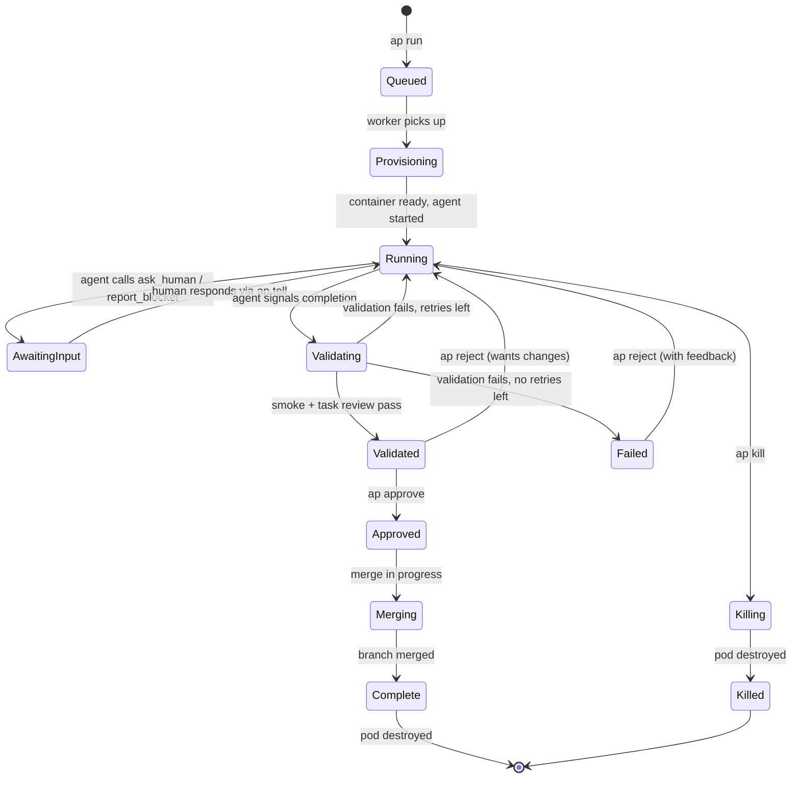

> The shared contract. Every package builds against these types. Change them first, build against them always.

## Package: `packages/shared`

This package exports all types, interfaces, constants, enums, and schemas used across the system. It has zero runtime dependencies beyond Zod (for schema validation). Every other package imports from `@autopod/shared`.

```
packages/shared/
├── src/
│   ├── index.ts              # Barrel export
│   ├── types/
│   │   ├── session.ts        # Session types + state machine
│   │   ├── profile.ts        # App profile types
│   │   ├── runtime.ts        # Runtime adapter interface
│   │   ├── validation.ts     # Validation types + verdicts
│   │   ├── escalation.ts     # MCP escalation types
│   │   ├── events.ts         # Event bus types
│   │   ├── notification.ts   # Notification payloads
│   │   └── auth.ts           # Auth token types
│   ├── schemas/
│   │   ├── session.schema.ts # Zod schemas for API validation
│   │   ├── profile.schema.ts
│   │   └── config.schema.ts
│   ├── constants.ts          # Status enums, limits, defaults
│   └── errors.ts             # Typed error hierarchy
├── package.json
└── tsconfig.json
```

---

## Session Types

The session is the central entity. Everything revolves around it.

### Session State Machine



### TypeScript Types

```typescript
// ─── Session ───────────────────────────────────────────────

type SessionStatus =
  | 'queued'
  | 'provisioning'
  | 'running'
  | 'awaiting_input'
  | 'validating'
  | 'validated'
  | 'failed'
  | 'approved'
  | 'merging'
  | 'complete'
  | 'killing'
  | 'killed';

interface Session {
  id: string;                    // nanoid, 8 chars (e.g., "a1b2c3d4")
  profileName: string;          // references Profile.name
  task: string;                 // original task description
  status: SessionStatus;
  model: string;                // e.g., "opus", "sonnet", "codex"
  runtime: RuntimeType;         // "claude" | "codex"
  branch: string;               // git branch name
  containerId: string | null;   // Docker container ID
  worktreePath: string | null;  // path inside container

  // Validation state
  validationAttempts: number;
  maxValidationAttempts: number; // default 3
  lastValidationResult: ValidationResult | null;

  // Escalation state
  pendingEscalation: EscalationRequest | null;
  escalationCount: number;

  // Timing
  createdAt: string;            // ISO 8601
  startedAt: string | null;     // when agent started working
  completedAt: string | null;   // when final state reached
  updatedAt: string;

  // Metadata
  userId: string;               // Entra ID user OID
  filesChanged: number;
  linesAdded: number;
  linesRemoved: number;
  previewUrl: string | null;    // Cloudflare Tunnel URL
}

interface CreateSessionRequest {
  profileName: string;
  task: string;
  model?: string;               // override profile default
  runtime?: RuntimeType;        // override profile default
  branch?: string;              // custom branch name
  skipValidation?: boolean;     // skip auto-validation
}

interface SessionSummary {
  id: string;
  profileName: string;
  task: string;
  status: SessionStatus;
  model: string;
  runtime: RuntimeType;
  duration: number | null;      // seconds since started
  filesChanged: number;
  createdAt: string;
}
```

---

## Profile Types

```typescript
// ─── Profile ───────────────────────────────────────────────

interface Profile {
  name: string;                  // unique identifier (e.g., "ideaspace")
  repoUrl: string;              // e.g., "https://github.com/esbenwiberg/ideaspace"
  defaultBranch: string;        // e.g., "main"
  template: StackTemplate;      // base Docker image

  // Build & serve
  buildCommand: string;         // e.g., "npm ci && npm run build"
  startCommand: string;         // e.g., "npx astro preview --host 0.0.0.0 --port $PORT"
  healthPath: string;           // e.g., "/"
  healthTimeout: number;        // seconds, default 120

  // Validation
  validationPages: ValidationPage[];
  maxValidationAttempts: number; // default 3

  // AI config
  defaultModel: string;         // e.g., "opus"
  defaultRuntime: RuntimeType;  // e.g., "claude"
  customInstructions: string | null; // injected into CLAUDE.md

  // Escalation config
  escalation: EscalationConfig;

  // Inheritance
  extends: string | null;       // parent profile name

  // Docker image state
  warmImageTag: string | null;  // ACR tag of pre-baked image
  warmImageBuiltAt: string | null;

  // Metadata
  createdAt: string;
  updatedAt: string;
}

type StackTemplate =
  | 'node22'
  | 'node22-pw'       // Node 22 + Playwright + Chromium
  | 'dotnet9'
  | 'python312'
  | 'custom';

interface ValidationPage {
  path: string;                  // URL path (e.g., "/", "/about")
  assertions?: PageAssertion[];  // optional CSS selector checks
}

interface PageAssertion {
  selector: string;              // CSS selector
  type: 'exists' | 'text_contains' | 'visible' | 'count';
  value?: string;                // expected text or count
}

interface EscalationConfig {
  askHuman: boolean;             // enable ask_human tool
  askAi: {
    enabled: boolean;
    model: string;               // reviewer model (e.g., "sonnet")
    maxCalls: number;            // per session, default 5
  };
  autoPauseAfter: number;       // pause after N blockers, default 3
  humanResponseTimeout: number;  // seconds to wait for human, default 3600
}
```

---

## Runtime Types

```typescript
// ─── Runtime Adapter ───────────────────────────────────────

type RuntimeType = 'claude' | 'codex';

interface Runtime {
  type: RuntimeType;

  /**
   * Spawn a new agent session inside a container.
   * Returns an async iterable of events as the agent works.
   */
  spawn(config: SpawnConfig): AsyncIterable<AgentEvent>;

  /**
   * Send a follow-up message to a running agent.
   * Used for corrections, answers to questions, and reject feedback.
   */
  resume(sessionId: string, message: string): AsyncIterable<AgentEvent>;

  /**
   * Forcefully stop the agent process.
   */
  abort(sessionId: string): Promise<void>;
}

interface SpawnConfig {
  sessionId: string;
  task: string;
  model: string;
  workDir: string;               // worktree path inside container
  customInstructions?: string;   // CLAUDE.md content
  env: Record<string, string>;   // environment variables (API keys, etc.)
  mcpServers?: McpServerConfig[];// MCP servers to inject
}

interface McpServerConfig {
  name: string;
  url: string;                   // MCP server endpoint
}

// ─── Agent Events ──────────────────────────────────────────

type AgentEvent =
  | AgentStatusEvent
  | AgentToolUseEvent
  | AgentFileChangeEvent
  | AgentCompleteEvent
  | AgentErrorEvent
  | AgentEscalationEvent;

interface AgentStatusEvent {
  type: 'status';
  timestamp: string;
  message: string;               // human-readable status
}

interface AgentToolUseEvent {
  type: 'tool_use';
  timestamp: string;
  tool: string;                  // tool name (e.g., "Read", "Edit", "Bash")
  input: Record<string, unknown>;
  output?: string;               // truncated output
}

interface AgentFileChangeEvent {
  type: 'file_change';
  timestamp: string;
  path: string;                  // relative to worktree
  action: 'create' | 'modify' | 'delete';
  diff?: string;                 // unified diff
}

interface AgentCompleteEvent {
  type: 'complete';
  timestamp: string;
  result: string;                // agent's completion message
}

interface AgentErrorEvent {
  type: 'error';
  timestamp: string;
  message: string;
  fatal: boolean;                // if true, session should transition to failed
}

interface AgentEscalationEvent {
  type: 'escalation';
  timestamp: string;
  escalationType: 'ask_human' | 'ask_ai' | 'report_blocker';
  payload: EscalationRequest;
}
```

---

## Validation Types

```typescript
// ─── Validation ────────────────────────────────────────────

interface ValidationResult {
  sessionId: string;
  attempt: number;
  timestamp: string;
  smoke: SmokeResult;
  taskReview: TaskReviewResult | null; // null if smoke failed
  overall: 'pass' | 'fail';
  duration: number;              // seconds
}

interface SmokeResult {
  status: 'pass' | 'fail';
  build: BuildResult;
  health: HealthResult;
  pages: PageResult[];
}

interface BuildResult {
  status: 'pass' | 'fail';
  output: string;                // truncated build log
  duration: number;              // seconds
}

interface HealthResult {
  status: 'pass' | 'fail';
  url: string;
  responseCode: number | null;
  duration: number;              // seconds until healthy (or timeout)
}

interface PageResult {
  path: string;
  status: 'pass' | 'fail';
  screenshotPath: string;        // path to stored screenshot
  consoleErrors: string[];       // captured browser console errors
  assertions: AssertionResult[];
  loadTime: number;              // milliseconds
}

interface AssertionResult {
  selector: string;
  type: PageAssertion['type'];
  expected: string | undefined;
  actual: string | undefined;
  passed: boolean;
}

interface TaskReviewResult {
  status: 'pass' | 'fail' | 'uncertain';
  reasoning: string;             // reviewer model's explanation
  issues: string[];              // specific problems found
  model: string;                 // which model reviewed
  screenshots: string[];         // paths to screenshots sent to reviewer
  diff: string;                  // the diff that was reviewed
}
```

---

## Escalation Types

```typescript
// ─── Escalation ────────────────────────────────────────────

type EscalationType = 'ask_human' | 'ask_ai' | 'report_blocker';

interface EscalationRequest {
  id: string;                    // nanoid
  sessionId: string;
  type: EscalationType;
  timestamp: string;
  payload: AskHumanPayload | AskAiPayload | ReportBlockerPayload;
  response: EscalationResponse | null;
}

interface AskHumanPayload {
  question: string;
  context?: string;              // what the agent has tried
  options?: string[];            // multiple-choice for quick response
}

interface AskAiPayload {
  question: string;
  context?: string;
  domain?: string;               // hint for model selection
}

interface ReportBlockerPayload {
  description: string;
  attempted: string[];           // what the agent already tried
  needs: string;                 // what it needs to proceed
}

interface EscalationResponse {
  respondedAt: string;
  respondedBy: 'human' | 'ai';
  response: string;
  model?: string;                // if respondedBy === 'ai'
}
```

---

## Event Bus Types

All system events flow through a typed event bus. The WebSocket connection and notification service subscribe to these events.

```typescript
// ─── Events ────────────────────────────────────────────────

type SystemEvent =
  | SessionCreatedEvent
  | SessionStatusChangedEvent
  | AgentActivityEvent
  | ValidationStartedEvent
  | ValidationCompletedEvent
  | EscalationCreatedEvent
  | EscalationResolvedEvent
  | SessionCompletedEvent;

interface SessionCreatedEvent {
  type: 'session.created';
  timestamp: string;
  session: SessionSummary;
}

interface SessionStatusChangedEvent {
  type: 'session.status_changed';
  timestamp: string;
  sessionId: string;
  previousStatus: SessionStatus;
  newStatus: SessionStatus;
}

interface AgentActivityEvent {
  type: 'session.agent_activity';
  timestamp: string;
  sessionId: string;
  event: AgentEvent;
}

interface ValidationStartedEvent {
  type: 'session.validation_started';
  timestamp: string;
  sessionId: string;
  attempt: number;
}

interface ValidationCompletedEvent {
  type: 'session.validation_completed';
  timestamp: string;
  sessionId: string;
  result: ValidationResult;
}

interface EscalationCreatedEvent {
  type: 'session.escalation_created';
  timestamp: string;
  sessionId: string;
  escalation: EscalationRequest;
}

interface EscalationResolvedEvent {
  type: 'session.escalation_resolved';
  timestamp: string;
  sessionId: string;
  escalationId: string;
  response: EscalationResponse;
}

interface SessionCompletedEvent {
  type: 'session.completed';
  timestamp: string;
  sessionId: string;
  finalStatus: 'complete' | 'killed';
  summary: SessionSummary;
}
```

---

## Notification Types

```typescript
// ─── Notifications ─────────────────────────────────────────

type NotificationType =
  | 'session_validated'
  | 'session_failed'
  | 'session_needs_input'
  | 'session_error';

interface NotificationPayload {
  type: NotificationType;
  sessionId: string;
  profileName: string;
  task: string;
  timestamp: string;
}

interface SessionValidatedNotification extends NotificationPayload {
  type: 'session_validated';
  previewUrl: string | null;
  filesChanged: number;
  linesAdded: number;
  linesRemoved: number;
  duration: number;              // total session duration in seconds
}

interface SessionFailedNotification extends NotificationPayload {
  type: 'session_failed';
  reason: string;
  validationResult: ValidationResult | null;
  screenshotUrl: string | null;
}

interface SessionNeedsInputNotification extends NotificationPayload {
  type: 'session_needs_input';
  escalation: EscalationRequest;
}

interface SessionErrorNotification extends NotificationPayload {
  type: 'session_error';
  error: string;
  fatal: boolean;
}
```

---

## Auth Types

```typescript
// ─── Auth ──────────────────────────────────────────────────

interface AuthToken {
  accessToken: string;
  refreshToken: string;
  expiresAt: string;             // ISO 8601
  userId: string;                // Entra OID
  displayName: string;
  email: string;
  roles: AppRole[];
}

type AppRole = 'admin' | 'operator' | 'viewer';

interface JwtPayload {
  oid: string;                   // user object ID
  preferred_username: string;
  name: string;
  roles: AppRole[];
  aud: string;                   // app client ID
  iss: string;                   // Entra issuer
  exp: number;
  iat: number;
}

interface DaemonConnection {
  url: string;                   // daemon base URL
  healthy: boolean;
  version: string;
  lastChecked: string;
}
```

---

## SQLite Schema

The daemon stores all state in SQLite. Simple, no ops overhead, single file backup.

```sql
-- Profiles
CREATE TABLE profiles (
  name            TEXT PRIMARY KEY,
  repo_url        TEXT NOT NULL,
  default_branch  TEXT NOT NULL DEFAULT 'main',
  template        TEXT NOT NULL DEFAULT 'node22',
  build_command   TEXT NOT NULL,
  start_command   TEXT NOT NULL,
  health_path     TEXT NOT NULL DEFAULT '/',
  health_timeout  INTEGER NOT NULL DEFAULT 120,
  validation_pages TEXT NOT NULL DEFAULT '[]',     -- JSON array of ValidationPage
  max_validation_attempts INTEGER NOT NULL DEFAULT 3,
  default_model   TEXT NOT NULL DEFAULT 'opus',
  default_runtime TEXT NOT NULL DEFAULT 'claude',
  custom_instructions TEXT,
  escalation_config TEXT NOT NULL DEFAULT '{}',    -- JSON EscalationConfig
  extends         TEXT REFERENCES profiles(name),
  warm_image_tag  TEXT,
  warm_image_built_at TEXT,
  created_at      TEXT NOT NULL DEFAULT (datetime('now')),
  updated_at      TEXT NOT NULL DEFAULT (datetime('now'))
);

-- Sessions
CREATE TABLE sessions (
  id              TEXT PRIMARY KEY,                -- nanoid 8 chars
  profile_name    TEXT NOT NULL REFERENCES profiles(name),
  task            TEXT NOT NULL,
  status          TEXT NOT NULL DEFAULT 'queued',
  model           TEXT NOT NULL,
  runtime         TEXT NOT NULL DEFAULT 'claude',
  branch          TEXT NOT NULL,
  container_id    TEXT,
  worktree_path   TEXT,
  validation_attempts INTEGER NOT NULL DEFAULT 0,
  max_validation_attempts INTEGER NOT NULL DEFAULT 3,
  last_validation_result TEXT,                     -- JSON ValidationResult
  pending_escalation TEXT,                         -- JSON EscalationRequest
  escalation_count INTEGER NOT NULL DEFAULT 0,
  skip_validation BOOLEAN NOT NULL DEFAULT 0,
  created_at      TEXT NOT NULL DEFAULT (datetime('now')),
  started_at      TEXT,
  completed_at    TEXT,
  updated_at      TEXT NOT NULL DEFAULT (datetime('now')),
  user_id         TEXT NOT NULL,
  files_changed   INTEGER NOT NULL DEFAULT 0,
  lines_added     INTEGER NOT NULL DEFAULT 0,
  lines_removed   INTEGER NOT NULL DEFAULT 0,
  preview_url     TEXT
);

CREATE INDEX idx_sessions_status ON sessions(status);
CREATE INDEX idx_sessions_user ON sessions(user_id);
CREATE INDEX idx_sessions_profile ON sessions(profile_name);

-- Escalation history
CREATE TABLE escalations (
  id              TEXT PRIMARY KEY,                -- nanoid
  session_id      TEXT NOT NULL REFERENCES sessions(id) ON DELETE CASCADE,
  type            TEXT NOT NULL,                   -- 'ask_human' | 'ask_ai' | 'report_blocker'
  payload         TEXT NOT NULL,                   -- JSON
  response        TEXT,                            -- JSON EscalationResponse
  created_at      TEXT NOT NULL DEFAULT (datetime('now')),
  resolved_at     TEXT
);

CREATE INDEX idx_escalations_session ON escalations(session_id);

-- Validation history
CREATE TABLE validations (
  id              TEXT PRIMARY KEY,                -- nanoid
  session_id      TEXT NOT NULL REFERENCES sessions(id) ON DELETE CASCADE,
  attempt         INTEGER NOT NULL,
  result          TEXT NOT NULL,                   -- JSON ValidationResult
  screenshots     TEXT NOT NULL DEFAULT '[]',      -- JSON array of file paths
  created_at      TEXT NOT NULL DEFAULT (datetime('now'))
);

CREATE INDEX idx_validations_session ON validations(session_id);

-- Event log (append-only, for audit trail)
CREATE TABLE events (
  id              INTEGER PRIMARY KEY AUTOINCREMENT,
  session_id      TEXT REFERENCES sessions(id) ON DELETE CASCADE,
  type            TEXT NOT NULL,
  payload         TEXT NOT NULL,                   -- JSON SystemEvent
  created_at      TEXT NOT NULL DEFAULT (datetime('now'))
);

CREATE INDEX idx_events_session ON events(session_id);
CREATE INDEX idx_events_type ON events(type);

-- Schema version (for migrations)
CREATE TABLE schema_version (
  version         INTEGER PRIMARY KEY,
  applied_at      TEXT NOT NULL DEFAULT (datetime('now'))
);
```

### Migration Strategy

Simple sequential migrations in `packages/daemon/migrations/`:

```
migrations/
├── 001_initial.sql       # Creates all tables above
├── 002_add_feature.sql   # Future migrations
└── ...
```

At daemon startup, check `schema_version` and apply any unapplied migrations in order. Use a simple migration runner — no ORM.

---

## Error Hierarchy

```typescript
// ─── Errors ────────────────────────────────────────────────

class AutopodError extends Error {
  constructor(
    message: string,
    public readonly code: string,
    public readonly statusCode: number = 500
  ) {
    super(message);
    this.name = 'AutopodError';
  }
}

// Auth errors
class AuthError extends AutopodError {
  constructor(message: string) {
    super(message, 'AUTH_ERROR', 401);
  }
}

class ForbiddenError extends AutopodError {
  constructor(message: string) {
    super(message, 'FORBIDDEN', 403);
  }
}

// Session errors
class SessionNotFoundError extends AutopodError {
  constructor(sessionId: string) {
    super(`Session ${sessionId} not found`, 'SESSION_NOT_FOUND', 404);
  }
}

class InvalidStateTransitionError extends AutopodError {
  constructor(sessionId: string, from: SessionStatus, to: SessionStatus) {
    super(
      `Cannot transition session ${sessionId} from ${from} to ${to}`,
      'INVALID_STATE_TRANSITION',
      409
    );
  }
}

// Profile errors
class ProfileNotFoundError extends AutopodError {
  constructor(name: string) {
    super(`Profile "${name}" not found`, 'PROFILE_NOT_FOUND', 404);
  }
}

class ProfileExistsError extends AutopodError {
  constructor(name: string) {
    super(`Profile "${name}" already exists`, 'PROFILE_EXISTS', 409);
  }
}

// Container errors
class ContainerError extends AutopodError {
  constructor(message: string) {
    super(message, 'CONTAINER_ERROR', 500);
  }
}

// Validation errors
class ValidationError extends AutopodError {
  constructor(message: string) {
    super(message, 'VALIDATION_ERROR', 500);
  }
}

// Runtime errors
class RuntimeError extends AutopodError {
  constructor(message: string, public readonly runtime: RuntimeType) {
    super(message, 'RUNTIME_ERROR', 500);
  }
}
```

---

## Constants

```typescript
// ─── Constants ─────────────────────────────────────────────

const SESSION_ID_LENGTH = 8;
const DEFAULT_MAX_VALIDATION_ATTEMPTS = 3;
const DEFAULT_HEALTH_TIMEOUT = 120;        // seconds
const DEFAULT_HUMAN_RESPONSE_TIMEOUT = 3600; // seconds
const DEFAULT_MAX_AI_ESCALATIONS = 5;
const DEFAULT_AUTO_PAUSE_AFTER = 3;        // blockers
const MAX_BUILD_LOG_LENGTH = 10_000;       // chars, truncated in DB
const MAX_DIFF_LENGTH = 50_000;            // chars, for task review
const SCREENSHOT_QUALITY = 80;             // JPEG quality
const EVENT_LOG_RETENTION_DAYS = 30;

const VALID_STATUS_TRANSITIONS: Record<SessionStatus, SessionStatus[]> = {
  queued: ['provisioning', 'killing'],
  provisioning: ['running', 'killing'],
  running: ['awaiting_input', 'validating', 'killing'],
  awaiting_input: ['running', 'killing'],
  validating: ['validated', 'running', 'failed'],
  validated: ['approved', 'running'],
  failed: ['running', 'killing'],
  approved: ['merging'],
  merging: ['complete'],
  complete: [],
  killing: ['killed'],
  killed: [],
};
```
