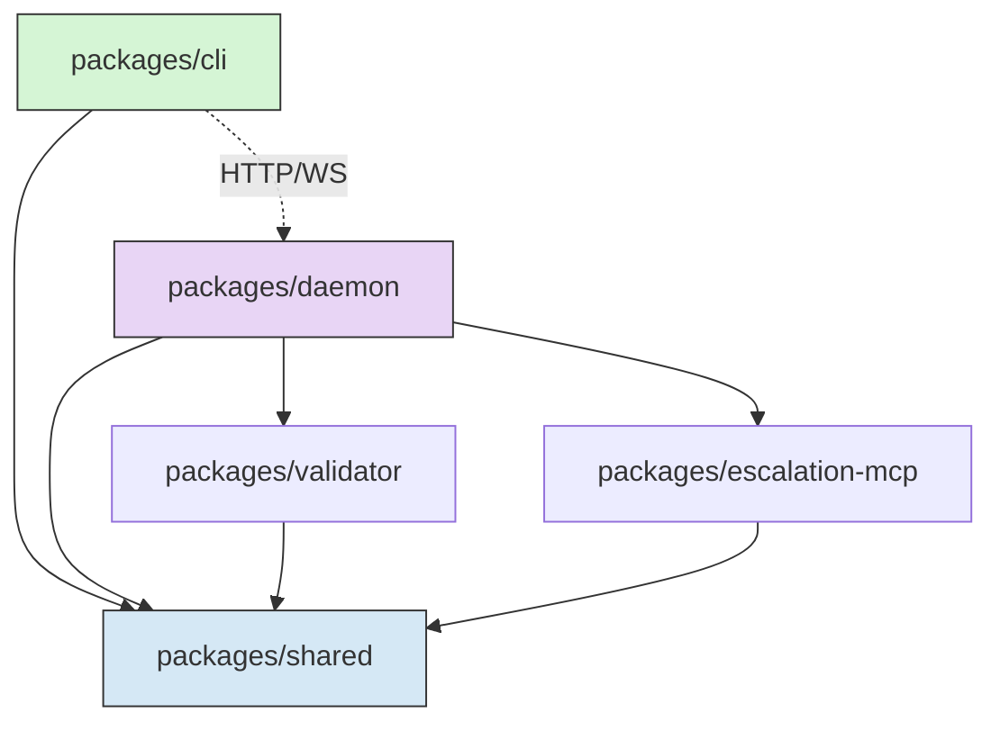
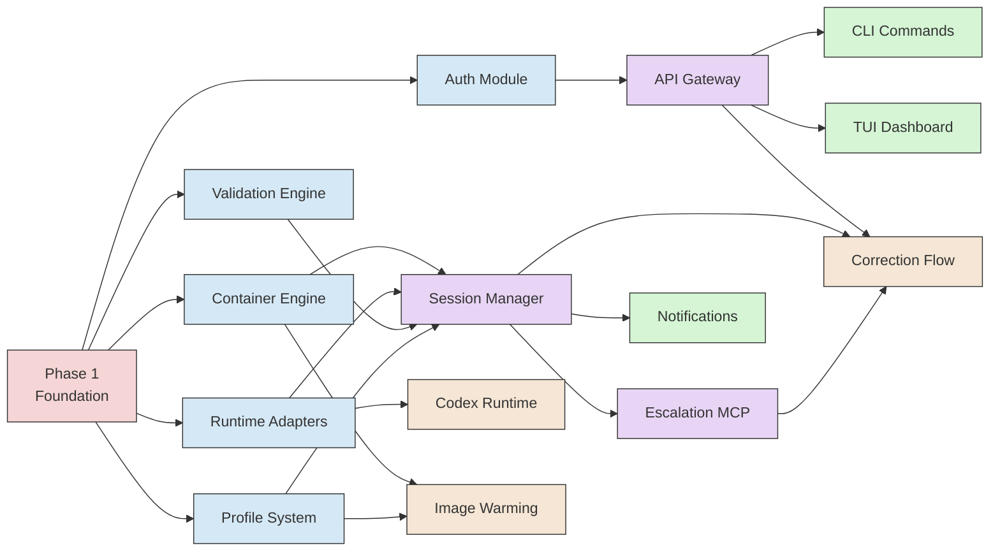

> The master plan. Phases, dependencies, parallelism, and conventions — everything an autonomous agent needs before touching code.

## Monorepo Structure

Turborepo workspace. Each package is independently buildable and testable. Shared types are the contract layer — change them first, build against them always.

```
autopod/
├── packages/
│   ├── cli/              # `ap` command — Ink TUI, REST client
│   ├── daemon/           # Fastify server — API, session manager, orchestration
│   ├── shared/           # Types, interfaces, constants, schemas
│   ├── validator/        # Playwright validation engine (smoke + task review)
│   └── escalation-mcp/  # MCP server for agent escalation tools
├── templates/
│   ├── base/             # Base Dockerfiles (node22, node22-pw, dotnet9)
│   └── profiles/         # Profile-specific Dockerfile extensions
├── infra/                # Azure IaC (Bicep modules)
│   ├── main.bicep
│   ├── container-apps.bicep
│   ├── keyvault.bicep
│   ├── acr.bicep
│   └── entra.bicep
├── e2e/                  # End-to-end integration tests
├── package.json          # Workspace root (pnpm)
├── turbo.json            # Build pipeline config
├── tsconfig.base.json    # Shared TypeScript config
└── .github/
    └── workflows/
        ├── ci.yml        # Build + test on PR
        └── deploy.yml    # Deploy daemon to Azure
```

### Package Dependencies



`packages/shared` is the foundation. Everything depends on it. Nothing depends on `cli` or `daemon` directly — they communicate over HTTP/WS.

## Tech Stack Decisions

| Choice | Technology | Why | Alternatives Considered |
|--------|-----------|-----|------------------------|
| Monorepo | Turborepo + pnpm workspaces | Fast, minimal config, good caching | Nx (too heavy), Lerna (deprecated vibes) |
| Language | TypeScript throughout | Same ecosystem CLI-to-daemon, shared types | Go for daemon (perf), but not worth the type-sharing pain |
| HTTP server | Fastify | Fastest Node framework, native WS, schema validation | Express (slower, less opinionated), Hono (newer, less ecosystem) |
| Database | SQLite via better-sqlite3 | Zero ops, handles concurrency fine at this scale, single file backup | Postgres (overkill), file-based JSON (no queries) |
| Container mgmt | dockerode | Programmatic Docker API, well-maintained | child_process + docker CLI (fragile parsing), Podman (less ecosystem) |
| Git operations | simple-git | Clean API, worktree support | child_process + git CLI (works but verbose), isomorphic-git (incomplete) |
| TUI | Ink (React for CLI) | Component model, good for dashboards | Blessed (older), raw ANSI (painful) |
| Auth | @azure/msal-node | First-party Entra ID SDK | Custom OAuth (unnecessary risk) |
| Validation | Playwright | Multi-browser, stable, good screenshot API | Puppeteer (Chrome only), Cypress (heavier) |
| MCP server | @modelcontextprotocol/sdk | Official SDK, standard protocol | Custom HTTP (reinventing the wheel) |
| Build | tsup | Fast esbuild-based bundler, minimal config | tsc (slow), rollup (more config), unbuild (less proven) |
| Testing | Vitest | Fast, native TypeScript, compatible API | Jest (slower, needs transforms) |
| Linting | Biome | Fast, replaces both ESLint + Prettier | ESLint + Prettier (slower, more config) |

## Phase Overview

Five phases. Phase 1 is sequential — everything depends on it. After that, parallelism opens up significantly.

```mermaid
gantt
    title Implementation Phases
    dateFormat X
    axisFormat %s

    section Phase 1
    Foundation + Shared Types     :p1, 0, 1

    section Phase 2 (parallel)
    Auth Module                   :p2a, 1, 2
    Container Engine              :p2b, 1, 2
    Runtime Adapters              :p2c, 1, 2
    Validation Engine             :p2d, 1, 2
    Profile System                :p2e, 1, 2

    section Phase 3
    API Gateway                   :p3a, 2, 3
    Session Manager               :p3b, 2, 3
    Escalation MCP                :p3c, 2, 3

    section Phase 4 (parallel)
    CLI Commands                  :p4a, 3, 4
    TUI Dashboard                 :p4b, 3, 4
    Notifications                 :p4c, 3, 4

    section Phase 5
    Correction Flow               :p5a, 4, 5
    Codex Runtime                 :p5b, 4, 5
    Image Warming                 :p5c, 4, 5
    Azure Deployment              :p5d, 4, 5
```



### Phase Dependency Graph



### Parallelism Map

| Phase | Components | Can Run In Parallel | Depends On |
|-------|-----------|---------------------|------------|
| **1** | Foundation | No — sequential | Nothing |
| **2** | Auth, Container Engine, Runtime Adapters, Validation Engine, Profile System | **Yes — all 5 are independent** | Phase 1 |
| **3** | API Gateway, Session Manager, Escalation MCP | **Partially** — Gateway and Session Manager can parallel. MCP needs Session Manager. | Phase 2 modules |
| **4** | CLI Commands, TUI Dashboard, Notifications | **Yes — all 3 are independent** | Phase 3 (API + Session Manager) |
| **5** | Correction Flow, Codex Runtime, Image Warming, Azure Deployment | **First 3 can parallel.** Azure deployment is last. | Various |

**Maximum parallelism**: 5 agents working simultaneously in Phase 2. This is where most of the implementation mass lives — the core modules that everything else assembles from.

## Conventions for Agents

### Code Style
- **Biome** for formatting + linting. Run `npx biome check --apply` before committing.
- **Strict TypeScript**. `strict: true`, no `any` unless genuinely unavoidable (and commented why).
- **Barrel exports** per package: each package has an `index.ts` that re-exports its public API.
- **Errors**: Use typed error classes extending `AutopodError`. Never throw raw strings.
- **Logging**: Use `pino` logger. Structured JSON in production, pretty in dev. Every log includes `component` and `sessionId` where applicable.

### Testing
- **Unit tests**: Vitest. Co-located with source (`foo.ts` → `foo.test.ts`).
- **Integration tests**: In `e2e/` directory. Use testcontainers for Docker-dependent tests.
- **Test naming**: `describe('ComponentName')` → `it('should do the specific thing')`.
- **Coverage target**: 80%+ on business logic. Don't test wrappers or simple pass-through functions.

### Git
- **Branch naming**: `feature/<phase>-<component>` (e.g., `feature/p2-auth-module`)
- **Commit style**: Conventional commits (`feat:`, `fix:`, `test:`, `refactor:`, `docs:`)
- **One PR per milestone component**. Don't mix concerns.

### Docker
- **Base images** live in `templates/base/`. Named `autopod-<stack>` (e.g., `autopod-node22-pw`).
- **Multi-stage builds**. Build stage installs deps, runtime stage copies artifacts.
- **Non-root user** in all containers. UID 1000.
- **Health checks** baked into every Dockerfile.

### Environment Variables
- **Never hardcode secrets.** Use `process.env` with validation at startup.
- **Config schema**: Zod validation for all env vars at boot. Fail fast with clear messages.
- **Dev defaults**: `.env.example` with safe defaults. `.env` is gitignored.

## Milestone Summary

| ID | Milestone | Phase | Parallel Group | Key Deliverables |
|----|-----------|-------|---------------|-----------------|
| M0 | Foundation | 1 | — | Monorepo, shared types, SQLite schema, dev environment |
| M1 | Auth Module | 2 | A | Entra ID flows, JWT validation, token storage |
| M2 | Container Engine | 2 | A | Docker lifecycle, worktrees, state machine |
| M3 | Runtime Adapters | 2 | A | Claude adapter, stream-json, AgentEvent |
| M4 | Validation Engine | 2 | A | Playwright smoke, AI task review |
| M5 | Profile System | 2 | A | Profile CRUD, inheritance, storage |
| M6 | API Gateway | 3 | B | Fastify, REST endpoints, WebSocket |
| M7 | Session Manager | 3 | B | Orchestrator, lifecycle, event bus |
| M8 | Escalation MCP | 3 | C | MCP server, ask_human/ask_ai/report_blocker |
| M9 | CLI Commands | 4 | D | All `ap` commands |
| M10 | TUI Dashboard | 4 | D | Ink dashboard, real-time updates |
| M11 | Notifications | 4 | D | Teams webhooks, Adaptive Cards |
| M12 | Correction Flow | 5 | E | Reject → feedback → retry loop |
| M13 | Codex Runtime | 5 | E | Second runtime adapter |
| M14 | Image Warming | 5 | E | Pre-baked Docker images |
| M15 | Azure Deployment | 5 | — | Container Apps, ACR, Key Vault, IaC |

See [Data Model](./data-model) for the complete type definitions and database schema that all milestones build against.

See individual phase documents for detailed specifications:
- [Phase 1: Foundation](./phase-1-foundation)
- [Phase 2: Core Modules](./phase-2-core-modules)
- [Phase 3: Daemon Assembly](./phase-3-daemon-assembly)
- [Phase 4: CLI & UX](./phase-4-cli-ux)
- [Phase 5: Expansion & Deployment](./phase-5-expansion)
