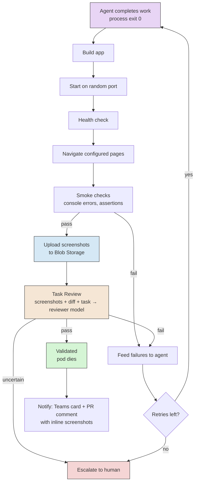

> You shouldn't have to babysit AI agents. Give them a task, lock them in a container, and don't let them out until they can prove it works.

## What This Is

A CLI tool for orchestrating sandboxed AI coding sessions. You describe what you want, pick a model, and `ap` spins up an isolated container, points an AI agent at your repo, and lets it work. When it's done, the system builds the app, serves it, validates it in a real browser, and only then pings you with screenshots and a link to review.

Think **docker-compose but for AI coding agents**.

```bash
ap run ideaspace "Add a dark mode toggle" --model opus
ap run my-api "Add pagination to /users" --model codex
ap watch
```

Three sessions. Different models. Different repos. All sandboxed. All self-validating. You go get coffee.

## The Problem

AI coding agents are powerful but chaotic. Right now you either:

1. **Sit and watch them** — defeats the purpose of automation
2. **Let them loose** — and hope they didn't break everything
3. **Run one at a time** — wasting the fact that these things are embarrassingly parallelisable

And when they're "done", you have no idea if the output actually works until you manually build it, run it, and check. That's not autonomous — that's outsourcing with extra steps.

## The Solution

A hybrid CLI + daemon architecture. Thin client on your laptop, daemon running on Azure. Close your laptop, agents keep working. Phone buzzes when they're done.

```
┌─ Your laptop ──────────────────────┐
│  ap CLI (thin client)              │
│  Commands, TUI dashboard           │
│  Connects/disconnects freely       │
└──────────┬─────────────────────────┘
           │ HTTPS + WebSocket
┌──────────▼─────────────────────────┐
│  Azure (daemon)                    │
│  ┌───────────────────────────────┐ │
│  │ Session Manager               │ │
│  │ Event bus, state, lifecycle   │ │
│  ├───────────────────────────────┤ │
│  │ Container App Jobs            │ │
│  │ ┌─────────┐ ┌─────────┐     │ │
│  │ │ Pod A   │ │ Pod B   │ ... │ │
│  │ │ claude  │ │ codex   │     │ │
│  │ │ + PW    │ │ + PW    │     │ │
│  │ └─────────┘ └─────────┘     │ │
│  ├───────────────────────────────┤ │
│  │ Screenshot Store (Blob)       │ │
│  │ On-demand Preview (ap open)   │ │
│  └───────────────────────────────┘ │
└────────────────────────────────────┘
```

## Core Concepts

### Pods

A pod is an isolated session — a Container App Job with a git worktree, an AI agent, Playwright, and everything it needs to work and validate itself. Pods are:

- **Sandboxed.** Filesystem restricted to the worktree. Network controlled. Can't touch your host.
- **Self-contained.** Dependencies pre-installed via warm images. Agent starts working immediately.
- **Self-validating.** After the agent finishes, the pod builds, serves, and validates with Playwright — all in-container.
- **Ephemeral.** Pod dies after validation. Screenshots are uploaded to blob storage. On-demand preview via `ap open`.

### App Profiles

Pre-configured environments per repo. You set up a profile once, and every session for that repo starts from a warm, ready-to-go container with deps installed.

```bash
ap profile create ideaspace \
  --repo esbenwiberg/ideaspace \
  --template node22-pw \
  --build "npm ci && npm run build" \
  --start "npx astro preview --host 0.0.0.0 --port \$PORT" \
  --health "/" \
  --model opus

ap profile warm ideaspace  # pre-bakes deps into image
```

Profiles support inheritance — define an `astro-base` template and extend it per-project.

### Self-Validation

The killer feature. When an agent says it's done, the daemon doesn't trust it. The pod runs a two-phase lifecycle — agent work, then validation — all inside the same container.

**Phase 1: Agent work** — the AI coding agent runs, makes changes, and exits. Completion is detected by **process exit** — exit code 0 means done, non-zero means error. Simple, universal, works for any runtime.

**Phase 2: Validation** — still inside the same pod, validation kicks in:

**Layer 1: Smoke validation** — does it work at all?

1. Runs the build command
2. Starts the app on a random port
3. Waits for the health check to pass
4. Navigates to each configured page with Playwright
5. Screenshots everything
6. Checks for console errors
7. Runs CSS selector assertions (element exists, text matches)

**Layer 2: Task validation** — did it actually do what was asked?

This is where it gets interesting. A smoke test tells you the app doesn't crash. Task validation tells you the agent actually did the job. The pod takes the original task description, the screenshots of the result, and the git diff, and sends them to a reviewer model:

> "The task was: 'Add a dark mode toggle to the navbar.' Here's a screenshot of the page. Here's the diff. Did the agent accomplish the task? Is the toggle visible? Does it look right?"

The reviewer model (can be a different, cheaper model) returns a structured verdict: pass, fail, or uncertain — with reasoning. On fail, the feedback goes back to the working agent with the specific issues. On uncertain, it escalates to the human.

After validation completes, **screenshots are uploaded to Azure Blob Storage** (expiring URLs, 90-day TTL). The pod then dies — no resources wasted waiting for human review.



### Screenshot Delivery

Screenshots are the primary review artifact. They're delivered through three channels:

1. **PR comment with inline images** — on approve, autopod creates the PR and posts a comment with screenshots embedded via blob URLs. Diff + visual proof in one place. The PR is the single source of truth.
2. **Teams notification card** — thumbnails in the Adaptive Card for quick glance, plus links to full-res screenshots in blob storage.
3. **Blob storage artifacts** — full-resolution screenshots with 90-day expiring URLs. Linked from both PR comments and Teams cards.

### On-Demand Preview

Screenshots cover 90% of reviews. When you need to actually browse the app:

```bash
ap open <id>
# → Spins up a fresh Container App Job from the branch
# → Builds, serves, exposes via ingress
# → https://a1b.autopod.dev
# → Auto-kills after 30min idle
```

No persistent preview infrastructure. No cost when nobody's looking. ~30-60s spin-up when you need it.

### Escalation MCP

Agents shouldn't spin in circles when they're stuck. Every pod gets an MCP server — a lightweight HTTP server running on port 9100 inside the container that proxies requests back to the daemon API. The agent discovers it via `.mcp.json` in the worktree.

Available tools:

- **`ask_human`** — sends a notification to the human (Teams + CLI) with the question. The agent pauses and waits for a response. Good for ambiguous requirements, design decisions, or "should I delete this?"
- **`ask_ai`** — routes the question to another AI model for a second opinion. Useful when the agent is uncertain about an approach, wants to sanity-check an architecture decision, or needs domain knowledge it doesn't have. No human needed — the response comes back in seconds.
- **`report_blocker`** — the agent declares it's stuck and can't proceed. Triggers immediate notification with full context (what it tried, what failed, what it needs). Session pauses until the human responds via `ap tell`.

This turns the agent from a fire-and-forget worker into something that can collaborate. It knows when it doesn't know, and it has a channel to ask instead of guessing.

```bash
# Agent calls ask_human → you get a Teams notification:
# "🤚 Session a1b needs input: Should the dark mode toggle persist
#  across page reloads? localStorage vs cookie vs server-side?"
#
# You respond from CLI:
ap tell a1b "Use localStorage, keep it client-side only"
# → Agent receives answer, continues working
```

The MCP server is injected into every pod automatically. The agent doesn't need to be told it exists — it discovers the tools via MCP and uses them when appropriate. The key config is just who to ask:

```yaml
# In the app profile
escalation:
  ask_human: true                    # enable human escalation
  ask_ai:
    model: sonnet                    # cheaper model for second opinions
    max_calls: 5                     # prevent infinite back-and-forth
  auto_pause_after: 3               # pause after 3 blockers in one session
```

### Multi-Model / Multi-Runtime

Not married to one AI. Same interface, different brains:

| Runtime | Models | How |
|---------|--------|-----|
| **Claude Code** | opus, sonnet | `claude -p --model opus --output-format stream-json` |
| **Codex** | gpt-5.2, etc. | `codex exec --model gpt-5.2 --json` |
| **Future** | Gemini CLI, local models | Same adapter pattern |

Mix and match per task. Run opus on the hard architecture work, sonnet on the boilerplate, codex on the Python stuff. Whatever fits.

## The CLI

Short name: `ap`. Two letters. Fast to type.

```bash
# Auth (Entra ID — device code or PKCE)
ap login

# Profiles
ap profile create <name> --repo <repo> --template <tpl> ...
ap profile warm <name>
ap profile ls

# Run
ap run <profile> "task description" --model opus
ap run <profile> "task description" --model codex --runtime codex

# Monitor
ap watch                          # TUI dashboard
ap status <id>                    # session details
ap logs <id>                      # stream agent logs

# Interact
ap tell <id> "actually use CSS variables"
ap tell <id> --file instructions.md

# Validate
ap validate <id>                  # trigger manually
ap open <id>                      # spin up on-demand preview

# Review
ap diff <id>
ap approve <id>                   # create PR with screenshots, merge branch
ap reject <id> "header is wrong"  # feedback → agent retries
```

See [CLI Design](./cli-design) for the full command reference.

## Auth & Infrastructure

- **CLI auth**: Entra ID via device code flow (works everywhere) or PKCE (smoother when local)
- **Daemon auth**: Validates JWTs against Entra's public keys. No shared secrets.
- **AI API keys**: Stored in Azure Key Vault, accessed via Managed Identity
- **Hosting**: Azure Container Apps (daemon) + Container App Jobs (pods) — scales to zero when idle
- **Screenshots**: Azure Blob Storage with 90-day expiring URLs
- **Notifications**: Teams webhook (Adaptive Cards with screenshot thumbnails)
- **Preview**: On-demand Container App Job via `ap open`, auto-kills after 30min idle
- **Git**: Daemon maintains bare repo cache per profile, creates worktrees per session

See [Architecture](./architecture) for the full technical breakdown.

## Why Not Just Use Claude Squad / Cursor / etc.?

| Tool | What it does | What it doesn't do |
|------|-------------|-------------------|
| **Claude Squad** | Multiple Claude sessions in tmux | No sandboxing, no validation, no multi-model, local only |
| **Cursor** | Multi-agent in IDE | Tied to the IDE, no headless mode, no custom validation |
| **code-container** | Docker sandboxing for agents | No orchestration, no validation, no dashboard |
| **Autopod** | All of the above. Sandboxed, validated, multi-model, remote-capable, CLI-native | Doesn't exist yet |

## Relationship to Other Ideas

- **[Autonomous SDLC](../autonomous-sdlc)**: Autopod is the execution layer. The Autonomous SDLC is the process that runs on top — spec enrichment, trust pillars, enforcer agents. Autopod provides the isolated, validated pods where that process executes.
- **[Daycare](../daycare)**: Similar philosophy — cheap compute grinds, expensive models supervise. Autopod's multi-model support and validation loop make it a natural runtime for the Daycare pattern.

## Monorepo Structure

```
apps/
  cli/                  # ap binary, Ink TUI
  daemon/               # Fastify server, session manager
libs/
  shared/               # types, interfaces, event schemas
  validator/            # Playwright smoke + AI task review
  mcp-escalation/       # HTTP MCP server for pods
  runtime-claude/       # Claude Code adapter
  runtime-codex/        # Codex adapter
```

See [Architecture](./architecture) for package details and the shared types contract.

## Implementation Plan

Detailed implementation plan broken into 5 phases with 15 milestones. Phases 2 and 4 are fully parallelizable (5 and 3 agents respectively).

- [Implementation Overview](./implementation-overview) — Master plan, dependency graph, parallelism map, conventions
- [Data Model](./data-model) — All TypeScript interfaces, SQLite schema, event types, error hierarchy
- [Phase 1: Foundation](./phase-1-foundation) — Monorepo scaffold, shared types, dev environment
- [Phase 2: Core Modules](./phase-2-core-modules) — Auth, Container Engine, Runtime Adapters, Validation Engine, Profile System (5 parallel tracks)
- [Phase 3: Daemon Assembly](./phase-3-daemon-assembly) — API Gateway, Session Manager, Escalation MCP
- [Phase 4: CLI & UX](./phase-4-cli-ux) — CLI Commands, TUI Dashboard, Teams Notifications (3 parallel tracks)
- [Phase 5: Expansion & Deployment](./phase-5-expansion) — Correction Flow, Codex Runtime, Image Warming, Azure Deployment
