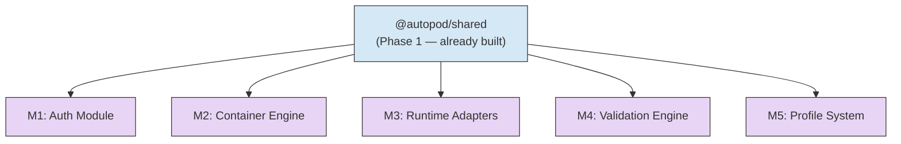

> Five independent modules. Five parallel agents. Zero dependencies between them. Each module implements interfaces from `@autopod/shared` (Phase 1) and nothing else.

## How to Read This Document

This document is designed for **autonomous agent consumption**. Each module section is fully self-contained — an agent implementing M3 does not need to read M1, M2, M4, or M5. Every section includes:

- Exact file paths to create
- Key interfaces to implement (copied from `@autopod/shared` for reference — the source of truth is the shared package)
- Internal component breakdown
- Testing strategy with specific scenarios
- Acceptance criteria as a checklist

**The only dependency for all 5 modules is `@autopod/shared`** — the types, constants, schemas, and error classes defined in Phase 1.

## Parallelism Map



All five modules can be built simultaneously. They share no code, no state, and no communication channels. They only share types from `@autopod/shared`.

---

## M1: Auth Module

**Package locations**: `packages/cli/src/auth/` and `packages/daemon/src/auth/`
**Branch**: `feature/p2-auth-module`
**Dependencies**: `@autopod/shared`, `@azure/msal-node`, `jose` (JWT validation), `fastify`

### What It Does

Handles Entra ID authentication on both sides of the wire. The CLI authenticates the user and stores tokens. The daemon validates JWTs on every inbound request and extracts user identity + roles.

### Shared Types Reference

These types live in `@autopod/shared` — import them, don't redefine them:

```typescript
// From @autopod/shared/types/auth
interface AuthToken {
  accessToken: string;
  refreshToken: string;
  expiresAt: string;             // ISO 8601
  userId: string;                // Entra OID
  displayName: string;
  email: string;
  roles: AppRole[];
}

type AppRole = 'admin' | 'operator' | 'viewer';

interface JwtPayload {
  oid: string;                   // user object ID
  preferred_username: string;
  name: string;
  roles: AppRole[];
  aud: string;                   // app client ID
  iss: string;                   // Entra issuer
  exp: number;
  iat: number;
}
```

Error classes to use: `AuthError` (401), `ForbiddenError` (403) — both from `@autopod/shared/errors`.

### CLI Side: `packages/cli/src/auth/`

#### File: `packages/cli/src/auth/device-code.ts`

Device code flow for headless environments (SSH, CI, containers without browsers).

```typescript
import { PublicClientApplication } from '@azure/msal-node';

export interface DeviceCodeFlowResult {
  authToken: AuthToken;
}

export async function deviceCodeLogin(config: {
  clientId: string;
  tenantId: string;
  scopes: string[];
  onDeviceCode: (code: string, verificationUri: string, expiresIn: number) => void;
}): Promise<DeviceCodeFlowResult>;
```

Implementation details:
- Use `PublicClientApplication` from MSAL with `acquireTokenByDeviceCode`
- The `onDeviceCode` callback is how the CLI displays the code + URL to the user (keep auth logic decoupled from UI)
- Scopes should include `api://<clientId>/access_as_user` and `offline_access` (for refresh tokens)
- On success, map the MSAL `AuthenticationResult` to our `AuthToken` type
- Extract `roles` from the `idTokenClaims` — they're in the `roles` array claim
- If the user doesn't complete auth within the timeout (typically 15 minutes), throw `AuthError`

#### File: `packages/cli/src/auth/pkce.ts`

PKCE flow for interactive terminals with browser access. Opens the browser, handles the redirect.

```typescript
export async function pkceLogin(config: {
  clientId: string;
  tenantId: string;
  scopes: string[];
  redirectPort?: number;         // default: random available port
}): Promise<DeviceCodeFlowResult>;
```

Implementation details:
- Use `PublicClientApplication` with `acquireTokenByCode`
- Start a temporary HTTP server on localhost to receive the redirect
- Generate PKCE code verifier + challenge (MSAL handles this)
- Open the browser with `open` (cross-platform) pointing to the auth URL
- Wait for the redirect, extract the auth code, exchange for tokens
- Kill the temporary server after receiving the code (or on timeout)
- Same `AuthToken` mapping as device code
- Timeout after 120 seconds — if the browser flow doesn't complete, fall back to device code with a helpful message

#### File: `packages/cli/src/auth/token-store.ts`

Persists and retrieves tokens from `~/.autopod/credentials.json`.

```typescript
export interface TokenStore {
  save(token: AuthToken): Promise<void>;
  load(): Promise<AuthToken | null>;
  clear(): Promise<void>;
  isExpired(): Promise<boolean>;
  getAccessToken(): Promise<string>;  // returns valid token, refreshing if needed
}

export function createTokenStore(config: {
  credentialsPath?: string;      // default: ~/.autopod/credentials.json
  refreshFn: (refreshToken: string) => Promise<AuthToken>;
}): TokenStore;
```

Implementation details:
- Store as JSON file with `0600` permissions (owner read/write only) — **this is a security requirement**
- `getAccessToken()` is the main entry point — it checks expiry, refreshes if needed, and returns a valid access token
- Refresh proactively: if token expires within 5 minutes, refresh it rather than waiting for a 401
- If refresh fails (token revoked, network error), clear stored credentials and throw `AuthError` with a message telling the user to run `ap login`
- Use `@autopod/shared` constants for the credentials path default
- Create the `~/.autopod/` directory if it doesn't exist (with `0700` permissions)

#### File: `packages/cli/src/auth/client.ts`

Top-level auth client that picks the right flow and exposes clean methods.

```typescript
export interface AuthClient {
  login(options?: { forceDeviceCode?: boolean }): Promise<AuthToken>;
  logout(): Promise<void>;
  whoami(): Promise<{ user: AuthToken; daemon: DaemonConnection | null }>;
  getAccessToken(): Promise<string>;
}

export function createAuthClient(config: {
  clientId: string;
  tenantId: string;
  scopes: string[];
}): AuthClient;
```

Flow selection logic in `login()`:
1. If `forceDeviceCode` is true, use device code flow
2. If `process.stdout.isTTY` is true and `process.env.DISPLAY` or `process.platform === 'darwin'` or `process.platform === 'win32'`, try PKCE flow
3. Otherwise, fall back to device code flow
4. On PKCE failure/timeout, automatically fall back to device code with a log message

The `whoami()` method should:
- Load stored token
- If token exists, return user info and try to ping the daemon for connection status
- If no token, throw `AuthError`

### Daemon Side: `packages/daemon/src/auth/`

#### File: `packages/daemon/src/auth/jwt-plugin.ts`

Fastify plugin that validates JWT on every request.

```typescript
import { FastifyPluginAsync } from 'fastify';

export interface JwtPluginOptions {
  clientId: string;              // Entra app client ID (used as audience)
  tenantId: string;              // Entra tenant ID
  jwksRefreshInterval?: number;  // ms, default: 3600000 (1 hour)
}

declare module 'fastify' {
  interface FastifyRequest {
    user: RequestUser;
  }
}

export interface RequestUser {
  oid: string;                   // user object ID
  username: string;              // preferred_username
  displayName: string;           // name claim
  roles: AppRole[];
  raw: JwtPayload;               // full decoded payload
}

export const jwtPlugin: FastifyPluginAsync<JwtPluginOptions>;
```

Implementation details:
- Use `jose` library (not `jsonwebtoken` — `jose` supports JWKS fetching and is more modern)
- Fetch Entra JWKS from `https://login.microsoftonline.com/{tenantId}/discovery/v2.0/keys`
- Cache the JWKS keyset. Refresh on a timer (default 1 hour) AND on verification failure (key rotation)
- On each request:
  1. Extract `Authorization: Bearer <token>` header — if missing, throw `AuthError("Missing authorization header")`
  2. Verify JWT signature against JWKS keys
  3. Validate `aud` claim matches `clientId`
  4. Validate `iss` matches `https://login.microsoftonline.com/{tenantId}/v2.0`
  5. Validate `exp` is in the future
  6. Extract user info into `request.user`
- Register `request.user` as a Fastify decorator
- Skip validation for health check endpoint (`GET /health`)
- Log failed auth attempts with the reason (expired, wrong audience, bad signature, etc.) — but never log the token itself

#### File: `packages/daemon/src/auth/roles.ts`

Role-based access control helpers.

```typescript
export type Permission =
  | 'session:create'
  | 'session:read'
  | 'session:message'
  | 'session:validate'
  | 'session:approve'
  | 'session:reject'
  | 'session:kill'
  | 'profile:create'
  | 'profile:read'
  | 'profile:update'
  | 'profile:delete'
  | 'profile:warm';

const ROLE_PERMISSIONS: Record<AppRole, Permission[]> = {
  admin: [/* all permissions */],
  operator: [
    'session:create', 'session:read', 'session:message',
    'session:validate', 'session:approve', 'session:reject', 'session:kill',
    'profile:read',
  ],
  viewer: [
    'session:read',
    'profile:read',
  ],
};

export function hasPermission(user: RequestUser, permission: Permission): boolean;

export function requirePermission(permission: Permission): FastifyPreHandler;
// Returns a Fastify preHandler hook that checks the user's role
// Throws ForbiddenError if the user lacks the permission
```

Implementation details:
- `hasPermission` checks if ANY of the user's roles grants the permission
- Users can have multiple roles — highest privilege wins
- `requirePermission` returns a Fastify preHandler hook for use in route definitions:
  ```typescript
  fastify.post('/sessions', {
    preHandler: [requirePermission('session:create')],
    handler: createSessionHandler,
  });
  ```
- Log permission denials at `warn` level with user OID and attempted permission

### File Structure Summary

```
packages/cli/src/auth/
├── index.ts              # barrel export
├── device-code.ts        # device code flow
├── pkce.ts               # PKCE flow
├── token-store.ts        # credential persistence
└── client.ts             # auth client (picks flow, exposes clean API)

packages/daemon/src/auth/
├── index.ts              # barrel export
├── jwt-plugin.ts         # Fastify JWT validation plugin
└── roles.ts              # role-based access control
```

### Testing Strategy

**Unit tests** (mock MSAL, mock filesystem, mock HTTP):

| Test file | What it covers |
|-----------|---------------|
| `device-code.test.ts` | Happy path: MSAL returns tokens, maps to AuthToken correctly. Error path: user doesn't complete flow (timeout). Error path: MSAL throws network error. |
| `pkce.test.ts` | Happy path: browser flow completes, tokens returned. Timeout: no redirect within 120s. Port conflict: fallback to different port. |
| `token-store.test.ts` | Save and load roundtrip. File permissions are 0600. Token refresh triggered when expiring within 5min. Refresh failure clears stored token. Load returns null when no file exists. |
| `client.test.ts` | PKCE selected on macOS TTY. Device code selected in non-TTY. Force device code flag works. PKCE failure falls back to device code. |
| `jwt-plugin.test.ts` | Valid JWT passes, user info extracted. Missing header returns 401. Expired JWT returns 401. Wrong audience returns 401. Bad signature returns 401. JWKS key rotation (verification failure triggers refresh). Health endpoint skips auth. |
| `roles.test.ts` | Admin has all permissions. Operator can create sessions but not profiles. Viewer can only read. Multiple roles: highest privilege wins. requirePermission hook returns 403 on denied. |

**Test JWT creation helper**: Create a utility that generates JWTs signed with a test RSA key. Mock the JWKS endpoint to serve the test public key. This lets you test the full JWT validation pipeline without hitting Entra.

```typescript
// test/helpers/jwt.ts
export function createTestJwt(claims: Partial<JwtPayload>, options?: {
  expired?: boolean;
  wrongAudience?: boolean;
  wrongIssuer?: boolean;
}): string;

export function getTestJwks(): { keys: JsonWebKey[] };
```

### Acceptance Criteria

- [ ] Device code flow completes and returns a valid `AuthToken`
- [ ] PKCE flow completes and returns a valid `AuthToken`
- [ ] Flow auto-detection picks PKCE on interactive TTY with display, device code otherwise
- [ ] PKCE falls back to device code on failure/timeout
- [ ] Tokens are stored in `~/.autopod/credentials.json` with `0600` permissions
- [ ] `getAccessToken()` silently refreshes tokens expiring within 5 minutes
- [ ] Failed refresh clears stored credentials and throws `AuthError`
- [ ] Daemon rejects requests with no Authorization header (401)
- [ ] Daemon rejects requests with expired JWT (401)
- [ ] Daemon rejects requests with wrong audience (401)
- [ ] Daemon rejects requests with invalid signature (401)
- [ ] Daemon extracts correct `RequestUser` from valid JWT
- [ ] Health endpoint (`GET /health`) is accessible without auth
- [ ] `requirePermission('session:create')` blocks viewers (403)
- [ ] `requirePermission('session:read')` allows viewers (200)
- [ ] Admin role has access to all permissions
- [ ] JWKS keys are cached and refreshed on schedule + on verification failure

---

## M2: Container Engine

**Package location**: `packages/daemon/src/containers/`
**Branch**: `feature/p2-container-engine`
**Dependencies**: `@autopod/shared`, `dockerode`, `simple-git`

### What It Does

Three things: manages Docker containers (spawn, exec, kill), manages git worktrees (create, diff, merge, cleanup), and enforces the session state machine. These three concerns live in the same package because they're tightly coupled in the session lifecycle — but they're separate classes with clean interfaces.

### Shared Types Reference

```typescript
// From @autopod/shared/types/session
type SessionStatus =
  | 'queued' | 'provisioning' | 'running' | 'awaiting_input'
  | 'validating' | 'validated' | 'failed' | 'approved'
  | 'merging' | 'complete' | 'killing' | 'killed';

// From @autopod/shared/constants
const VALID_STATUS_TRANSITIONS: Record<SessionStatus, SessionStatus[]> = {
  queued: ['provisioning', 'killing'],
  provisioning: ['running', 'killing'],
  running: ['awaiting_input', 'validating', 'killing'],
  awaiting_input: ['running', 'killing'],
  validating: ['validated', 'running', 'failed'],
  validated: ['approved', 'running'],
  failed: ['running', 'killing'],
  approved: ['merging'],
  merging: ['complete'],
  complete: [],
  killing: ['killed'],
  killed: [],
};
```

Error classes to use: `ContainerError`, `InvalidStateTransitionError` — from `@autopod/shared/errors`.

### Component: ContainerManager

#### File: `packages/daemon/src/containers/container-manager.ts`

```typescript
import Docker from 'dockerode';

export interface ContainerConfig {
  image: string;                   // Docker image to use (e.g., "autopod-node22:latest")
  worktreePath: string;            // host path to mount as /workspace
  env: Record<string, string>;     // environment variables (API keys, session ID, etc.)
  resourceLimits?: ResourceLimits;
  networkPolicy?: NetworkPolicy;
  sessionId: string;               // used for container naming + labeling
}

export interface ResourceLimits {
  cpuCount: number;                // default: 2
  memoryMb: number;                // default: 4096
}

export interface NetworkPolicy {
  allowedHosts: string[];          // hostnames/IPs allowed for outbound
  // Default: ['api.anthropic.com', 'api.openai.com', 'registry.npmjs.org', 'pypi.org']
}

export interface ContainerStatus {
  containerId: string;
  running: boolean;
  exitCode: number | null;
  cpuPercent: number;
  memoryUsageMb: number;
  startedAt: string;
}

export interface ExecResult {
  exitCode: number;
  stdout: string;
  stderr: string;
}

export interface ContainerManager {
  spawn(config: ContainerConfig): Promise<string>;        // returns container ID
  exec(containerId: string, command: string[]): Promise<ExecResult>;
  execStream(containerId: string, command: string[]): AsyncIterable<Buffer>;
  kill(containerId: string): Promise<void>;
  getStatus(containerId: string): Promise<ContainerStatus>;
  streamLogs(containerId: string): AsyncIterable<string>;
}

export function createContainerManager(docker?: Docker): ContainerManager;
```

Implementation details for `spawn()`:
1. Check if image exists locally. If not, pull it (with progress logging).
2. Create the container with these settings:
   ```typescript
   {
     Image: config.image,
     name: `autopod-${config.sessionId}`,
     Labels: { 'autopod.session': config.sessionId },
     HostConfig: {
       Binds: [`${config.worktreePath}:/workspace:rw`],
       Memory: (config.resourceLimits?.memoryMb ?? 4096) * 1024 * 1024,
       NanoCpus: (config.resourceLimits?.cpuCount ?? 2) * 1e9,
       NetworkMode: 'autopod-net',    // custom Docker network with restrictions
       User: '1000:1000',             // non-root
     },
     WorkingDir: '/workspace',
     Env: Object.entries(config.env).map(([k, v]) => `${k}=${v}`),
     Tty: false,
     OpenStdin: false,
   }
   ```
3. Start the container.
4. Return the container ID.

Implementation details for `exec()`:
- Use `container.exec()` + `exec.start()` from dockerode
- Demux stdout/stderr from the multiplexed stream (dockerode provides a `demuxStream` helper)
- Return combined result with exit code
- Timeout: 30 minutes by default (configurable). Kill the exec if it exceeds timeout.

Implementation details for `execStream()`:
- Same as `exec()` but returns an async iterable of raw output chunks
- Used by RuntimeAdapters to stream agent output in real-time
- Must handle backpressure — if the consumer is slow, buffer up to 1MB then pause the Docker stream

Implementation details for `kill()`:
- `container.stop({ t: 10 })` — give the process 10 seconds to shut down
- Then `container.remove({ force: true, v: true })` — force remove including volumes
- If the container doesn't exist (already removed), swallow the error
- Log the kill event

Implementation details for `getStatus()`:
- Use `container.inspect()` for running state
- Use `container.stats({ stream: false })` for resource usage
- Calculate CPU percentage from the stats delta

#### File: `packages/daemon/src/containers/docker-config.ts`

Builder for Docker container creation options. Keeps the logic for translating our `ContainerConfig` into dockerode's `ContainerCreateOptions` in one place.

```typescript
export function buildContainerOptions(config: ContainerConfig): Docker.ContainerCreateOptions;
```

#### File: `packages/daemon/src/containers/network.ts`

Docker network setup for container isolation.

```typescript
export interface NetworkManager {
  ensureNetwork(): Promise<void>;  // create 'autopod-net' if it doesn't exist
  applyPolicy(containerId: string, policy: NetworkPolicy): Promise<void>;
}

export function createNetworkManager(docker?: Docker): NetworkManager;
```

Implementation details:
- Create a bridge network named `autopod-net` with `--internal` flag (no default internet access)
- To allow specific outbound hosts, use iptables rules injected into the container at startup via an init script
- Default allowed hosts: `api.anthropic.com`, `api.openai.com`, `registry.npmjs.org`, `pypi.org`, `github.com`
- The MCP server URL (on the daemon host) must also be allowed — pass it in as part of the network policy
- Log all blocked connection attempts at `debug` level

### Component: WorktreeManager

#### File: `packages/daemon/src/containers/worktree-manager.ts`

```typescript
import simpleGit from 'simple-git';

export interface WorktreeInfo {
  path: string;                    // absolute path on host
  branch: string;
  repoUrl: string;
  createdAt: string;
}

export interface DiffSummary {
  filesChanged: number;
  insertions: number;
  deletions: number;
  files: Array<{ path: string; insertions: number; deletions: number }>;
}

export interface WorktreeManager {
  create(config: {
    repoUrl: string;
    baseBranch: string;
    newBranch: string;
    sessionId: string;
  }): Promise<WorktreeInfo>;

  getDiff(worktreePath: string): Promise<string>;           // unified diff
  getChangeSummary(worktreePath: string): Promise<DiffSummary>;
  commitAll(worktreePath: string, message: string): Promise<string>;  // returns commit hash
  mergeBranch(worktreePath: string, targetBranch: string): Promise<void>;
  pushBranch(worktreePath: string): Promise<void>;
  cleanup(worktreePath: string): Promise<void>;
}

export function createWorktreeManager(config: {
  basePath: string;                // where to store clones/worktrees (e.g., /var/autopod/worktrees)
  githubToken?: string;            // for private repos
}): WorktreeManager;
```

Implementation details for `create()`:
1. **Clone or reuse**: Check if a bare clone of `repoUrl` exists at `{basePath}/repos/{hash(repoUrl)}`. If not, `git clone --bare`.
2. **Fetch latest**: `git fetch origin` in the bare clone to get latest refs.
3. **Create worktree**: `git worktree add {basePath}/sessions/{sessionId} -b {newBranch} origin/{baseBranch}` — this creates a new branch from the base and checks it out in a new directory.
4. **Return** the worktree info with the absolute path.

Implementation details for `getDiff()`:
- Run `git diff HEAD` in the worktree to get all uncommitted changes
- Also run `git diff {baseBranch}...HEAD` if there are commits to include committed changes
- Truncate to `MAX_DIFF_LENGTH` (50,000 chars) from `@autopod/shared` constants

Implementation details for `cleanup()`:
1. `git worktree remove {path} --force`
2. `git branch -D {branch}` in the bare clone
3. Remove the directory if it still exists (belt and suspenders)

Important edge cases:
- If the repo URL uses HTTPS and requires auth, inject the GitHub token: `https://{token}@github.com/...`
- Handle network failures during clone/fetch gracefully — retry once, then throw `ContainerError`
- Worktree paths must not contain spaces (use session IDs which are nanoid)

### Component: SessionStateMachine

#### File: `packages/daemon/src/containers/state-machine.ts`

```typescript
import { VALID_STATUS_TRANSITIONS } from '@autopod/shared';

export interface StateTransition {
  sessionId: string;
  from: SessionStatus;
  to: SessionStatus;
  timestamp: string;
}

export interface SessionStateMachine {
  transition(
    sessionId: string,
    currentStatus: SessionStatus,
    newStatus: SessionStatus
  ): StateTransition;
  // Throws InvalidStateTransitionError if the transition is not allowed

  canTransition(from: SessionStatus, to: SessionStatus): boolean;

  getValidTransitions(from: SessionStatus): SessionStatus[];
}

export function createStateMachine(config: {
  onTransition?: (transition: StateTransition) => void;
  // Callback fired on every valid transition — used to emit events, update DB, etc.
}): SessionStateMachine;
```

Implementation details:
- `transition()` validates against `VALID_STATUS_TRANSITIONS` — if `to` is not in the allowed list for `from`, throw `InvalidStateTransitionError(sessionId, from, to)`
- On valid transition, call the `onTransition` callback (if provided) and return the `StateTransition` object
- `canTransition()` is a pure check — no side effects
- `getValidTransitions()` returns the allowed next states from the current state
- This class has NO database access — it's a pure logic component. The caller (Session Manager in Phase 3) is responsible for persisting the state change.

### File Structure Summary

```
packages/daemon/src/containers/
├── index.ts                  # barrel export
├── container-manager.ts      # Docker container lifecycle
├── docker-config.ts          # container creation options builder
├── network.ts                # network policy setup
├── worktree-manager.ts       # git worktree operations
└── state-machine.ts          # session state transition logic
```

### Testing Strategy

**Unit tests** (mock dockerode, mock simple-git):

| Test file | What it covers |
|-----------|---------------|
| `container-manager.test.ts` | Spawn creates container with correct config (image, mounts, env, limits, user). Spawn pulls image if not present. Exec returns stdout/stderr/exitCode. Exec timeout kills the process. Kill stops and removes container. Kill ignores already-removed containers. getStatus returns resource usage. |
| `docker-config.test.ts` | Translates ContainerConfig to dockerode options correctly. Default resource limits applied. Custom limits override defaults. Env vars formatted correctly. |
| `network.test.ts` | Network created if not exists. Network not recreated if exists. Policy allows configured hosts. Default hosts are included. |
| `worktree-manager.test.ts` | Create clones repo on first use. Create reuses existing bare clone. Create fetches latest before creating worktree. getDiff returns uncommitted changes. getChangeSummary counts files/lines. Cleanup removes worktree and branch. Private repo auth token injected into URL. |
| `state-machine.test.ts` | Every valid transition in VALID_STATUS_TRANSITIONS succeeds. Every invalid transition throws InvalidStateTransitionError. onTransition callback fires on valid transition. canTransition returns correct boolean. getValidTransitions returns correct list. Terminal states (complete, killed) have no valid transitions. |

**Integration tests** (using testcontainers):

| Test file | What it covers |
|-----------|---------------|
| `container-manager.integration.test.ts` | Spawn a real container from alpine image. Execute a command and get output. Kill the container and verify removal. Resource limits are enforced. |
| `worktree-manager.integration.test.ts` | Clone a real git repo (use a test fixture repo). Create worktree on new branch. Make changes, verify getDiff shows them. Cleanup removes worktree directory. |

### Acceptance Criteria

- [ ] `spawn()` creates a Docker container with the correct image, mounts, env vars, resource limits, and user (UID 1000)
- [ ] `spawn()` pulls the image if not locally available
- [ ] Container's working directory is `/workspace`
- [ ] `exec()` runs a command inside the container and returns stdout/stderr/exit code
- [ ] `execStream()` returns an async iterable of output chunks in real-time
- [ ] `kill()` stops and removes the container (including volumes)
- [ ] `kill()` is idempotent — doesn't throw if container already removed
- [ ] `getStatus()` returns running state and resource usage (CPU %, memory MB)
- [ ] Git worktree created from the correct base branch on a new feature branch
- [ ] Bare clone is reused across sessions for the same repo
- [ ] `getDiff()` returns the unified diff of all changes in the worktree
- [ ] `getChangeSummary()` returns correct file count, insertions, and deletions
- [ ] `cleanup()` removes the worktree directory and deletes the branch
- [ ] Private repos work with injected GitHub token
- [ ] State machine allows all transitions defined in `VALID_STATUS_TRANSITIONS`
- [ ] State machine throws `InvalidStateTransitionError` on illegal transitions (e.g., `queued` -> `validated`)
- [ ] State machine's `onTransition` callback fires on every valid transition
- [ ] Network policy restricts outbound to allowed hosts only

---

## M3: Runtime Adapters

**Package location**: `packages/daemon/src/runtimes/`
**Branch**: `feature/p2-runtime-adapters`
**Dependencies**: `@autopod/shared`

### What It Does

Abstracts over AI coding agents. Provides a common interface (`Runtime`) that the Session Manager (Phase 3) uses to spawn agents, stream their events, send follow-ups, and abort them. Phase 2 implements the Claude adapter only. The Codex adapter comes in Phase 5.

This module does NOT manage containers or state — it receives a `ContainerManager` reference (via dependency injection) and uses `execStream()` to run the agent process inside an already-running container.

### Shared Types Reference

```typescript
// From @autopod/shared/types/runtime
type RuntimeType = 'claude' | 'codex';

interface Runtime {
  type: RuntimeType;
  spawn(config: SpawnConfig): AsyncIterable<AgentEvent>;
  resume(sessionId: string, message: string): AsyncIterable<AgentEvent>;
  abort(sessionId: string): Promise<void>;
}

interface SpawnConfig {
  sessionId: string;
  task: string;
  model: string;
  workDir: string;
  customInstructions?: string;
  env: Record<string, string>;
  mcpServers?: McpServerConfig[];
}

// From @autopod/shared/types/events
type AgentEvent =
  | AgentStatusEvent      // { type: 'status', timestamp, message }
  | AgentToolUseEvent     // { type: 'tool_use', timestamp, tool, input, output? }
  | AgentFileChangeEvent  // { type: 'file_change', timestamp, path, action, diff? }
  | AgentCompleteEvent    // { type: 'complete', timestamp, result }
  | AgentErrorEvent       // { type: 'error', timestamp, message, fatal }
  | AgentEscalationEvent; // { type: 'escalation', timestamp, escalationType, payload }
```

Error class to use: `RuntimeError` — from `@autopod/shared/errors`.

### Component: RuntimeRegistry

#### File: `packages/daemon/src/runtimes/runtime-registry.ts`

```typescript
export interface RuntimeRegistry {
  register(type: RuntimeType, factory: RuntimeFactory): void;
  get(type: RuntimeType): Runtime;
  // Throws RuntimeError if type not registered
}

export type RuntimeFactory = (containerManager: ContainerManager) => Runtime;

export function createRuntimeRegistry(): RuntimeRegistry;
```

Implementation details:
- Simple Map-based registry
- `get()` throws `RuntimeError("Unsupported runtime type: ${type}", type)` if not registered
- In Phase 2, only `claude` is registered. Phase 5 adds `codex`.
- The registry is created at daemon startup and passed to the Session Manager

### Component: ClaudeRuntime

#### File: `packages/daemon/src/runtimes/claude-runtime.ts`

```typescript
export function createClaudeRuntime(containerManager: ContainerManager): Runtime;
```

Implementation details for `spawn()`:

Build the Claude CLI command:
```bash
claude -p "<task>" \
  --model <model> \
  --output-format stream-json \
  --dangerously-skip-permissions \
  --mcp-server "<name>:<url>"    # for each MCP server
```

- The command runs inside the container via `containerManager.execStream(containerId, command)`
- `containerId` is looked up from the session (the caller provides it via `SpawnConfig`)
- If `customInstructions` is provided, write it to `/workspace/CLAUDE.md` inside the container before spawning claude (via `containerManager.exec()`)
- The `--dangerously-skip-permissions` flag is safe here because the container IS the sandbox
- Pass MCP servers with `--mcp-server` flag for each entry in `config.mcpServers`

The spawn returns an `AsyncIterable<AgentEvent>` that:
1. Reads the NDJSON stream from `execStream()`
2. Passes each line through the stream parser (see below)
3. Yields parsed `AgentEvent` objects
4. On stream end, yields a final `AgentCompleteEvent` if not already emitted

Track active sessions in a `Map<string, { containerId: string; processRunning: boolean }>` so `resume()` and `abort()` can reference them.

Implementation details for `resume()`:
```bash
claude -p "<message>" \
  --resume <session-id> \
  --model <model> \
  --output-format stream-json \
  --dangerously-skip-permissions
```
- Same streaming behavior as `spawn()`
- The Claude CLI's `--resume` flag continues the conversation

Implementation details for `abort()`:
- Execute `kill -SIGTERM $(pgrep -f "claude -p")` inside the container
- If the process doesn't exit within 5 seconds, send SIGKILL
- Mark the session as no longer running in the internal tracking map

### Component: Claude Stream Parser

#### File: `packages/daemon/src/runtimes/claude-stream-parser.ts`

This is the most critical piece of M3. Claude's `stream-json` output is NDJSON (newline-delimited JSON). Each line is a complete JSON object. But real-world streams have edge cases.

```typescript
export function parseClaudeStream(
  input: AsyncIterable<Buffer>
): AsyncIterable<AgentEvent>;
```

**Claude stream-json format** — these are the line types the parser must handle:

```json
{"type":"system","subtype":"init","session_id":"abc123","tools":["Read","Edit","Bash"]}
{"type":"assistant","message":{"id":"msg_01","content":[{"type":"text","text":"I'll start by reading the file..."}],"role":"assistant"}}
{"type":"tool_use","tool_use":{"id":"tu_01","name":"Read","input":{"file_path":"/workspace/src/index.ts"}}}
{"type":"tool_result","tool_result":{"tool_use_id":"tu_01","content":"file contents here..."}}
{"type":"assistant","message":{"id":"msg_02","content":[{"type":"text","text":"Now I'll edit the file..."},{"type":"tool_use","id":"tu_02","name":"Edit","input":{"file_path":"/workspace/src/index.ts","old_string":"foo","new_string":"bar"}}],"role":"assistant"}}
{"type":"result","result":"I've completed the task. Here's what I did...","session_id":"abc123","cost":{"input_tokens":1234,"output_tokens":567}}
```

**Mapping rules** — how each Claude event type maps to an `AgentEvent`:

| Claude event | Maps to | Details |
|-------------|---------|---------|
| `{"type":"system"}` | Skip | Internal init, not useful for consumers |
| `{"type":"assistant","message":{...}}` | `AgentStatusEvent` | Extract text content from `message.content` array. Concatenate all `text` type blocks. |
| `{"type":"tool_use","tool_use":{...}}` | `AgentToolUseEvent` | Extract `name` and `input` from `tool_use`. |
| `{"type":"tool_result"}` | Skip OR update previous `AgentToolUseEvent` | If the consumer needs tool output, attach it to the previous tool_use event. Otherwise skip. |
| `{"type":"assistant"}` with `tool_use` in content | Both `AgentStatusEvent` AND `AgentToolUseEvent` | When assistant message contains both text and tool_use blocks, emit both. |
| `{"type":"result"}` | `AgentCompleteEvent` | Extract `result` field. |
| File-modifying tool_use (`Edit`, `Write`, `MultiEdit`) | ALSO emit `AgentFileChangeEvent` | Parse the tool input to extract file path and action. `Edit` = modify, `Write` = create (or modify if file exists), `MultiEdit` = modify. |
| MCP tool calls (`ask_human`, `ask_ai`, `report_blocker`) | `AgentEscalationEvent` | Detect by tool name prefix matching. Parse input as escalation payload. |
| Unrecognized types | Log warning, skip | Don't crash on unknown event types — Claude may add new ones. |

**Edge cases the parser MUST handle**:

1. **Partial lines**: The input is a raw byte stream. Lines can be split across chunks. Buffer bytes and only parse when a newline (`\n`) is seen.
2. **Empty lines**: Skip them silently.
3. **Malformed JSON**: Log a warning with the raw line, skip it, continue parsing. Never crash.
4. **Very long lines**: Tool results can be enormous (file contents). Don't accumulate in memory — truncate `output` in `AgentToolUseEvent` to 10,000 chars.
5. **Backpressure**: The parser is an async generator. It only reads the next chunk when the consumer requests the next item. This naturally handles backpressure.
6. **Stream end without result**: If the stream ends without a `result` event, emit `AgentErrorEvent` with `fatal: true` and message `"Agent process exited without completing"`.
7. **UTF-8 handling**: Buffer must handle multi-byte characters split across chunks. Use `TextDecoder` with `stream: true` option.

```typescript
// Internal implementation sketch
async function* parseClaudeStream(input: AsyncIterable<Buffer>): AsyncIterable<AgentEvent> {
  const decoder = new TextDecoder('utf-8', { fatal: false });
  let buffer = '';
  let sawResult = false;

  for await (const chunk of input) {
    buffer += decoder.decode(chunk, { stream: true });
    const lines = buffer.split('\n');
    buffer = lines.pop()!; // keep incomplete last line in buffer

    for (const line of lines) {
      const trimmed = line.trim();
      if (!trimmed) continue;

      let parsed: unknown;
      try {
        parsed = JSON.parse(trimmed);
      } catch {
        logger.warn({ rawLine: trimmed.slice(0, 200) }, 'Malformed JSON in claude stream');
        continue;
      }

      const events = mapClaudeEvent(parsed);
      for (const event of events) {
        if (event.type === 'complete') sawResult = true;
        yield event;
      }
    }
  }

  // Flush remaining buffer
  if (buffer.trim()) {
    try {
      const parsed = JSON.parse(buffer.trim());
      const events = mapClaudeEvent(parsed);
      for (const event of events) {
        if (event.type === 'complete') sawResult = true;
        yield event;
      }
    } catch {
      logger.warn({ rawLine: buffer.slice(0, 200) }, 'Malformed JSON in final buffer');
    }
  }

  if (!sawResult) {
    yield {
      type: 'error',
      timestamp: new Date().toISOString(),
      message: 'Agent process exited without completing',
      fatal: true,
    };
  }
}
```

#### File: `packages/daemon/src/runtimes/types.ts`

Re-exports from `@autopod/shared` for internal convenience:

```typescript
export type {
  Runtime,
  RuntimeType,
  SpawnConfig,
  McpServerConfig,
  AgentEvent,
  AgentStatusEvent,
  AgentToolUseEvent,
  AgentFileChangeEvent,
  AgentCompleteEvent,
  AgentErrorEvent,
  AgentEscalationEvent,
} from '@autopod/shared';
```

### File Structure Summary

```
packages/daemon/src/runtimes/
├── index.ts                   # barrel export
├── runtime-registry.ts        # factory/registry for runtime implementations
├── claude-runtime.ts          # Claude CLI adapter
├── claude-stream-parser.ts    # NDJSON stream parser for Claude's output
└── types.ts                   # re-exports from @autopod/shared
```

### Testing Strategy

**Test fixtures**: Create a directory `packages/daemon/src/runtimes/__fixtures__/` with real (sanitized) Claude stream-json output samples:

| Fixture file | Content |
|-------------|---------|
| `simple-task.ndjson` | A complete session: init → assistant messages → tool uses → result |
| `with-escalation.ndjson` | Session where agent calls `ask_human` MCP tool |
| `file-operations.ndjson` | Session with Edit, Write, MultiEdit tool calls |
| `partial-lines.bin` | Raw bytes with lines split across chunk boundaries |
| `malformed-mixed.ndjson` | Mix of valid JSON and garbage lines |
| `no-result.ndjson` | Stream that ends without a result event |
| `large-tool-output.ndjson` | Tool result with > 10KB of content |

**Unit tests**:

| Test file | What it covers |
|-----------|---------------|
| `claude-stream-parser.test.ts` | Parse all event types correctly from fixtures. Handle partial lines (feed fixture byte-by-byte). Handle malformed JSON (log + skip). Handle empty lines. Handle stream end without result (emit error event). Truncate large tool output. UTF-8 multi-byte characters split across chunks. File-modifying tools emit AgentFileChangeEvent. MCP tool calls emit AgentEscalationEvent. |
| `claude-runtime.test.ts` | `spawn()` builds correct CLI command with all flags. `spawn()` writes CLAUDE.md when customInstructions provided. `spawn()` includes MCP server flags. `resume()` uses --resume flag with session ID. `abort()` sends SIGTERM then SIGKILL. Internal session tracking map updated on spawn/complete/abort. |
| `runtime-registry.test.ts` | Register and retrieve runtime. Throws RuntimeError for unregistered type. Can register multiple types. |

### Acceptance Criteria

- [ ] `ClaudeRuntime.spawn()` builds the correct `claude` CLI command with `--model`, `--output-format stream-json`, `--dangerously-skip-permissions`
- [ ] `ClaudeRuntime.spawn()` writes `CLAUDE.md` to the container when `customInstructions` is provided
- [ ] `ClaudeRuntime.spawn()` passes MCP server configs as `--mcp-server` flags
- [ ] Stream parser correctly maps `assistant` messages to `AgentStatusEvent`
- [ ] Stream parser correctly maps `tool_use` to `AgentToolUseEvent`
- [ ] Stream parser correctly maps `result` to `AgentCompleteEvent`
- [ ] Stream parser detects file-modifying tools (`Edit`, `Write`, `MultiEdit`) and emits `AgentFileChangeEvent`
- [ ] Stream parser detects MCP escalation tools and emits `AgentEscalationEvent`
- [ ] Stream parser handles partial lines split across chunks
- [ ] Stream parser handles malformed JSON (log warning, skip, continue)
- [ ] Stream parser handles empty lines (skip silently)
- [ ] Stream parser truncates tool output exceeding 10,000 chars
- [ ] Stream parser emits `AgentErrorEvent(fatal: true)` when stream ends without result
- [ ] `ClaudeRuntime.resume()` uses `--resume` flag with session ID
- [ ] `ClaudeRuntime.abort()` sends SIGTERM to the claude process inside the container
- [ ] `RuntimeRegistry.get('claude')` returns the Claude runtime
- [ ] `RuntimeRegistry.get('codex')` throws `RuntimeError` (not yet implemented)

---

## M4: Validation Engine

**Package location**: `packages/validator/`
**Branch**: `feature/p2-validation-engine`
**Dependencies**: `@autopod/shared`, `playwright`, `@anthropic-ai/sdk`

### What It Does

Two-layer validation: smoke checks (does the app build, serve, and render?) and task review (did the agent actually do what was asked?). The validator receives a worktree path and a profile config, then runs the full pipeline and returns a structured `ValidationResult`.

This is a standalone package — it doesn't import from `packages/daemon` or `packages/cli`. It exports a single `Validator` class that the Session Manager (Phase 3) calls.

### Shared Types Reference

```typescript
// From @autopod/shared/types/validation
interface ValidationResult {
  sessionId: string;
  attempt: number;
  timestamp: string;
  smoke: SmokeResult;
  taskReview: TaskReviewResult | null;  // null if smoke failed
  overall: 'pass' | 'fail';
  duration: number;
}

interface SmokeResult {
  status: 'pass' | 'fail';
  build: BuildResult;
  health: HealthResult;
  pages: PageResult[];
}

interface BuildResult {
  status: 'pass' | 'fail';
  output: string;
  duration: number;
}

interface HealthResult {
  status: 'pass' | 'fail';
  url: string;
  responseCode: number | null;
  duration: number;
}

interface PageResult {
  path: string;
  status: 'pass' | 'fail';
  screenshotPath: string;
  consoleErrors: string[];
  assertions: AssertionResult[];
  loadTime: number;
}

interface AssertionResult {
  selector: string;
  type: PageAssertion['type'];
  expected: string | undefined;
  actual: string | undefined;
  passed: boolean;
}

interface TaskReviewResult {
  status: 'pass' | 'fail' | 'uncertain';
  reasoning: string;
  issues: string[];
  model: string;
  screenshots: string[];
  diff: string;
}

// From @autopod/shared/types/profile
interface ValidationPage {
  path: string;
  assertions?: PageAssertion[];
}

interface PageAssertion {
  selector: string;
  type: 'exists' | 'text_contains' | 'visible' | 'count';
  value?: string;
}

// From @autopod/shared/constants
const MAX_BUILD_LOG_LENGTH = 10_000;
const MAX_DIFF_LENGTH = 50_000;
const SCREENSHOT_QUALITY = 80;
```

Error class to use: `ValidationError` — from `@autopod/shared/errors`.

### Component: Validator (Top-Level Orchestrator)

#### File: `packages/validator/src/validator.ts`

```typescript
export interface ValidatorConfig {
  screenshotDir: string;         // where to store screenshots (e.g., /var/autopod/screenshots)
  anthropicApiKey: string;       // for task review
  reviewerModel?: string;        // default: 'claude-sonnet-4-20250514'
}

export interface ValidateInput {
  sessionId: string;
  attempt: number;
  worktreePath: string;          // absolute path to the git worktree
  task: string;                  // original task description
  diff: string;                  // git diff of changes
  buildCommand: string;
  startCommand: string;
  healthPath: string;
  healthTimeout: number;         // seconds
  validationPages: ValidationPage[];
}

export interface Validator {
  validate(input: ValidateInput): Promise<ValidationResult>;
}

export function createValidator(config: ValidatorConfig): Validator;
```

Implementation flow of `validate()`:
1. Run smoke validation → get `SmokeResult`
2. If smoke fails, return `ValidationResult` with `overall: 'fail'` and `taskReview: null`
3. If smoke passes, run task review with screenshots + diff → get `TaskReviewResult`
4. Determine overall: pass if both smoke and task review pass. Fail otherwise.
5. Return complete `ValidationResult`

Critical: **Always clean up**. The app process must be killed even if validation throws. Use try/finally.

### Component: SmokeValidator

#### File: `packages/validator/src/smoke-validator.ts`

```typescript
export interface SmokeValidatorConfig {
  screenshotDir: string;
}

export interface SmokeValidateInput {
  sessionId: string;
  worktreePath: string;
  buildCommand: string;
  startCommand: string;
  healthPath: string;
  healthTimeout: number;
  validationPages: ValidationPage[];
}

export interface SmokeValidator {
  run(input: SmokeValidateInput): Promise<SmokeResult>;
}

export function createSmokeValidator(config: SmokeValidatorConfig): SmokeValidator;
```

Implementation flow of `run()`:

**Step 1: Build**
- Execute `buildCommand` in `worktreePath` using `child_process.execSync` (or spawn for streaming)
- Capture stdout + stderr combined
- Truncate output to `MAX_BUILD_LOG_LENGTH` (keep last N chars — the end of build output is more useful than the start)
- If build exits non-zero, return `SmokeResult` with `build.status: 'fail'` immediately — don't proceed to serve
- Record duration

**Step 2: Serve**
- Pick a random available port (use `get-port` or `net.createServer` trick)
- Replace `$PORT` in `startCommand` with the chosen port
- Spawn the app process with `child_process.spawn` in `worktreePath`
- Store the child process reference for cleanup

**Step 3: Health check**
- Poll `http://localhost:{port}{healthPath}` every 2 seconds
- Success: HTTP 200 response
- Timeout: `healthTimeout` seconds
- If timeout, return `SmokeResult` with `health.status: 'fail'` — kill the app process

**Step 4: Page validation**
- Launch Playwright Chromium browser (headless)
- For each `ValidationPage`:
  1. Navigate to `http://localhost:{port}{page.path}`
  2. Wait for `networkidle` (or 10 second timeout)
  3. Capture full-page screenshot → save to `{screenshotDir}/{sessionId}/{page.path.replace(/\//g, '_')}.jpeg`
  4. Collect console errors (register `page.on('console')` before navigation, filter for `error` level)
  5. Run assertions (see AssertionRunner below)
  6. Record load time
  7. Page passes if: no console errors AND all assertions pass
- Close the browser

**Step 5: Cleanup**
- Kill the app process (`process.kill(pid, 'SIGTERM')`, then SIGKILL after 5 seconds)
- Always runs, even if earlier steps threw

**Result**:
- `SmokeResult.status` is `'pass'` if build passed AND health passed AND all pages passed
- Otherwise `'fail'`

#### File: `packages/validator/src/process-manager.ts`

Manages the build and serve child processes.

```typescript
export interface ManagedProcess {
  pid: number;
  kill(): Promise<void>;          // SIGTERM → wait 5s → SIGKILL
  waitForExit(): Promise<{ exitCode: number; output: string }>;
}

export function runBuild(command: string, cwd: string): Promise<{
  exitCode: number;
  output: string;
  duration: number;
}>;

export function startApp(command: string, cwd: string, port: number): ManagedProcess;

export async function waitForHealth(
  url: string,
  timeoutSeconds: number,
  pollIntervalMs?: number        // default: 2000
): Promise<HealthResult>;
```

Implementation details:
- `runBuild` runs synchronously (blocking) — builds must complete before serving
- `startApp` spawns asynchronously — the app keeps running while we validate
- `kill()` on `ManagedProcess` must handle the case where the process already exited
- Port replacement: replace literal `$PORT` in the command string before spawning
- Set `NODE_ENV=production` in the environment for builds (unless overridden)

### Component: AssertionRunner

#### File: `packages/validator/src/assertion-runner.ts`

```typescript
import { Page } from 'playwright';

export async function runAssertions(
  page: Page,
  assertions: PageAssertion[]
): Promise<AssertionResult[]>;
```

Implementation for each assertion type:

**`exists`**: `page.locator(selector).count() > 0`
```typescript
{
  selector, type: 'exists',
  expected: undefined,
  actual: String(count),
  passed: count > 0,
}
```

**`visible`**: `page.locator(selector).first().isVisible()`
```typescript
{
  selector, type: 'visible',
  expected: undefined,
  actual: String(isVisible),
  passed: isVisible,
}
```

**`text_contains`**: `page.locator(selector).first().textContent()` then check includes
```typescript
{
  selector, type: 'text_contains',
  expected: value,
  actual: textContent?.slice(0, 500),  // truncate for readability
  passed: textContent?.includes(value!) ?? false,
}
```

**`count`**: `page.locator(selector).count()` then compare to expected
```typescript
{
  selector, type: 'count',
  expected: value,
  actual: String(count),
  passed: count === Number(value),
}
```

Edge cases:
- If the selector is invalid CSS, catch the error and return `passed: false` with `actual: 'Invalid selector'`
- Each assertion has a 5-second timeout — if Playwright hangs waiting for an element, fail the assertion rather than blocking indefinitely

### Component: TaskReviewer

#### File: `packages/validator/src/task-reviewer.ts`

```typescript
import Anthropic from '@anthropic-ai/sdk';

export interface TaskReviewPayload {
  task: string;
  diff: string;
  screenshots: Array<{ path: string; base64: string; mimeType: string }>;
  filesChanged: string[];
}

export interface TaskReviewer {
  review(payload: TaskReviewPayload): Promise<TaskReviewResult>;
}

export function createTaskReviewer(config: {
  apiKey: string;
  model?: string;                // default: 'claude-sonnet-4-20250514'
}): TaskReviewer;
```

Implementation details:

Build the API call:
```typescript
const response = await anthropic.messages.create({
  model: config.model ?? 'claude-sonnet-4-20250514',
  max_tokens: 1024,
  messages: [{
    role: 'user',
    content: [
      // Screenshots as images
      ...payload.screenshots.map(s => ({
        type: 'image' as const,
        source: { type: 'base64' as const, media_type: s.mimeType, data: s.base64 },
      })),
      // Text prompt
      {
        type: 'text' as const,
        text: `The task was: "${payload.task}"

The agent made these changes:

Files changed: ${payload.filesChanged.join(', ')}

Diff:
\`\`\`
${payload.diff.slice(0, MAX_DIFF_LENGTH)}
\`\`\`

Did the agent accomplish the task correctly? Look for: missing UI elements, wrong positioning, broken layouts, incomplete implementations, anything that doesn't match the task description.

Respond with ONLY valid JSON (no markdown, no explanation outside the JSON):
{ "status": "pass" | "fail" | "uncertain", "reasoning": "string explaining why", "issues": ["specific problem 1", "specific problem 2"] }`,
      },
    ],
  }],
});
```

Parse the response:
- Extract text content from the response
- Parse as JSON
- Validate that `status` is one of `pass`, `fail`, `uncertain`
- If JSON parsing fails, return `{ status: 'uncertain', reasoning: 'Failed to parse reviewer response', issues: ['Reviewer response was not valid JSON'] }`
- Never crash on a bad reviewer response — degrade gracefully to `uncertain`

Cost control:
- Truncate diff to `MAX_DIFF_LENGTH` before sending
- Use JPEG screenshots at `SCREENSHOT_QUALITY` (80) — not PNG
- Model defaults to Sonnet (cheaper than Opus for review tasks)

#### File: `packages/validator/src/screenshot.ts`

```typescript
export async function captureScreenshot(
  page: Page,
  outputPath: string,
  options?: { quality?: number; fullPage?: boolean }
): Promise<string>;  // returns the absolute path to the saved file

export async function screenshotToBase64(filePath: string): Promise<{
  base64: string;
  mimeType: string;
}>;
```

### File Structure Summary

```
packages/validator/
├── src/
│   ├── index.ts               # barrel export (exports Validator + createValidator)
│   ├── validator.ts           # top-level orchestrator
│   ├── smoke-validator.ts     # Playwright smoke checks
│   ├── task-reviewer.ts       # AI task review
│   ├── assertion-runner.ts    # CSS assertion checks
│   ├── process-manager.ts     # build/serve process management
│   └── screenshot.ts          # screenshot capture + storage
├── package.json
└── tsconfig.json
```

### Testing Strategy

**Test fixture app**: Create a minimal static HTML app at `packages/validator/src/__fixtures__/test-app/` with:
- `index.html` — page with known elements for assertion testing
- `about.html` — second page for multi-page validation
- `broken.html` — page that throws console errors
- `package.json` with build and start scripts

```html
<!-- index.html -->
<!DOCTYPE html>
<html>
<head><title>Test App</title></head>
<body>
  <h1 id="title">Hello World</h1>
  <nav class="nav-item">
    <a href="/about.html">About</a>
  </nav>
  <div class="card" data-testid="card">Card 1</div>
  <div class="card" data-testid="card">Card 2</div>
  <div class="card" data-testid="card">Card 3</div>
</body>
</html>
```

**Unit tests**:

| Test file | What it covers |
|-----------|---------------|
| `assertion-runner.test.ts` | `exists`: passes when selector matches, fails when it doesn't. `visible`: passes when element visible. `text_contains`: passes when text includes value. `count`: passes when count matches. Invalid selector returns failed result, not crash. |
| `task-reviewer.test.ts` | Sends correct payload to Anthropic API (mock). Parses valid JSON response. Handles pass/fail/uncertain status. Handles malformed reviewer response (returns uncertain). Truncates diff to MAX_DIFF_LENGTH. |
| `process-manager.test.ts` | `runBuild` returns exit code and output. `runBuild` truncates output. `startApp` replaces $PORT. `waitForHealth` polls and succeeds. `waitForHealth` times out. `kill()` sends SIGTERM then SIGKILL. |
| `screenshot.test.ts` | Captures screenshot to correct path. Converts to base64 with correct mime type. Creates directories if needed. |

**Integration tests** (require Playwright — use the test fixture app):

| Test file | What it covers |
|-----------|---------------|
| `smoke-validator.integration.test.ts` | Full smoke pipeline against test-app: build succeeds, health passes, pages render, screenshots captured. Build failure short-circuits (no serve attempt). Health timeout returns fail. Console errors detected on broken.html. All assertion types work against real HTML. App process killed after validation (no orphan processes). |
| `validator.integration.test.ts` | Full pipeline: smoke passes → task review runs. Smoke fails → task review skipped, overall fail. Task review fail → overall fail. |

### Acceptance Criteria

- [ ] Build step executes the build command in the worktree and captures output
- [ ] Build failure (non-zero exit) short-circuits — no serve or page checks attempted
- [ ] Build output truncated to `MAX_BUILD_LOG_LENGTH` (keeping the tail)
- [ ] App served on random port with `$PORT` substitution
- [ ] Health check polls every 2 seconds until 200 response or timeout
- [ ] Health timeout returns `HealthResult` with `status: 'fail'`
- [ ] Full-page screenshots captured as JPEG at quality 80 for each validation page
- [ ] Console errors captured from the browser and included in `PageResult`
- [ ] Assertion `exists` passes when CSS selector matches at least one element
- [ ] Assertion `visible` passes when first matching element is visible
- [ ] Assertion `text_contains` passes when element text includes expected value
- [ ] Assertion `count` passes when number of matching elements equals expected
- [ ] Invalid CSS selectors don't crash — they produce a failed assertion result
- [ ] Task reviewer sends screenshots + diff + task to Anthropic API
- [ ] Task reviewer parses structured JSON response into `TaskReviewResult`
- [ ] Task reviewer degrades to `uncertain` on malformed response (doesn't crash)
- [ ] Diff truncated to `MAX_DIFF_LENGTH` before sending to reviewer
- [ ] App process killed after validation, even if validation throws
- [ ] No orphan processes left after validation completes
- [ ] `ValidationResult.overall` is `'pass'` only if both smoke and task review pass
- [ ] Smoke failure results in `taskReview: null` in the result

---

## M5: Profile System

**Package location**: `packages/daemon/src/profiles/`
**Branch**: `feature/p2-profile-system`
**Dependencies**: `@autopod/shared`, `better-sqlite3`

### What It Does

CRUD for app profiles with inheritance support. Profiles define how a repo gets built, served, validated, and what AI model runs against it. Profiles can extend other profiles to share common configuration.

This module owns the profiles table in SQLite. It provides a `ProfileStore` that the API Gateway (Phase 3) calls for all profile operations.

### Shared Types Reference

```typescript
// From @autopod/shared/types/profile
interface Profile {
  name: string;
  repoUrl: string;
  defaultBranch: string;
  template: StackTemplate;
  buildCommand: string;
  startCommand: string;
  healthPath: string;
  healthTimeout: number;
  validationPages: ValidationPage[];
  maxValidationAttempts: number;
  defaultModel: string;
  defaultRuntime: RuntimeType;
  customInstructions: string | null;
  escalation: EscalationConfig;
  extends: string | null;
  warmImageTag: string | null;
  warmImageBuiltAt: string | null;
  createdAt: string;
  updatedAt: string;
}

type StackTemplate = 'node22' | 'node22-pw' | 'dotnet9' | 'python312' | 'custom';

// From @autopod/shared/schemas/profile.schema
// Zod schema for validating profile input
```

Error classes to use: `ProfileNotFoundError` (404), `ProfileExistsError` (409) — from `@autopod/shared/errors`.

### Component: ProfileStore

#### File: `packages/daemon/src/profiles/profile-store.ts`

```typescript
import Database from 'better-sqlite3';

export interface CreateProfileInput {
  name: string;
  repoUrl: string;
  defaultBranch?: string;          // default: 'main'
  template?: StackTemplate;        // default: 'node22'
  buildCommand: string;
  startCommand: string;
  healthPath?: string;             // default: '/'
  healthTimeout?: number;          // default: 120
  validationPages?: ValidationPage[];
  maxValidationAttempts?: number;  // default: 3
  defaultModel?: string;           // default: 'opus'
  defaultRuntime?: RuntimeType;    // default: 'claude'
  customInstructions?: string;
  escalation?: Partial<EscalationConfig>;
  extends?: string;
}

export interface UpdateProfileInput {
  repoUrl?: string;
  defaultBranch?: string;
  template?: StackTemplate;
  buildCommand?: string;
  startCommand?: string;
  healthPath?: string;
  healthTimeout?: number;
  validationPages?: ValidationPage[];
  maxValidationAttempts?: number;
  defaultModel?: string;
  defaultRuntime?: RuntimeType;
  customInstructions?: string;
  escalation?: Partial<EscalationConfig>;
  extends?: string | null;
}

export interface ProfileStore {
  create(input: CreateProfileInput): Profile;
  get(name: string): Profile;              // resolved (inheritance applied)
  getRaw(name: string): Profile;           // unresolved (as stored)
  list(): Profile[];                       // all profiles, resolved
  update(name: string, changes: UpdateProfileInput): Profile;
  delete(name: string): void;
  exists(name: string): boolean;
}

export function createProfileStore(db: Database.Database): ProfileStore;
```

Implementation details for `create()`:
1. Validate input with Zod schema from `@autopod/shared`
2. If `extends` is provided, verify parent profile exists — throw `ProfileNotFoundError` if not
3. Check name doesn't already exist — throw `ProfileExistsError` if it does
4. Apply defaults for optional fields
5. Serialize `validationPages` and `escalation` as JSON strings for SQLite
6. Insert into `profiles` table
7. Return the created profile (resolved, with inheritance applied if `extends` is set)

Implementation details for `get()`:
1. Fetch the raw profile from SQLite — throw `ProfileNotFoundError` if not found
2. Deserialize JSON fields (`validation_pages`, `escalation_config`)
3. Map snake_case columns to camelCase TypeScript fields
4. If `extends` is set, resolve inheritance (see inheritance logic below)
5. Return the resolved profile

Implementation details for `update()`:
1. Verify profile exists — throw `ProfileNotFoundError` if not
2. Validate changes with partial Zod schema
3. If `extends` is being changed, verify new parent exists
4. Build SQL UPDATE with only the changed fields (don't overwrite untouched fields)
5. Update `updated_at` timestamp
6. Return the updated profile (resolved)

Implementation details for `delete()`:
1. Check if any sessions reference this profile: `SELECT COUNT(*) FROM sessions WHERE profile_name = ? AND status NOT IN ('complete', 'killed')`
2. If active sessions exist, throw `AutopodError("Cannot delete profile with active sessions", 'PROFILE_IN_USE', 409)`
3. Check if any other profiles extend this one: `SELECT name FROM profiles WHERE extends = ?`
4. If child profiles exist, throw `AutopodError("Cannot delete profile that is extended by: ${children.join(', ')}", 'PROFILE_HAS_CHILDREN', 409)`
5. Delete from `profiles` table

**Column mapping** (SQLite snake_case → TypeScript camelCase):

| SQLite column | TypeScript field |
|--------------|-----------------|
| `name` | `name` |
| `repo_url` | `repoUrl` |
| `default_branch` | `defaultBranch` |
| `template` | `template` |
| `build_command` | `buildCommand` |
| `start_command` | `startCommand` |
| `health_path` | `healthPath` |
| `health_timeout` | `healthTimeout` |
| `validation_pages` | `validationPages` (JSON) |
| `max_validation_attempts` | `maxValidationAttempts` |
| `default_model` | `defaultModel` |
| `default_runtime` | `defaultRuntime` |
| `custom_instructions` | `customInstructions` |
| `escalation_config` | `escalation` (JSON) |
| `extends` | `extends` |
| `warm_image_tag` | `warmImageTag` |
| `warm_image_built_at` | `warmImageBuiltAt` |
| `created_at` | `createdAt` |
| `updated_at` | `updatedAt` |

### Component: Inheritance Resolution

#### File: `packages/daemon/src/profiles/inheritance.ts`

```typescript
export function resolveInheritance(
  child: Profile,
  parent: Profile
): Profile;
```

**Inheritance rules** — these are specific and agents implementing this module must follow them exactly:

1. **Simple fields** (strings, numbers, booleans): Child's value wins if set. If the child field is `null` or was never set (uses the default), inherit from parent.

2. **`validationPages`**: Child's pages are **APPENDED** to parent's pages. Not replaced.
   ```typescript
   resolved.validationPages = [...parent.validationPages, ...child.validationPages];
   ```
   Rationale: A child profile typically adds new pages to check, not replaces the parent's health checks.

3. **`escalation`** (EscalationConfig): **Deep merged**. Child overrides individual keys within the object.
   ```typescript
   resolved.escalation = {
     ...parent.escalation,
     ...child.escalation,
     askAi: {
       ...parent.escalation.askAi,
       ...child.escalation?.askAi,
     },
   };
   ```

4. **`customInstructions`**: Child's instructions are **APPENDED** after parent's, separated by `\n\n`.
   ```typescript
   if (parent.customInstructions && child.customInstructions) {
     resolved.customInstructions = `${parent.customInstructions}\n\n${child.customInstructions}`;
   } else {
     resolved.customInstructions = child.customInstructions ?? parent.customInstructions;
   }
   ```

5. **Never inherited**: `name`, `extends`, `createdAt`, `updatedAt`. These always come from the child.

6. **Multi-level inheritance**: If parent also extends another profile, resolve the parent first (recursively). Limit recursion depth to 5 — throw `AutopodError("Inheritance chain too deep (max 5 levels)", 'INHERITANCE_TOO_DEEP', 400)` if exceeded.

7. **Circular inheritance detection**: Before resolving, walk the chain and check for cycles. If `A extends B extends A`, throw `AutopodError("Circular inheritance detected: ${chain.join(' → ')}", 'CIRCULAR_INHERITANCE', 400)`.

### Component: ProfileValidator

#### File: `packages/daemon/src/profiles/profile-validator.ts`

```typescript
export interface ProfileValidationResult {
  valid: boolean;
  errors: string[];
}

export function validateProfile(input: CreateProfileInput): ProfileValidationResult;
```

Validation checks:
- `name`: Must be lowercase alphanumeric + hyphens only. 1-50 chars. Regex: `/^[a-z0-9][a-z0-9-]{0,48}[a-z0-9]$/` (min 2 chars if you want hyphens, or single char is fine)
- `repoUrl`: Must be a valid URL starting with `https://`. Must contain `github.com` or `dev.azure.com` (for now — can expand later).
- `template`: Must be a valid `StackTemplate` value
- `buildCommand`: Must not be empty. Must not contain `rm -rf /`, `sudo`, or `curl | bash` patterns (basic safety check — not foolproof, just catches obvious disasters)
- `startCommand`: Must not be empty. Must contain `$PORT` (the app must bind to the assigned port)
- `healthPath`: Must start with `/`
- `healthTimeout`: Must be between 10 and 600 seconds
- `defaultModel`: Must be one of known models (from `@autopod/shared` constants if defined, or a simple allowlist: `['opus', 'sonnet', 'haiku', 'gpt-5.2', 'codex']`)
- `defaultRuntime`: Must be a valid `RuntimeType`
- `maxValidationAttempts`: Must be between 1 and 10

Return ALL errors at once (don't short-circuit on first error). This lets the user fix everything in one pass.

### File Structure Summary

```
packages/daemon/src/profiles/
├── index.ts                    # barrel export
├── profile-store.ts            # CRUD with SQLite
├── inheritance.ts              # inheritance resolution logic
└── profile-validator.ts        # input validation
```

### Testing Strategy

**Test database**: Each test file creates a fresh in-memory SQLite database (`new Database(':memory:')`). Run the migration SQL from Phase 1 to create the tables.

```typescript
// test helper
function createTestDb(): Database.Database {
  const db = new Database(':memory:');
  db.exec(MIGRATION_001_SQL); // create tables
  return db;
}
```

**Unit tests**:

| Test file | What it covers |
|-----------|---------------|
| `profile-store.test.ts` | Create profile and read it back. Create with all defaults. Create with all fields specified. Create fails on duplicate name (ProfileExistsError). Get throws ProfileNotFoundError for nonexistent. Update changes specific fields only. Update doesn't touch untouched fields. Delete removes profile. Delete fails with active sessions. Delete fails when extended by other profiles. List returns all profiles. JSON serialization/deserialization for validationPages and escalation. |
| `inheritance.test.ts` | Child overrides parent's simple fields. Child inherits parent's simple fields when not set. validationPages are appended (parent pages first). escalation is deep merged. customInstructions are concatenated with separator. name, extends, createdAt, updatedAt always from child. Multi-level inheritance (A extends B extends C). Circular inheritance detected and throws. Depth limit (> 5 levels) throws. |
| `profile-validator.test.ts` | Valid profile passes. Invalid name (uppercase, spaces, special chars) fails. Invalid repoUrl (not https, not github/azure) fails. Dangerous build command patterns detected. Start command without $PORT fails. Health path without leading / fails. Health timeout out of range fails. Unknown model fails. Unknown runtime fails. Multiple errors returned at once. |

### Acceptance Criteria

- [ ] `create()` inserts a profile with all fields correctly serialized
- [ ] `create()` applies defaults for optional fields (defaultBranch='main', template='node22', etc.)
- [ ] `create()` throws `ProfileExistsError` if name already taken
- [ ] `create()` throws `ProfileNotFoundError` if `extends` references nonexistent parent
- [ ] `get()` returns a fully resolved profile (inheritance applied)
- [ ] `getRaw()` returns the profile as stored (no inheritance)
- [ ] `list()` returns all profiles with inheritance resolved
- [ ] `update()` changes only the specified fields
- [ ] `update()` updates `updatedAt` timestamp
- [ ] `delete()` removes the profile
- [ ] `delete()` throws if active sessions reference the profile
- [ ] `delete()` throws if other profiles extend this one
- [ ] Inheritance: child overrides parent's simple fields
- [ ] Inheritance: `validationPages` are appended (parent first, child second)
- [ ] Inheritance: `escalation` is deep merged (child overrides individual keys)
- [ ] Inheritance: `customInstructions` are concatenated with `\n\n` separator
- [ ] Inheritance: `name`, `extends`, `createdAt`, `updatedAt` are never inherited
- [ ] Inheritance: multi-level chains resolve correctly (up to 5 levels)
- [ ] Inheritance: circular references detected and rejected
- [ ] Validation: rejects invalid profile names, URLs, commands, and out-of-range values
- [ ] Validation: returns all errors at once (doesn't short-circuit)
- [ ] JSON fields (`validationPages`, `escalation`) survive roundtrip through SQLite

---

## Cross-Module Conventions

These apply to ALL five modules. Every implementing agent should follow them.

### Error Handling

- Use typed error classes from `@autopod/shared/errors` (see [Data Model](./data-model))
- Never throw raw strings or generic `Error` instances
- Always include context in error messages: session ID, profile name, container ID — whatever is relevant
- Log errors with structured fields via pino, not string interpolation

### Logging

Every module uses pino. Create a child logger with the module name:

```typescript
import pino from 'pino';

const logger = pino({ name: 'autopod' }).child({ component: 'auth' });
// or: 'containers', 'runtimes', 'validator', 'profiles'
```

Log levels:
- `error`: Something broke and needs attention
- `warn`: Something unexpected but handled (malformed input, retry, degraded response)
- `info`: Significant operations (session spawned, validation complete, profile created)
- `debug`: Detailed operation trace (JWKS refresh, container stats, SQL queries)

### TypeScript

- `strict: true` in every package's `tsconfig.json`
- Extend `tsconfig.base.json` from the monorepo root
- No `any` unless unavoidable (and commented why)
- Use `interface` for object shapes, `type` for unions and intersections
- Export types explicitly via barrel `index.ts`

### Testing

- Vitest, co-located: `foo.ts` → `foo.test.ts`
- Test naming: `describe('ComponentName')` → `it('should do the specific thing')`
- 80%+ coverage on business logic
- Use `vi.mock()` for dependency injection in unit tests
- Integration tests in a separate `*.integration.test.ts` file

### Package.json

Each module (where applicable) should have:

```json
{
  "scripts": {
    "build": "tsup src/index.ts --format esm --dts",
    "test": "vitest run",
    "test:watch": "vitest",
    "lint": "biome check src/",
    "lint:fix": "biome check --apply src/"
  }
}
```

### Git

- Branch naming: `feature/p2-<module-name>` (e.g., `feature/p2-auth-module`)
- Conventional commits: `feat:`, `fix:`, `test:`, `refactor:`
- One PR per module. Don't mix modules in a single PR.
