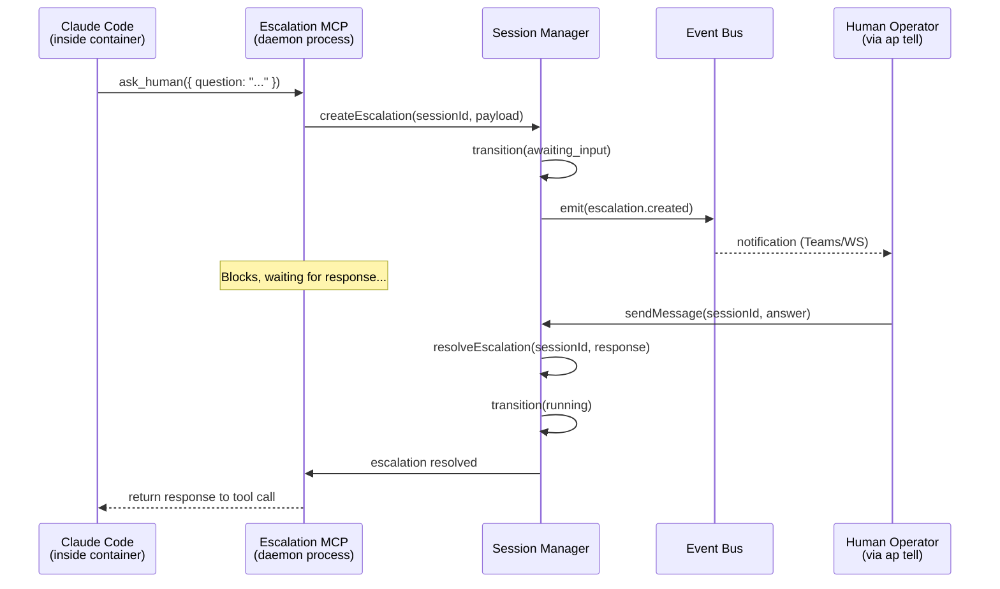

> Phase 2 built the organs. Phase 3 stitches them into a living daemon. This is where the API Gateway, Session Manager, and Escalation MCP come together — the three components that make Autopod an actual running system instead of a pile of libraries.

**Prerequisite**: All Phase 2 modules (M1–M5) must be complete and passing tests before any Phase 3 work begins. The Session Manager depends on *every* Phase 2 module. The API Gateway depends on Auth. The Escalation MCP depends on the Session Manager itself.

## Parallelism Strategy

```mermaid
gantt
    title Phase 3 Build Order
    dateFormat X
    axisFormat %s

    section Parallel
    M6 — API Gateway         :m6, 0, 2
    M7 — Session Manager     :m7, 0, 2

    section Sequential
    M8 — Escalation MCP      :m8, 2, 3
    Integration wiring       :int, 2, 3
```



- **M6 (API Gateway)** and **M7 (Session Manager)** can be built simultaneously by different agents. Their internal logic is independent — they only need to agree on interfaces, which are already defined in `@autopod/shared`.
- **M8 (Escalation MCP)** depends on M7's event bus and session state management. Start it after M7 is functional.
- **Integration wiring** connects M6 → M7 → M8 at the end. Thin glue — the interfaces are already the contract.

---

## M6: API Gateway

**Package**: `packages/daemon/src/api/`
**Depends on**: M1 (Auth Module)
**Parallel group**: B (can run alongside M7)

The daemon's front door. A Fastify HTTP server with REST endpoints and WebSocket support. Every CLI command hits this layer. It validates input, authenticates requests, delegates to the Session Manager or Profile Store, and returns results. Zero business logic lives here — route handlers are dumb pipes.

### File Structure

```
packages/daemon/src/api/
├── server.ts              — Fastify server setup + plugin registration
├── plugins/
│   ├── auth.ts            — JWT validation plugin (wraps M1)
│   ├── cors.ts            — CORS configuration
│   ├── rate-limit.ts      — Per-user rate limiting
│   └── request-logger.ts  — Pino request/response logging
├── routes/
│   ├── sessions.ts        — Session CRUD + lifecycle routes
│   ├── profiles.ts        — Profile CRUD routes
│   └── health.ts          — Health check + version info
├── websocket.ts           — WebSocket event streaming
├── error-handler.ts       — Global error handler
├── schemas.ts             — Zod request/response schemas (re-exports from @autopod/shared)
└── __tests__/
    ├── sessions.test.ts
    ├── profiles.test.ts
    ├── health.test.ts
    ├── websocket.test.ts
    ├── error-handler.test.ts
    └── auth.test.ts
```

### Server Setup (`server.ts`)

The server factory function creates and configures a Fastify instance. It does NOT start listening — that happens in the daemon's main entry point.

```typescript
import Fastify from 'fastify';
import fastifyWebsocket from '@fastify/websocket';

export async function createServer(deps: ServerDependencies): Promise<FastifyInstance> {
  const app = Fastify({
    logger: deps.logger,       // pino instance, shared with daemon
    requestId: true,
    disableRequestLogging: true, // we handle this ourselves for more control
  });

  // Register plugins in order
  await app.register(corsPlugin, deps.corsConfig);
  await app.register(rateLimitPlugin, deps.rateLimitConfig);
  await app.register(requestLoggerPlugin);
  await app.register(authPlugin, { authModule: deps.authModule });
  await app.register(fastifyWebsocket);

  // Register routes
  await app.register(healthRoutes, { prefix: '/' });
  await app.register(sessionRoutes, {
    prefix: '/sessions',
    sessionManager: deps.sessionManager,
  });
  await app.register(profileRoutes, {
    prefix: '/profiles',
    profileStore: deps.profileStore,
  });

  // WebSocket
  await app.register(websocketHandler, {
    eventBus: deps.eventBus,
    authModule: deps.authModule,
  });

  // Global error handler
  app.setErrorHandler(errorHandler);

  return app;
}
```

**Key decision**: The server receives all its dependencies via `ServerDependencies` — the session manager, profile store, event bus, and auth module are all injected. This makes testing trivial (inject mocks) and keeps the server decoupled from instantiation details.

```typescript
interface ServerDependencies {
  logger: Logger;
  authModule: AuthModule;         // from M1
  sessionManager: SessionManager; // from M7
  profileStore: ProfileStore;     // from M5
  eventBus: EventBus;            // from M7
  corsConfig: CorsConfig;
  rateLimitConfig: RateLimitConfig;
}
```

### Auth Plugin (`plugins/auth.ts`)

Fastify decorator that wraps M1's JWT validation. Registers a `preHandler` hook on all routes except those decorated with `{ auth: false }`.

```typescript
export const authPlugin: FastifyPluginAsync<AuthPluginOptions> = async (app, opts) => {
  app.decorateRequest('user', null);

  app.addHook('preHandler', async (request, reply) => {
    // Skip auth for routes that opt out
    if (request.routeOptions.config?.auth === false) return;

    const token = request.headers.authorization?.replace('Bearer ', '');
    if (!token) throw new AuthError('Missing authorization header');

    try {
      const payload = await opts.authModule.validateToken(token);
      request.user = payload; // JwtPayload from @autopod/shared
    } catch (err) {
      throw new AuthError('Invalid or expired token');
    }
  });
};
```

**Edge case**: WebSocket connections send the token as a query parameter (`?token=...`) since browsers can't set headers on WebSocket upgrade. The auth plugin must handle both paths.

### REST Routes

#### Session Routes (`routes/sessions.ts`)

Every handler follows the same pattern: validate input → call session manager → return result. No business logic.

```typescript
export const sessionRoutes: FastifyPluginAsync<SessionRouteOptions> = async (app, opts) => {
  const { sessionManager } = opts;

  // POST /sessions — create session
  app.post('/', {
    schema: { body: CreateSessionRequestSchema, response: { 201: SessionSchema } },
    handler: async (request, reply) => {
      const session = await sessionManager.createSession(request.body, request.user.oid);
      reply.status(201).send(session);
    },
  });

  // GET /sessions — list sessions
  app.get('/', {
    schema: { querystring: ListSessionsQuerySchema, response: { 200: SessionListSchema } },
    handler: async (request, reply) => {
      const sessions = await sessionManager.listSessions(request.query);
      reply.send(sessions);
    },
  });

  // GET /sessions/:id — session detail
  app.get('/:id', {
    schema: { params: SessionParamsSchema, response: { 200: SessionDetailSchema } },
    handler: async (request, reply) => {
      const session = await sessionManager.getSession(request.params.id);
      reply.send(session);
    },
  });

  // POST /sessions/:id/message — send message to agent (ap tell)
  app.post('/:id/message', {
    schema: { params: SessionParamsSchema, body: SendMessageSchema },
    handler: async (request, reply) => {
      await sessionManager.sendMessage(request.params.id, request.body.message);
      reply.status(202).send({ accepted: true });
    },
  });

  // POST /sessions/:id/validate — trigger manual validation
  app.post('/:id/validate', {
    schema: { params: SessionParamsSchema },
    handler: async (request, reply) => {
      await sessionManager.triggerValidation(request.params.id);
      reply.status(202).send({ accepted: true });
    },
  });

  // POST /sessions/:id/approve — approve and merge
  app.post('/:id/approve', {
    schema: { params: SessionParamsSchema, body: ApproveSessionSchema },
    handler: async (request, reply) => {
      await sessionManager.approveSession(request.params.id, request.body?.squash);
      reply.send({ merged: true });
    },
  });

  // POST /sessions/:id/reject — reject with feedback
  app.post('/:id/reject', {
    schema: { params: SessionParamsSchema, body: RejectSessionSchema },
    handler: async (request, reply) => {
      await sessionManager.rejectSession(request.params.id, request.body.feedback);
      reply.status(202).send({ accepted: true });
    },
  });

  // DELETE /sessions/:id — kill session
  app.delete('/:id', {
    schema: { params: SessionParamsSchema },
    handler: async (request, reply) => {
      await sessionManager.killSession(request.params.id);
      reply.status(202).send({ accepted: true });
    },
  });
};
```

**Response codes matter**:
- `201` for create (something was born)
- `202` for async operations (message, validate, reject, kill — the work happens in the background)
- `200` for reads and synchronous completions (approve, where we wait for merge)
- `4xx` for client errors (mapped from AutopodError subclasses)
- `5xx` for unexpected errors

#### Profile Routes (`routes/profiles.ts`)

```typescript
export const profileRoutes: FastifyPluginAsync<ProfileRouteOptions> = async (app, opts) => {
  const { profileStore } = opts;

  // GET /profiles
  app.get('/', async (request, reply) => {
    const profiles = await profileStore.list();
    reply.send(profiles);
  });

  // POST /profiles
  app.post('/', {
    schema: { body: CreateProfileSchema, response: { 201: ProfileSchema } },
    handler: async (request, reply) => {
      const profile = await profileStore.create(request.body);
      reply.status(201).send(profile);
    },
  });

  // GET /profiles/:name
  app.get('/:name', async (request, reply) => {
    const profile = await profileStore.get(request.params.name);
    reply.send(profile);
  });

  // PUT /profiles/:name
  app.put('/:name', {
    schema: { body: UpdateProfileSchema },
    handler: async (request, reply) => {
      const profile = await profileStore.update(request.params.name, request.body);
      reply.send(profile);
    },
  });

  // DELETE /profiles/:name
  app.delete('/:name', async (request, reply) => {
    await profileStore.delete(request.params.name);
    reply.status(204).send();
  });

  // POST /profiles/:name/warm — trigger image warming
  app.post('/:name/warm', async (request, reply) => {
    await profileStore.triggerWarm(request.params.name);
    reply.status(202).send({ accepted: true });
  });
};
```

#### Health Routes (`routes/health.ts`)

No auth required. These are the only unauthenticated endpoints.

```typescript
export const healthRoutes: FastifyPluginAsync = async (app) => {
  app.get('/health', { config: { auth: false } }, async () => {
    return {
      status: 'ok',
      uptime: process.uptime(),
      timestamp: new Date().toISOString(),
    };
  });

  app.get('/version', { config: { auth: false } }, async () => {
    return {
      version: process.env.npm_package_version ?? 'dev',
      node: process.version,
      commit: process.env.GIT_SHA ?? 'unknown',
    };
  });
};
```

### WebSocket Event Streaming (`websocket.ts`)

The most complex piece of the gateway. Clients connect to `WS /events` and receive real-time `SystemEvent` payloads as the daemon works.

```typescript
export const websocketHandler: FastifyPluginAsync<WebSocketOptions> = async (app, opts) => {
  const { eventBus, authModule } = opts;

  app.get('/events', { websocket: true, config: { auth: false } }, (socket, request) => {
    // Auth via query param (browsers can't set WS headers)
    const token = request.query.token as string;
    if (!token) {
      socket.send(JSON.stringify({ error: 'Missing token' }));
      socket.close(4001, 'Unauthorized');
      return;
    }

    let user: JwtPayload;
    try {
      user = authModule.validateTokenSync(token);
    } catch {
      socket.send(JSON.stringify({ error: 'Invalid token' }));
      socket.close(4001, 'Unauthorized');
      return;
    }

    // Track subscription state
    const state: ClientState = {
      userId: user.oid,
      subscribedSessions: new Set<string>(), // empty = all events
      lastEventId: 0,
      alive: true,
    };

    // Handle incoming messages (subscription management)
    socket.on('message', (data) => {
      try {
        const msg = JSON.parse(data.toString()) as ClientMessage;
        switch (msg.type) {
          case 'subscribe':
            state.subscribedSessions.add(msg.sessionId);
            break;
          case 'unsubscribe':
            state.subscribedSessions.delete(msg.sessionId);
            break;
          case 'subscribe_all':
            state.subscribedSessions.clear(); // empty set = all
            break;
          case 'pong':
            state.alive = true;
            break;
        }
      } catch {
        // Malformed message, ignore
      }
    });

    // Subscribe to event bus
    const unsubscribe = eventBus.subscribe((event: SystemEvent) => {
      // Filter: send only if client is subscribed to this session (or all)
      if (state.subscribedSessions.size > 0 && 'sessionId' in event) {
        if (!state.subscribedSessions.has(event.sessionId)) return;
      }

      socket.send(JSON.stringify(event));
    });

    // Heartbeat — detect dead connections
    const heartbeat = setInterval(() => {
      if (!state.alive) {
        socket.close(4002, 'Heartbeat timeout');
        return;
      }
      state.alive = false;
      socket.send(JSON.stringify({ type: 'ping' }));
    }, 30_000);

    // Replay missed events (if client sends lastEventId)
    if (request.query.lastEventId) {
      const missedEvents = eventBus.getEventsSince(Number(request.query.lastEventId));
      for (const event of missedEvents) {
        socket.send(JSON.stringify(event));
      }
    }

    // Cleanup on disconnect
    socket.on('close', () => {
      unsubscribe();
      clearInterval(heartbeat);
    });
  });
};
```

**Reconnection strategy**: When a client reconnects, it sends its `lastEventId` as a query parameter. The event bus replays all events since that ID. This handles brief network blips without losing updates.

**Subscription filtering**: Clients can subscribe to specific session IDs to avoid noise. The TUI dashboard subscribes to all; `ap watch <id>` subscribes to one session.

### Error Handler (`error-handler.ts`)

Maps `AutopodError` subclasses to HTTP status codes. Unknown errors become 500s.

```typescript
export const errorHandler: FastifyErrorHandler = (error, request, reply) => {
  const logger = request.log;

  if (error instanceof AutopodError) {
    logger.warn({ err: error, code: error.code }, error.message);
    reply.status(error.statusCode).send({
      error: error.code,
      message: error.message,
      statusCode: error.statusCode,
    });
    return;
  }

  // Fastify validation errors (schema mismatch)
  if (error.validation) {
    reply.status(400).send({
      error: 'VALIDATION_ERROR',
      message: 'Invalid request',
      statusCode: 400,
      details: error.validation,
    });
    return;
  }

  // Unexpected errors — log full stack, return generic message
  logger.error({ err: error }, 'Unexpected error');
  reply.status(500).send({
    error: 'INTERNAL_ERROR',
    message: 'An unexpected error occurred',
    statusCode: 500,
  });
};
```

**Never leak stack traces** to clients. The pino logger captures them for debugging; the client gets a structured error body.

### Rate Limiting (`plugins/rate-limit.ts`)

Per-user rate limiting using `@fastify/rate-limit`. Different limits per endpoint class:

```typescript
const RATE_LIMITS = {
  default: { max: 100, timeWindow: '1 minute' },
  create: { max: 10, timeWindow: '1 minute' },   // POST /sessions
  health: { max: 300, timeWindow: '1 minute' },   // /health, /version
  mutation: { max: 30, timeWindow: '1 minute' },  // approve, reject, kill
};
```

Key function extracts the user ID from the JWT for per-user tracking. Unauthenticated endpoints (health) rate-limit by IP.

### Request/Response Schemas (`schemas.ts`)

Re-export and extend the Zod schemas from `@autopod/shared` for Fastify's schema validation:

```typescript
// Re-exports from @autopod/shared
export { CreateSessionRequestSchema, SessionSchema, SessionSummarySchema } from '@autopod/shared';

// API-specific schemas
export const SessionParamsSchema = z.object({
  id: z.string().length(8),
});

export const ListSessionsQuerySchema = z.object({
  status: z.enum(SESSION_STATUSES).optional(),
  profile: z.string().optional(),
  userId: z.string().optional(),
  limit: z.coerce.number().int().min(1).max(100).default(50),
  offset: z.coerce.number().int().min(0).default(0),
});

export const SendMessageSchema = z.object({
  message: z.string().min(1).max(10_000),
});

export const ApproveSessionSchema = z.object({
  squash: z.boolean().optional().default(false),
}).optional();

export const RejectSessionSchema = z.object({
  feedback: z.string().min(1).max(10_000),
});
```

### Testing Strategy

Use Fastify's built-in `inject()` method — no need for supertest. Mock all dependencies.

```typescript
describe('Session Routes', () => {
  let app: FastifyInstance;
  let mockSessionManager: MockSessionManager;

  beforeEach(async () => {
    mockSessionManager = createMockSessionManager();
    app = await createServer({
      sessionManager: mockSessionManager,
      authModule: createMockAuth({ oid: 'user-1', roles: ['operator'] }),
      // ... other mocked deps
    });
  });

  afterEach(() => app.close());

  it('should create a session', async () => {
    mockSessionManager.createSession.mockResolvedValue(mockSession);

    const res = await app.inject({
      method: 'POST',
      url: '/sessions',
      headers: { authorization: 'Bearer valid-token' },
      payload: { profileName: 'ideaspace', task: 'Add dark mode' },
    });

    expect(res.statusCode).toBe(201);
    expect(JSON.parse(res.body)).toMatchObject({ id: expect.any(String) });
  });

  it('should reject unauthenticated requests', async () => {
    const res = await app.inject({ method: 'GET', url: '/sessions' });
    expect(res.statusCode).toBe(401);
  });

  it('should return 404 for unknown session', async () => {
    mockSessionManager.getSession.mockRejectedValue(
      new SessionNotFoundError('xxxx1234')
    );

    const res = await app.inject({
      method: 'GET',
      url: '/sessions/xxxx1234',
      headers: { authorization: 'Bearer valid-token' },
    });

    expect(res.statusCode).toBe(404);
    expect(JSON.parse(res.body).error).toBe('SESSION_NOT_FOUND');
  });
});
```

### Acceptance Criteria

- [ ] All REST endpoints return correct responses for valid requests
- [ ] Invalid requests return 400 with structured error bodies and Zod validation details
- [ ] `SessionNotFoundError` → 404, `InvalidStateTransitionError` → 409, `AuthError` → 401, `ForbiddenError` → 403
- [ ] WebSocket connection authenticates via query parameter token
- [ ] WebSocket streams `SystemEvent` payloads to connected clients
- [ ] WebSocket subscription filtering works (subscribe to specific session IDs)
- [ ] WebSocket reconnection replays missed events since `lastEventId`
- [ ] WebSocket heartbeat detects and closes dead connections after 30s
- [ ] Rate limiting enforced per user, configurable per endpoint class
- [ ] Health and version endpoints work without authentication
- [ ] Request logging captures method, path, status code, and duration via pino
- [ ] CORS configured to allow CLI origins
- [ ] Fastify `inject()` tests cover every route with mocked dependencies
- [ ] No business logic in route handlers — they validate, delegate, return

---

## M7: Session Manager

**Package**: `packages/daemon/src/sessions/`
**Depends on**: M2 (Container Engine), M3 (Runtime Adapters), M4 (Validation Engine), M5 (Profile System)
**Parallel group**: B (can run alongside M6)

The brain of the daemon. It orchestrates the full lifecycle of every session — from "user typed `ap run`" to "branch merged and pod destroyed." It ties together containers, runtimes, validation, and profiles into a coherent workflow driven by a state machine.

This is the most complex component in the entire system. Every other component either feeds into it (Phase 2 modules) or consumes from it (API Gateway, CLI, Notifications).

### File Structure

```
packages/daemon/src/sessions/
├── session-manager.ts         — main orchestrator class
├── event-bus.ts               — typed event emitter + persistence
├── session-queue.ts           — processing queue with concurrency control
├── claude-md-generator.ts     — CLAUDE.md builder for pods
├── state-machine.ts           — state transition validation + hooks
├── session-repository.ts      — SQLite CRUD for sessions table
├── event-repository.ts        — SQLite CRUD for events table
└── __tests__/
    ├── session-manager.test.ts
    ├── event-bus.test.ts
    ├── session-queue.test.ts
    ├── claude-md-generator.test.ts
    ├── state-machine.test.ts
    └── integration/
        └── lifecycle.test.ts  — full happy-path + error-path tests
```

### SessionManager (`session-manager.ts`)

The main class. Receives all Phase 2 modules as dependencies and wires them into lifecycle flows.

```typescript
export class SessionManager {
  constructor(private readonly deps: SessionManagerDependencies) {}
}

interface SessionManagerDependencies {
  containerManager: ContainerManager;  // M2
  worktreeManager: WorktreeManager;    // M2
  runtimeRegistry: RuntimeRegistry;    // M3 — resolves RuntimeType → Runtime
  validator: ValidationEngine;         // M4
  profileStore: ProfileStore;          // M5
  sessionRepo: SessionRepository;     // local
  eventBus: EventBus;                 // local
  queue: SessionQueue;                // local
  claudeMdGenerator: ClaudeMdGenerator; // local
  logger: Logger;
}
```

#### `createSession(request, userId)`

Creates a session record and enqueues it for processing. Returns immediately — the actual work happens asynchronously via the queue.

```typescript
async createSession(request: CreateSessionRequest, userId: string): Promise<Session> {
  // 1. Resolve profile (with inheritance chain)
  const profile = await this.deps.profileStore.getResolved(request.profileName);

  // 2. Generate IDs
  const id = nanoid(SESSION_ID_LENGTH);
  const model = request.model ?? profile.defaultModel;
  const runtime = request.runtime ?? profile.defaultRuntime;

  // 3. Generate branch name
  const taskSlug = slugify(request.task, { lower: true, strict: true }).slice(0, 30);
  const branch = request.branch ?? `autopod/${profile.name}-${taskSlug}-${id}`;

  // 4. Insert session record
  const session: Session = {
    id,
    profileName: profile.name,
    task: request.task,
    status: 'queued',
    model,
    runtime,
    branch,
    containerId: null,
    worktreePath: null,
    validationAttempts: 0,
    maxValidationAttempts: request.skipValidation ? 0 : profile.maxValidationAttempts,
    lastValidationResult: null,
    pendingEscalation: null,
    escalationCount: 0,
    createdAt: new Date().toISOString(),
    startedAt: null,
    completedAt: null,
    updatedAt: new Date().toISOString(),
    userId,
    filesChanged: 0,
    linesAdded: 0,
    linesRemoved: 0,
    previewUrl: null,
  };

  await this.deps.sessionRepo.insert(session);

  // 5. Emit event
  this.deps.eventBus.emit({
    type: 'session.created',
    timestamp: new Date().toISOString(),
    session: toSummary(session),
  });

  // 6. Enqueue for processing
  this.deps.queue.enqueue(id);

  return session;
}
```

**Why return the session immediately?** The CLI needs an ID to track the session. The actual provisioning/running happens in the background. The client watches progress via WebSocket or polling.

#### `processSession(sessionId)`

The main lifecycle loop. Called by the `SessionQueue` when a slot opens up. This is where all the Phase 2 modules come together.

```typescript
async processSession(sessionId: string): Promise<void> {
  const session = await this.deps.sessionRepo.getOrThrow(sessionId);
  const profile = await this.deps.profileStore.getResolved(session.profileName);
  const runtime = this.deps.runtimeRegistry.get(session.runtime);

  try {
    // ── Provision ──────────────────────────────────────────
    await this.transition(sessionId, 'provisioning');

    // Create git worktree
    const worktreePath = await this.deps.worktreeManager.create({
      repoUrl: profile.repoUrl,
      branch: session.branch,
      baseBranch: profile.defaultBranch,
    });

    // Spawn container
    const containerId = await this.deps.containerManager.spawn({
      template: profile.template,
      warmImageTag: profile.warmImageTag,
      worktreePath,
      env: this.buildContainerEnv(session, profile),
    });

    await this.deps.sessionRepo.update(sessionId, { containerId, worktreePath });

    // Generate and inject CLAUDE.md
    const claudeMd = this.deps.claudeMdGenerator.generate({
      profile,
      session,
      mcpServerUrl: this.getMcpServerUrl(sessionId),
    });
    await this.deps.containerManager.writeFile(containerId, `${worktreePath}/CLAUDE.md`, claudeMd);

    // ── Run ────────────────────────────────────────────────
    await this.transition(sessionId, 'running');
    await this.deps.sessionRepo.update(sessionId, {
      startedAt: new Date().toISOString(),
    });

    // Spawn runtime and consume agent events
    const events = runtime.spawn({
      sessionId,
      task: session.task,
      model: session.model,
      workDir: worktreePath,
      customInstructions: profile.customInstructions ?? undefined,
      env: this.buildRuntimeEnv(profile),
      mcpServers: this.getMcpServers(sessionId),
    });

    await this.consumeAgentEvents(sessionId, events, profile, runtime);

  } catch (error) {
    this.deps.logger.error({ sessionId, err: error }, 'Session processing failed');
    await this.transitionSafe(sessionId, 'failed');
    // Don't rethrow — the queue should continue processing other sessions
  }
}
```

#### `consumeAgentEvents(sessionId, events, profile, runtime)`

The inner event loop. Processes each event from the runtime adapter and drives state transitions.

```typescript
private async consumeAgentEvents(
  sessionId: string,
  events: AsyncIterable<AgentEvent>,
  profile: Profile,
  runtime: Runtime,
): Promise<void> {
  for await (const event of events) {
    // Store every event in the audit log
    await this.deps.eventBus.emitAgentActivity(sessionId, event);

    switch (event.type) {
      case 'status':
      case 'tool_use':
      case 'file_change':
        // Informational — just logged and streamed. No state change.
        break;

      case 'escalation':
        // Agent is asking for help
        await this.handleEscalation(sessionId, event.payload);
        // The escalation handler blocks until resolved — then we continue
        break;

      case 'complete':
        // Agent says it's done. Time to validate.
        await this.handleCompletion(sessionId, profile);
        return; // Exit the event loop

      case 'error':
        if (event.fatal) {
          await this.transition(sessionId, 'failed');
          this.deps.eventBus.emit({
            type: 'session.status_changed',
            timestamp: new Date().toISOString(),
            sessionId,
            previousStatus: 'running',
            newStatus: 'failed',
          });
          return;
        }
        // Non-fatal errors: log and continue
        this.deps.logger.warn({ sessionId, error: event.message }, 'Non-fatal agent error');
        break;
    }
  }
}
```

#### `handleCompletion(sessionId, profile)`

Runs validation and handles the pass/fail/retry loop.

```typescript
private async handleCompletion(sessionId: string, profile: Profile): Promise<void> {
  const session = await this.deps.sessionRepo.getOrThrow(sessionId);

  // Skip validation if disabled
  if (session.maxValidationAttempts === 0) {
    await this.transition(sessionId, 'validated');
    return;
  }

  await this.transition(sessionId, 'validating');
  const attempt = session.validationAttempts + 1;

  this.deps.eventBus.emit({
    type: 'session.validation_started',
    timestamp: new Date().toISOString(),
    sessionId,
    attempt,
  });

  const result = await this.deps.validator.validate({
    sessionId,
    containerId: session.containerId!,
    profile,
    attempt,
  });

  await this.deps.sessionRepo.update(sessionId, {
    validationAttempts: attempt,
    lastValidationResult: result,
  });

  this.deps.eventBus.emit({
    type: 'session.validation_completed',
    timestamp: new Date().toISOString(),
    sessionId,
    result,
  });

  // Update file stats from the worktree diff
  const stats = await this.deps.worktreeManager.getDiffStats(session.worktreePath!);
  await this.deps.sessionRepo.update(sessionId, {
    filesChanged: stats.filesChanged,
    linesAdded: stats.linesAdded,
    linesRemoved: stats.linesRemoved,
  });

  if (result.overall === 'pass') {
    await this.transition(sessionId, 'validated');
    return;
  }

  // Validation failed
  if (attempt < session.maxValidationAttempts) {
    // Retry: feed failure details back to the agent
    await this.transition(sessionId, 'running');
    const runtime = this.deps.runtimeRegistry.get(session.runtime);
    const feedback = this.formatValidationFeedback(result);
    const retryEvents = runtime.resume(sessionId, feedback);
    await this.consumeAgentEvents(sessionId, retryEvents, profile, runtime);
  } else {
    // Out of retries
    await this.transition(sessionId, 'failed');
  }
}
```

**Recursive retry**: Notice how `handleCompletion` can call `consumeAgentEvents`, which can call `handleCompletion` again. This is intentional — each validation retry is a full cycle of agent work + validation. The `maxValidationAttempts` cap prevents infinite recursion.

#### `sendMessage(sessionId, message)`

Delivers a human message to a running or paused agent.

```typescript
async sendMessage(sessionId: string, message: string): Promise<void> {
  const session = await this.deps.sessionRepo.getOrThrow(sessionId);

  if (!['running', 'awaiting_input'].includes(session.status)) {
    throw new InvalidStateTransitionError(
      sessionId,
      session.status,
      'running' // we want to send a message, which requires running
    );
  }

  const profile = await this.deps.profileStore.getResolved(session.profileName);
  const runtime = this.deps.runtimeRegistry.get(session.runtime);

  // If awaiting input, resolve the pending escalation
  if (session.status === 'awaiting_input' && session.pendingEscalation) {
    await this.resolveEscalation(sessionId, session.pendingEscalation.id, {
      respondedAt: new Date().toISOString(),
      respondedBy: 'human',
      response: message,
    });
    await this.transition(sessionId, 'running');
  }

  // Resume the agent with the message
  const events = runtime.resume(sessionId, message);
  await this.consumeAgentEvents(sessionId, events, profile, runtime);
}
```

#### `approveSession(sessionId, squash?)`

Merges the branch and cleans up everything.

```typescript
async approveSession(sessionId: string, squash = false): Promise<void> {
  const session = await this.deps.sessionRepo.getOrThrow(sessionId);

  if (session.status !== 'validated') {
    throw new InvalidStateTransitionError(sessionId, session.status, 'approved');
  }

  await this.transition(sessionId, 'approved');
  await this.transition(sessionId, 'merging');

  try {
    await this.deps.worktreeManager.mergeBranch({
      branch: session.branch,
      targetBranch: (await this.deps.profileStore.get(session.profileName)).defaultBranch,
      squash,
    });

    await this.transition(sessionId, 'complete');
    await this.deps.sessionRepo.update(sessionId, {
      completedAt: new Date().toISOString(),
    });

    this.deps.eventBus.emit({
      type: 'session.completed',
      timestamp: new Date().toISOString(),
      sessionId,
      finalStatus: 'complete',
      summary: toSummary(await this.deps.sessionRepo.getOrThrow(sessionId)),
    });
  } finally {
    // Cleanup regardless of merge success
    await this.cleanupSession(sessionId);
  }
}
```

#### `rejectSession(sessionId, feedback)`

Sends structured feedback to the agent and resumes work.

```typescript
async rejectSession(sessionId: string, feedback: string): Promise<void> {
  const session = await this.deps.sessionRepo.getOrThrow(sessionId);

  if (!['validated', 'failed'].includes(session.status)) {
    throw new InvalidStateTransitionError(sessionId, session.status, 'running');
  }

  const profile = await this.deps.profileStore.getResolved(session.profileName);
  const runtime = this.deps.runtimeRegistry.get(session.runtime);

  await this.transition(sessionId, 'running');

  // Reset validation attempts on explicit reject — human wants another try
  await this.deps.sessionRepo.update(sessionId, { validationAttempts: 0 });

  const structuredFeedback = [
    '## Human Feedback (Rejection)',
    '',
    feedback,
    '',
    'Please address the feedback above and try again.',
    'When done, signal completion so validation can run.',
  ].join('\n');

  const events = runtime.resume(sessionId, structuredFeedback);
  await this.consumeAgentEvents(sessionId, events, profile, runtime);
}
```

**Why reset validation attempts?** An explicit `ap reject` is a human saying "I don't like this, try again." The previous validation attempts were against a different version of the work. The agent gets a fresh set of retries.

#### `killSession(sessionId)`

Hard stop. Kill container, cleanup worktree, update state.

```typescript
async killSession(sessionId: string): Promise<void> {
  const session = await this.deps.sessionRepo.getOrThrow(sessionId);

  // Can kill from most states except terminal ones
  const terminalStates: SessionStatus[] = ['complete', 'killed'];
  if (terminalStates.includes(session.status)) {
    throw new InvalidStateTransitionError(sessionId, session.status, 'killing');
  }

  await this.transition(sessionId, 'killing');
  await this.cleanupSession(sessionId);
  await this.transition(sessionId, 'killed');

  await this.deps.sessionRepo.update(sessionId, {
    completedAt: new Date().toISOString(),
  });

  this.deps.eventBus.emit({
    type: 'session.completed',
    timestamp: new Date().toISOString(),
    sessionId,
    finalStatus: 'killed',
    summary: toSummary(await this.deps.sessionRepo.getOrThrow(sessionId)),
  });
}
```

#### Helper Methods

```typescript
// State transition with validation
private async transition(sessionId: string, newStatus: SessionStatus): Promise<void> {
  const session = await this.deps.sessionRepo.getOrThrow(sessionId);
  const validTargets = VALID_STATUS_TRANSITIONS[session.status];

  if (!validTargets.includes(newStatus)) {
    throw new InvalidStateTransitionError(sessionId, session.status, newStatus);
  }

  const previousStatus = session.status;
  await this.deps.sessionRepo.update(sessionId, {
    status: newStatus,
    updatedAt: new Date().toISOString(),
  });

  this.deps.eventBus.emit({
    type: 'session.status_changed',
    timestamp: new Date().toISOString(),
    sessionId,
    previousStatus,
    newStatus,
  });
}

// Transition that doesn't throw on invalid state (for error recovery paths)
private async transitionSafe(sessionId: string, newStatus: SessionStatus): Promise<void> {
  try {
    await this.transition(sessionId, newStatus);
  } catch (err) {
    this.deps.logger.warn({ sessionId, newStatus, err }, 'Safe transition failed — ignoring');
  }
}

// Cleanup container + worktree
private async cleanupSession(sessionId: string): Promise<void> {
  const session = await this.deps.sessionRepo.getOrThrow(sessionId);

  if (session.containerId) {
    try {
      await this.deps.containerManager.kill(session.containerId);
    } catch (err) {
      this.deps.logger.warn({ sessionId, containerId: session.containerId, err },
        'Failed to kill container during cleanup');
    }
  }

  if (session.worktreePath) {
    try {
      await this.deps.worktreeManager.cleanup(session.worktreePath);
    } catch (err) {
      this.deps.logger.warn({ sessionId, worktreePath: session.worktreePath, err },
        'Failed to cleanup worktree');
    }
  }
}

// Format validation failure for agent feedback
private formatValidationFeedback(result: ValidationResult): string {
  const lines = ['## Validation Failed', ''];

  if (result.smoke.status === 'fail') {
    if (result.smoke.build.status === 'fail') {
      lines.push('### Build Failed', '```', result.smoke.build.output, '```', '');
    }
    if (result.smoke.health.status === 'fail') {
      lines.push(`### Health Check Failed`,
        `URL: ${result.smoke.health.url}`,
        `Response: ${result.smoke.health.responseCode ?? 'timeout'}`, '');
    }
    for (const page of result.smoke.pages.filter(p => p.status === 'fail')) {
      lines.push(`### Page Failed: ${page.path}`);
      if (page.consoleErrors.length > 0) {
        lines.push('Console errors:', ...page.consoleErrors.map(e => `- ${e}`));
      }
      for (const a of page.assertions.filter(a => !a.passed)) {
        lines.push(`- Assertion failed: ${a.type} on "${a.selector}" — expected ${a.expected}, got ${a.actual}`);
      }
      lines.push('');
    }
  }

  if (result.taskReview?.status === 'fail') {
    lines.push('### Task Review Failed', result.taskReview.reasoning, '');
    if (result.taskReview.issues.length > 0) {
      lines.push('Issues:', ...result.taskReview.issues.map(i => `- ${i}`));
    }
  }

  lines.push('', 'Fix the issues above and signal completion again.');
  return lines.join('\n');
}
```

### EventBus (`event-bus.ts`)

A typed event emitter with persistence. Every event is stored in SQLite for audit trail and WebSocket replay.

```typescript
export class EventBus {
  private handlers: Set<(event: SystemEvent) => void> = new Set();
  private sessionHandlers: Map<string, Set<(event: SystemEvent) => void>> = new Map();

  constructor(
    private readonly eventRepo: EventRepository,
    private readonly logger: Logger,
  ) {}

  emit(event: SystemEvent & { id?: number }): void {
    // Persist to DB (synchronous — better-sqlite3 is sync)
    const id = this.eventRepo.insert(event);

    const enriched = { ...event, id };

    // Broadcast to all subscribers
    for (const handler of this.handlers) {
      try {
        handler(enriched);
      } catch (err) {
        this.logger.error({ err }, 'Event handler threw');
      }
    }

    // Broadcast to session-specific subscribers
    if ('sessionId' in event) {
      const sessionSubs = this.sessionHandlers.get(event.sessionId);
      if (sessionSubs) {
        for (const handler of sessionSubs) {
          try {
            handler(enriched);
          } catch (err) {
            this.logger.error({ err }, 'Session event handler threw');
          }
        }
      }
    }
  }

  emitAgentActivity(sessionId: string, agentEvent: AgentEvent): void {
    this.emit({
      type: 'session.agent_activity',
      timestamp: new Date().toISOString(),
      sessionId,
      event: agentEvent,
    });
  }

  subscribe(handler: (event: SystemEvent) => void): () => void {
    this.handlers.add(handler);
    return () => this.handlers.delete(handler);
  }

  subscribeSession(sessionId: string, handler: (event: SystemEvent) => void): () => void {
    if (!this.sessionHandlers.has(sessionId)) {
      this.sessionHandlers.set(sessionId, new Set());
    }
    this.sessionHandlers.get(sessionId)!.add(handler);
    return () => {
      this.sessionHandlers.get(sessionId)?.delete(handler);
      if (this.sessionHandlers.get(sessionId)?.size === 0) {
        this.sessionHandlers.delete(sessionId);
      }
    };
  }

  getEventsSince(lastEventId: number): SystemEvent[] {
    return this.eventRepo.getSince(lastEventId);
  }
}
```

**Why not use a library like EventEmitter2?** The persistence requirement (storing events in SQLite for replay) means we need custom logic anyway. A thin wrapper keeps it simple and fully typed.

### SessionQueue (`session-queue.ts`)

Controls how many sessions process simultaneously. Prevents the daemon from spawning 50 containers and killing the host.

```typescript
export class SessionQueue {
  private queue: string[] = [];
  private active: Set<string> = new Set();
  private processing = false;

  constructor(
    private readonly maxConcurrency: number,
    private readonly processSession: (id: string) => Promise<void>,
    private readonly logger: Logger,
  ) {}

  enqueue(sessionId: string): void {
    this.queue.push(sessionId);
    this.logger.info({ sessionId, queueLength: this.queue.length }, 'Session enqueued');
    this.drain(); // Start processing if capacity available
  }

  private async drain(): Promise<void> {
    if (this.processing) return; // Already draining
    this.processing = true;

    try {
      while (this.queue.length > 0 && this.active.size < this.maxConcurrency) {
        const sessionId = this.queue.shift()!;
        this.active.add(sessionId);

        // Process in background — don't block the drain loop
        this.processSession(sessionId)
          .catch((err) => {
            this.logger.error({ sessionId, err }, 'Session processing failed');
          })
          .finally(() => {
            this.active.delete(sessionId);
            this.drain(); // Check if more can be processed
          });
      }
    } finally {
      this.processing = false;
    }
  }

  get stats(): { queued: number; active: number; maxConcurrency: number } {
    return {
      queued: this.queue.length,
      active: this.active.size,
      maxConcurrency: this.maxConcurrency,
    };
  }
}
```

**Concurrency default**: Start with `maxConcurrency = 3`. This is configurable via env var `AUTOPOD_MAX_CONCURRENT_SESSIONS`. On a beefy Azure VM with Docker, 3–5 simultaneous pods is reasonable.

### ClaudeMdGenerator (`claude-md-generator.ts`)

Generates the `CLAUDE.md` file that gets injected into every pod's worktree. This is how we control what the agent does and how it escalates.

```typescript
export class ClaudeMdGenerator {
  generate(config: ClaudeMdConfig): string {
    const lines: string[] = [];

    // Task context
    lines.push('# Autopod Session', '');
    lines.push(`**Session ID**: ${config.session.id}`);
    lines.push(`**Task**: ${config.session.task}`);
    lines.push(`**Profile**: ${config.profile.name}`);
    lines.push('');

    // Profile custom instructions
    if (config.profile.customInstructions) {
      lines.push('## Project Instructions', '');
      lines.push(config.profile.customInstructions);
      lines.push('');
    }

    // Validation expectations
    lines.push('## Validation', '');
    lines.push('When you signal completion, automated validation will run:');
    lines.push(`1. Build: \`${config.profile.buildCommand}\``);
    lines.push(`2. Health check: \`${config.profile.healthPath}\` must return 200`);
    if (config.profile.validationPages.length > 0) {
      lines.push('3. Page checks:');
      for (const page of config.profile.validationPages) {
        lines.push(`   - ${page.path}`);
      }
    }
    lines.push('4. AI task review against your changes');
    lines.push('');
    lines.push('Make sure the build passes and the app works before signaling completion.');
    lines.push('');

    // Escalation tools
    if (config.profile.escalation.askHuman || config.profile.escalation.askAi.enabled) {
      lines.push('## Escalation', '');
      lines.push('If you get stuck, you have escalation tools available via MCP:');
      if (config.profile.escalation.askHuman) {
        lines.push('- `ask_human`: Pause and ask the operator a question. Use this for ambiguity, missing context, or decisions you cannot make alone.');
      }
      if (config.profile.escalation.askAi.enabled) {
        lines.push(`- \`ask_ai\`: Ask a reviewer AI for guidance (max ${config.profile.escalation.askAi.maxCalls} calls). Use this for code review, architecture questions, or when you want a second opinion.`);
      }
      lines.push('- `report_blocker`: Report something blocking your progress. Describe what you tried and what you need.');
      lines.push('');
      lines.push('Do NOT silently skip requirements. If something is unclear, escalate.');
      lines.push('');
    }

    // Git conventions
    lines.push('## Git', '');
    lines.push(`You are working on branch \`${config.session.branch}\`.`);
    lines.push('Commit frequently with clear messages. Use conventional commits (feat:, fix:, refactor:, etc.).');
    lines.push('Do NOT push to remote — the daemon handles that.');
    lines.push('');

    return lines.join('\n');
  }
}
```

### State Machine (`state-machine.ts`)

Extracted for testability. The `VALID_STATUS_TRANSITIONS` map from `@autopod/shared` is the source of truth, but this module adds transition hooks and validation logic.

```typescript
export function validateTransition(from: SessionStatus, to: SessionStatus): boolean {
  return VALID_STATUS_TRANSITIONS[from]?.includes(to) ?? false;
}

export function isTerminalState(status: SessionStatus): boolean {
  return VALID_STATUS_TRANSITIONS[status]?.length === 0;
}

export function canReceiveMessage(status: SessionStatus): boolean {
  return status === 'running' || status === 'awaiting_input';
}

export function canKill(status: SessionStatus): boolean {
  return !isTerminalState(status) && status !== 'killing';
}
```

### SessionRepository (`session-repository.ts`)

Thin SQLite wrapper using `better-sqlite3`. Handles serialization/deserialization of JSON columns.

```typescript
export class SessionRepository {
  constructor(private readonly db: Database) {}

  insert(session: Session): void {
    this.db.prepare(`
      INSERT INTO sessions (id, profile_name, task, status, model, runtime, branch,
        max_validation_attempts, skip_validation, user_id, created_at, updated_at)
      VALUES (?, ?, ?, ?, ?, ?, ?, ?, ?, ?, ?, ?)
    `).run(
      session.id, session.profileName, session.task, session.status,
      session.model, session.runtime, session.branch,
      session.maxValidationAttempts, session.maxValidationAttempts === 0 ? 1 : 0,
      session.userId, session.createdAt, session.updatedAt,
    );
  }

  getOrThrow(id: string): Session {
    const row = this.db.prepare('SELECT * FROM sessions WHERE id = ?').get(id);
    if (!row) throw new SessionNotFoundError(id);
    return this.deserialize(row);
  }

  update(id: string, fields: Partial<Session>): void {
    const sets: string[] = [];
    const values: unknown[] = [];

    for (const [key, value] of Object.entries(fields)) {
      const column = toSnakeCase(key);
      if (typeof value === 'object' && value !== null) {
        sets.push(`${column} = ?`);
        values.push(JSON.stringify(value));
      } else {
        sets.push(`${column} = ?`);
        values.push(value);
      }
    }

    sets.push('updated_at = ?');
    values.push(new Date().toISOString());
    values.push(id);

    this.db.prepare(`UPDATE sessions SET ${sets.join(', ')} WHERE id = ?`).run(...values);
  }

  list(filters?: ListSessionsQuery): SessionSummary[] {
    let sql = 'SELECT * FROM sessions WHERE 1=1';
    const params: unknown[] = [];

    if (filters?.status) {
      sql += ' AND status = ?';
      params.push(filters.status);
    }
    if (filters?.profile) {
      sql += ' AND profile_name = ?';
      params.push(filters.profile);
    }
    if (filters?.userId) {
      sql += ' AND user_id = ?';
      params.push(filters.userId);
    }

    sql += ' ORDER BY created_at DESC LIMIT ? OFFSET ?';
    params.push(filters?.limit ?? 50, filters?.offset ?? 0);

    return this.db.prepare(sql).all(...params).map(row => toSummary(this.deserialize(row)));
  }

  private deserialize(row: Record<string, unknown>): Session {
    return {
      ...row,
      profileName: row.profile_name as string,
      containerId: row.container_id as string | null,
      worktreePath: row.worktree_path as string | null,
      validationAttempts: row.validation_attempts as number,
      maxValidationAttempts: row.max_validation_attempts as number,
      lastValidationResult: row.last_validation_result
        ? JSON.parse(row.last_validation_result as string)
        : null,
      pendingEscalation: row.pending_escalation
        ? JSON.parse(row.pending_escalation as string)
        : null,
      escalationCount: row.escalation_count as number,
      createdAt: row.created_at as string,
      startedAt: row.started_at as string | null,
      completedAt: row.completed_at as string | null,
      updatedAt: row.updated_at as string,
      userId: row.user_id as string,
      filesChanged: row.files_changed as number,
      linesAdded: row.lines_added as number,
      linesRemoved: row.lines_removed as number,
      previewUrl: row.preview_url as string | null,
    } as Session;
  }
}
```

### Testing Strategy

M7 is the most complex component. Testing requires a layered approach:

**Unit tests** (mocked dependencies):
- Each `SessionManager` method tested in isolation
- State machine transitions — valid and invalid
- `formatValidationFeedback` produces correct markdown
- `ClaudeMdGenerator` output for various profile configs
- `SessionQueue` respects concurrency limits
- `EventBus` dispatches to correct subscribers

**Integration tests** (real SQLite, mocked external systems):
- Full happy path: create → provision → run → complete → validate (pass) → approve → merge → cleanup
- Validation failure → retry: create → run → complete → validate (fail) → retry → validate (pass)
- Escalation flow: create → run → ask_human → pause → human responds → resume → complete
- Reject flow: create → run → validate (pass) → reject → run → validate (pass) → approve
- Kill flow: kill from each non-terminal state
- Concurrent sessions: queue 5 sessions with max concurrency 2, verify only 2 run simultaneously
- Error recovery: container spawn fails → session transitions to failed, not crashed daemon

**Critical edge cases to test**:
- What if the runtime emits an error event during validation?
- What if `cleanupSession` partially fails (container killed but worktree cleanup fails)?
- What if `mergeBranch` fails after transitioning to `merging`?
- What if the same session gets enqueued twice?
- What if a message arrives for a session that's mid-transition?

### Acceptance Criteria

- [ ] `createSession` inserts record, emits event, enqueues for processing, returns session with ID
- [ ] `processSession` provisions worktree, spawns container, injects CLAUDE.md, starts runtime, consumes events
- [ ] State transitions follow `VALID_STATUS_TRANSITIONS` — invalid transitions throw `InvalidStateTransitionError`
- [ ] Agent events are stored in the events table and emitted over the event bus
- [ ] Agent `complete` event triggers validation automatically
- [ ] Validation pass → session status `validated`, event emitted
- [ ] Validation fail + retries remaining → failure feedback sent to agent, agent resumes
- [ ] Validation fail + no retries → session status `failed`, event emitted
- [ ] `sendMessage` delivers to running agents and resolves pending escalations for paused agents
- [ ] `approveSession` merges branch, cleans up container + worktree, transitions to complete
- [ ] `rejectSession` resets validation attempts, sends structured feedback, agent resumes
- [ ] `killSession` kills container, cleans up worktree, transitions to killed from any non-terminal state
- [ ] Event bus delivers events to global subscribers and session-specific subscribers
- [ ] Event bus persists all events to SQLite for audit trail and WebSocket replay
- [ ] Session queue respects `maxConcurrency` — never exceeds the limit
- [ ] Session queue recovers from processing failures — one crashed session doesn't block others
- [ ] CLAUDE.md includes task description, profile instructions, validation config, escalation tools, git conventions
- [ ] Cleanup is best-effort — partial cleanup failures are logged, not thrown

---

## M8: Escalation MCP

**Package**: `packages/escalation-mcp/`
**Depends on**: M7 (Session Manager — needs event bus and session state management)
**Sequential**: Must start after M7 is functional

An MCP server that runs on the daemon host and provides escalation tools to agents inside pods. When Claude Code inside a container needs human help, it calls these tools via the Model Context Protocol. The tools communicate with the Session Manager to pause sessions, notify humans, and deliver responses back.

### File Structure

```
packages/escalation-mcp/
├── src/
│   ├── index.ts               — barrel export
│   ├── server.ts              — MCP server setup + HTTP transport
│   ├── tools/
│   │   ├── ask-human.ts       — pause + wait for human response
│   │   ├── ask-ai.ts          — call reviewer model, return answer
│   │   └── report-blocker.ts  — escalate blocker, maybe pause
│   ├── session-bridge.ts      — interface to Session Manager
│   ├── pending-requests.ts    — in-memory tracker for blocked requests
│   └── __tests__/
│       ├── ask-human.test.ts
│       ├── ask-ai.test.ts
│       ├── report-blocker.test.ts
│       ├── session-bridge.test.ts
│       └── server.test.ts
├── package.json
└── tsconfig.json
```

### Architecture

The MCP server runs as an HTTP endpoint on the daemon, not as a separate process. It's mounted at `/mcp/:sessionId/` on the Fastify server.



**Key insight**: The `ask_human` tool call BLOCKS inside the MCP server. The agent's process is suspended waiting for the tool response. When a human responds via `ap tell`, the Session Manager resolves the pending escalation, which unblocks the MCP tool handler, which returns the response to the agent.

### MCP Server Setup (`server.ts`)

Uses `@modelcontextprotocol/sdk` with HTTP transport (not stdio — the agent connects over the network from inside a container).

```typescript
import { McpServer } from '@modelcontextprotocol/sdk/server/mcp.js';
import { StreamableHTTPServerTransport } from '@modelcontextprotocol/sdk/server/streamableHttp.js';

export function createEscalationMcpServer(deps: McpDependencies): McpServer {
  const server = new McpServer({
    name: 'autopod-escalation',
    version: '1.0.0',
  });

  // Register tools
  registerAskHumanTool(server, deps);
  registerAskAiTool(server, deps);
  registerReportBlockerTool(server, deps);

  return server;
}

interface McpDependencies {
  sessionBridge: SessionBridge;
  pendingRequests: PendingRequests;
  logger: Logger;
}
```

**Transport**: The MCP server uses HTTP Streamable transport. The daemon mounts it at `/mcp/:sessionId/` on the Fastify server. The session ID is extracted from the URL path, so each agent automatically scopes to its own session.

```typescript
// In the daemon's server setup (api/server.ts), mount the MCP handler:
app.all('/mcp/:sessionId/*', async (request, reply) => {
  const { sessionId } = request.params;
  // Route to MCP server with session context
  await mcpTransport.handleRequest(request, reply, { sessionId });
});
```

### Tool: `ask_human` (`tools/ask-human.ts`)

The most important tool. Pauses the session and blocks until a human responds.

```typescript
export function registerAskHumanTool(server: McpServer, deps: McpDependencies): void {
  server.tool(
    'ask_human',
    'Pause and ask the human operator a question. Use when you need clarification, a decision, or information you cannot find in the codebase.',
    {
      question: z.string().describe('The question to ask the human operator'),
      context: z.string().optional().describe('What you have tried so far and why you need help'),
      options: z.array(z.string()).optional().describe('Multiple-choice options for quick response'),
    },
    async ({ question, context, options }, extra) => {
      const sessionId = extra.sessionId; // from URL path
      const logger = deps.logger.child({ sessionId, tool: 'ask_human' });

      logger.info({ question }, 'ask_human called');

      const payload: AskHumanPayload = { question, context, options };

      // Create escalation and pause the session
      const escalationId = await deps.sessionBridge.createEscalation(sessionId, 'ask_human', payload);

      // Block until the escalation is resolved
      // This is a promise that resolves when a human calls `ap tell`
      const response = await deps.pendingRequests.waitForResponse(escalationId, {
        timeout: deps.sessionBridge.getHumanResponseTimeout(sessionId),
      });

      logger.info({ escalationId, respondedBy: response.respondedBy }, 'ask_human resolved');

      return {
        content: [{ type: 'text', text: response.response }],
      };
    },
  );
}
```

### Tool: `ask_ai` (`tools/ask-ai.ts`)

Routes a question to a reviewer model. Does NOT pause the session — the agent gets an answer immediately.

```typescript
export function registerAskAiTool(server: McpServer, deps: McpDependencies): void {
  server.tool(
    'ask_ai',
    'Ask a reviewer AI for guidance. Use for code review, architecture questions, or getting a second opinion. Does NOT pause your session.',
    {
      question: z.string().describe('The question to ask the reviewer AI'),
      context: z.string().optional().describe('Relevant code or context for the question'),
      domain: z.string().optional().describe('Domain hint (e.g., "react", "database", "security")'),
    },
    async ({ question, context, domain }, extra) => {
      const sessionId = extra.sessionId;
      const logger = deps.logger.child({ sessionId, tool: 'ask_ai' });

      // Check rate limit
      const callCount = await deps.sessionBridge.getAiEscalationCount(sessionId);
      const maxCalls = await deps.sessionBridge.getMaxAiCalls(sessionId);

      if (callCount >= maxCalls) {
        return {
          content: [{
            type: 'text',
            text: `You have used all ${maxCalls} ask_ai calls for this session. Use ask_human if you need further guidance.`,
          }],
          isError: true,
        };
      }

      logger.info({ question, callCount: callCount + 1, maxCalls }, 'ask_ai called');

      const payload: AskAiPayload = { question, context, domain };

      // Create escalation record (for audit trail)
      const escalationId = await deps.sessionBridge.createEscalation(sessionId, 'ask_ai', payload);

      // Call the reviewer model
      const aiResponse = await deps.sessionBridge.callReviewerModel(sessionId, {
        question,
        context,
        domain,
      });

      // Record the response
      await deps.sessionBridge.resolveEscalation(escalationId, {
        respondedAt: new Date().toISOString(),
        respondedBy: 'ai',
        response: aiResponse,
        model: await deps.sessionBridge.getReviewerModel(sessionId),
      });

      return {
        content: [{ type: 'text', text: aiResponse }],
      };
    },
  );
}
```

### Tool: `report_blocker` (`tools/report-blocker.ts`)

Reports a blocking issue. May or may not pause the session, depending on the `autoPauseAfter` threshold.

```typescript
export function registerReportBlockerTool(server: McpServer, deps: McpDependencies): void {
  server.tool(
    'report_blocker',
    'Report something blocking your progress. Describe what you tried and what you need. May pause the session if too many blockers accumulate.',
    {
      description: z.string().describe('What is blocking you'),
      attempted: z.array(z.string()).describe('What you have already tried'),
      needs: z.string().describe('What you need to proceed'),
    },
    async ({ description, attempted, needs }, extra) => {
      const sessionId = extra.sessionId;
      const logger = deps.logger.child({ sessionId, tool: 'report_blocker' });

      const payload: ReportBlockerPayload = { description, attempted, needs };

      logger.info({ description }, 'report_blocker called');

      // Create escalation record
      const escalationId = await deps.sessionBridge.createEscalation(
        sessionId, 'report_blocker', payload
      );

      // Increment escalation count and check threshold
      const escalationCount = await deps.sessionBridge.incrementEscalationCount(sessionId);
      const autoPauseAfter = await deps.sessionBridge.getAutoPauseThreshold(sessionId);

      if (escalationCount >= autoPauseAfter) {
        logger.info({ escalationCount, autoPauseAfter },
          'Blocker threshold reached — pausing session');

        // This blocks like ask_human — waits for human response
        const response = await deps.pendingRequests.waitForResponse(escalationId, {
          timeout: deps.sessionBridge.getHumanResponseTimeout(sessionId),
        });

        return {
          content: [{
            type: 'text',
            text: `Human responded to your blocker:\n\n${response.response}`,
          }],
        };
      }

      // Below threshold: acknowledge the blocker but don't pause
      return {
        content: [{
          type: 'text',
          text: `Blocker recorded (${escalationCount}/${autoPauseAfter} before auto-pause). The operator has been notified. Continue working on other aspects if possible.`,
        }],
      };
    },
  );
}
```

### PendingRequests (`pending-requests.ts`)

In-memory tracker for tool calls that are blocking, waiting for a human response. Maps escalation IDs to resolve/reject functions.

```typescript
export class PendingRequests {
  private pending = new Map<string, {
    resolve: (response: EscalationResponse) => void;
    reject: (error: Error) => void;
    timer: NodeJS.Timeout;
  }>();

  waitForResponse(escalationId: string, opts: { timeout: number }): Promise<EscalationResponse> {
    return new Promise((resolve, reject) => {
      const timer = setTimeout(() => {
        this.pending.delete(escalationId);
        reject(new AutopodError(
          `Human response timeout after ${opts.timeout}s`,
          'ESCALATION_TIMEOUT',
          408,
        ));
      }, opts.timeout * 1000);

      this.pending.set(escalationId, { resolve, reject, timer });
    });
  }

  resolve(escalationId: string, response: EscalationResponse): boolean {
    const entry = this.pending.get(escalationId);
    if (!entry) return false;

    clearTimeout(entry.timer);
    this.pending.delete(escalationId);
    entry.resolve(response);
    return true;
  }

  hasPending(escalationId: string): boolean {
    return this.pending.has(escalationId);
  }

  cancelAll(sessionId: string): void {
    // Called when a session is killed — cancel all pending escalations
    for (const [id, entry] of this.pending) {
      clearTimeout(entry.timer);
      entry.reject(new AutopodError('Session killed', 'SESSION_KILLED', 410));
      this.pending.delete(id);
    }
  }
}
```

### SessionBridge (`session-bridge.ts`)

The bridge between the MCP server and the Session Manager. Abstracts the daemon internals so the MCP tools don't need to know about SQLite, the event bus, or internal state management.

```typescript
export interface SessionBridge {
  // Escalation management
  createEscalation(sessionId: string, type: EscalationType, payload: unknown): Promise<string>;
  resolveEscalation(escalationId: string, response: EscalationResponse): Promise<void>;
  getAiEscalationCount(sessionId: string): Promise<number>;
  incrementEscalationCount(sessionId: string): Promise<number>;

  // Config queries
  getMaxAiCalls(sessionId: string): Promise<number>;
  getAutoPauseThreshold(sessionId: string): Promise<number>;
  getHumanResponseTimeout(sessionId: string): number;
  getReviewerModel(sessionId: string): Promise<string>;

  // AI reviewer
  callReviewerModel(sessionId: string, params: AskAiParams): Promise<string>;
}
```

The implementation talks to the Session Manager and Profile Store internally. This is where the MCP package couples to the daemon — but through a clean interface, not direct imports of internals.

### Container Injection

When a container is spawned (in M7's `processSession`), the MCP server URL is injected via environment variable and MCP config:

```typescript
// In session-manager.ts, buildContainerEnv():
{
  AUTOPOD_MCP_URL: `http://host.docker.internal:${daemonPort}/mcp/${sessionId}/`,
  AUTOPOD_SESSION_ID: sessionId,
}
```

The `ClaudeMdGenerator` also writes MCP server configuration so Claude Code discovers the escalation tools automatically:

```json
{
  "mcpServers": {
    "autopod-escalation": {
      "url": "http://host.docker.internal:3000/mcp/a1b2c3d4/"
    }
  }
}
```

This is written to `.claude/settings.json` (or equivalent) inside the container's home directory.

### Testing Strategy

**Unit tests**:
- `ask_human`: Verify it creates an escalation, blocks, and returns the response when resolved
- `ask_human`: Verify timeout behavior (rejects after configured timeout)
- `ask_ai`: Verify it checks rate limits and returns error when exceeded
- `ask_ai`: Verify it calls the reviewer model and records the response
- `report_blocker`: Verify it increments count and does NOT block when below threshold
- `report_blocker`: Verify it DOES block when escalation count >= autoPauseAfter
- `PendingRequests`: Verify resolve unblocks the waiting promise
- `PendingRequests`: Verify timeout triggers rejection
- `PendingRequests`: Verify cancelAll rejects all pending

**Integration tests** (with mocked Session Manager):
- Full ask_human flow: tool call → session paused → human responds → tool returns
- Full ask_ai flow: tool call → reviewer model called → response returned
- Full report_blocker escalation: 3 blockers → auto-pause → human responds → unblocked
- MCP protocol compliance: verify the tools are discoverable via `tools/list`

### Acceptance Criteria

- [ ] MCP server starts and exposes 3 tools discoverable via standard MCP `tools/list`
- [ ] `ask_human` creates escalation, transitions session to `awaiting_input`, blocks until response
- [ ] `ask_human` returns the human's response text to the agent when resolved
- [ ] `ask_human` rejects with timeout error after `humanResponseTimeout` seconds
- [ ] `ask_ai` calls reviewer model and returns response without pausing the session
- [ ] `ask_ai` enforces `maxCalls` rate limit — returns error when exceeded
- [ ] `ask_ai` records escalation in DB for audit trail
- [ ] `report_blocker` logs blocker and continues when below `autoPauseAfter` threshold
- [ ] `report_blocker` pauses session and blocks when threshold reached
- [ ] Session state transitions correctly on escalation (running → awaiting_input → running)
- [ ] Escalation history stored in `escalations` table with payload and response
- [ ] MCP server URL correctly injected into container environment
- [ ] Claude Code inside container can discover and call escalation tools
- [ ] `PendingRequests.cancelAll` cleans up when session is killed
- [ ] All tool calls logged with session ID and tool name via pino

---

## Integration Wiring

After M6, M7, and M8 are individually built and tested, they need to be wired together in the daemon's main entry point.

### Daemon Entry Point (`packages/daemon/src/main.ts`)

```typescript
import { createServer } from './api/server';
import { SessionManager } from './sessions/session-manager';
import { EventBus } from './sessions/event-bus';
import { SessionQueue } from './sessions/session-queue';
import { createEscalationMcpServer } from '@autopod/escalation-mcp';
// ... other imports

async function main() {
  const logger = pino({ level: process.env.LOG_LEVEL ?? 'info' });
  const db = openDatabase(process.env.DB_PATH ?? './autopod.db');

  // Run migrations
  await runMigrations(db);

  // Instantiate repositories
  const sessionRepo = new SessionRepository(db);
  const eventRepo = new EventRepository(db);

  // Instantiate Phase 2 modules
  const authModule = new AuthModule(/* entra config */);
  const containerManager = new ContainerManager(/* docker config */);
  const worktreeManager = new WorktreeManager(/* git config */);
  const runtimeRegistry = new RuntimeRegistry();
  runtimeRegistry.register('claude', new ClaudeRuntime(/* config */));
  const validator = new ValidationEngine(/* playwright config */);
  const profileStore = new ProfileStore(db);

  // Instantiate Phase 3 core
  const eventBus = new EventBus(eventRepo, logger);
  const pendingRequests = new PendingRequests();

  const sessionManager = new SessionManager({
    containerManager,
    worktreeManager,
    runtimeRegistry,
    validator,
    profileStore,
    sessionRepo,
    eventBus,
    queue: null!, // circular — set below
    claudeMdGenerator: new ClaudeMdGenerator(),
    logger,
  });

  const queue = new SessionQueue(
    Number(process.env.AUTOPOD_MAX_CONCURRENT_SESSIONS ?? 3),
    (id) => sessionManager.processSession(id),
    logger,
  );

  // Fix circular dependency
  sessionManager.setQueue(queue);

  // Create MCP server
  const mcpServer = createEscalationMcpServer({
    sessionBridge: new SessionBridgeImpl(sessionManager, profileStore, pendingRequests),
    pendingRequests,
    logger,
  });

  // Create HTTP server
  const app = await createServer({
    logger,
    authModule,
    sessionManager,
    profileStore,
    eventBus,
    corsConfig: { origin: '*' }, // tighten in production
    rateLimitConfig: { max: 100, timeWindow: '1 minute' },
  });

  // Mount MCP handler
  mountMcpHandler(app, mcpServer);

  // Start
  const port = Number(process.env.PORT ?? 3000);
  await app.listen({ port, host: '0.0.0.0' });
  logger.info({ port }, 'Autopod daemon started');

  // Graceful shutdown
  for (const signal of ['SIGINT', 'SIGTERM']) {
    process.on(signal, async () => {
      logger.info({ signal }, 'Shutting down...');
      await app.close();
      db.close();
      process.exit(0);
    });
  }
}

main().catch((err) => {
  console.error('Fatal startup error:', err);
  process.exit(1);
});
```

### Key Decision: Circular Dependency

The `SessionManager` needs the `SessionQueue` (to enqueue sessions), and the `SessionQueue` needs the `SessionManager` (to call `processSession`). Two options:

1. **Setter injection** (shown above): Create the SessionManager with a null queue, then set it after both are created. Simple but slightly ugly.
2. **Callback injection**: Pass a `processSession` callback to the queue instead of the full SessionManager. Cleaner — the queue just knows "call this function with a session ID."

**Recommendation**: Option 2. The queue doesn't need the full SessionManager interface. It just needs `(id: string) => Promise<void>`.

### Integration Test Checklist

Before declaring Phase 3 complete, run these end-to-end flows with all components wired together (real SQLite, mocked Docker + runtime):

- [ ] `POST /sessions` → session created → appears in `GET /sessions`
- [ ] Session processes through queue → container spawned → agent runs → events stream over WebSocket
- [ ] Agent completes → validation runs → session status becomes `validated`
- [ ] `POST /sessions/:id/approve` → branch merges → session becomes `complete` → container + worktree cleaned up
- [ ] `POST /sessions/:id/reject` → feedback sent to agent → agent resumes → completes again
- [ ] `DELETE /sessions/:id` → container killed → worktree cleaned up → session becomes `killed`
- [ ] Agent calls `ask_human` → session pauses → `POST /sessions/:id/message` → agent resumes
- [ ] Agent calls `ask_ai` → reviewer model called → response returned → agent continues without pause
- [ ] Agent calls `report_blocker` 3 times → session auto-pauses on 3rd call
- [ ] WebSocket client receives all events in order
- [ ] WebSocket reconnection replays missed events
- [ ] Rate limiting blocks excessive requests
- [ ] Unauthenticated requests to protected endpoints return 401
- [ ] Health endpoint responds without auth

---

## Risk Register

| Risk | Impact | Mitigation |
|------|--------|------------|
| `ask_human` blocks indefinitely if human never responds | Agent process hangs, container wasted | Configurable timeout (`humanResponseTimeout`), defaults to 1 hour. After timeout, escalation returns error to agent. |
| State machine race conditions (two transitions at once) | Inconsistent session state | SQLite is single-writer — all state transitions go through `sessionRepo.update` which serializes writes. Add optimistic locking (`WHERE status = ?`) as a safety net. |
| WebSocket memory leak from abandoned connections | Daemon OOM | Heartbeat mechanism (30s) detects dead connections. Max connections per user configurable. |
| Queue starvation if one session hangs | Other sessions never process | Per-session timeout in queue (configurable). Log + force-fail sessions that exceed it. |
| MCP server URL unreachable from inside container | Agent can't escalate | `host.docker.internal` requires Docker Desktop or explicit `--add-host`. Validate connectivity during container spawn. Fallback: mount Unix socket. |
| Validation retry recursion depth | Stack overflow | `maxValidationAttempts` caps recursion. Default 3, never allow > 10. |
