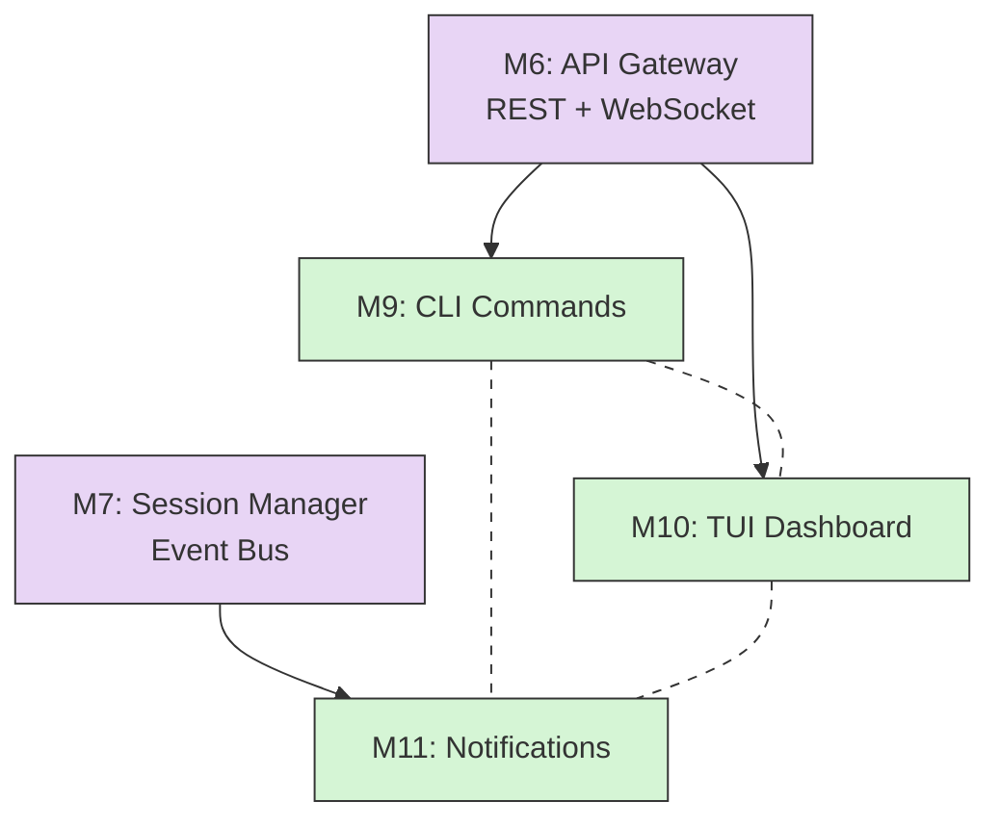
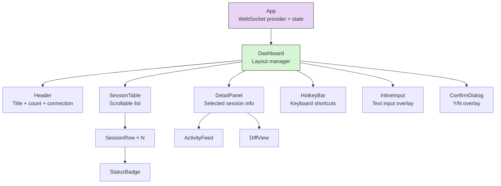
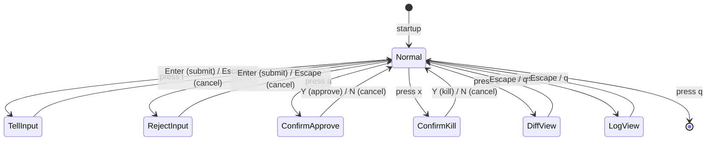

> The user-facing layer. Three independent components — CLI commands, TUI dashboard, and notifications — all building on the Phase 3 API Gateway and Session Manager. Each section is self-contained: an agent working on one doesn't need to read the others.

## Phase Overview

Phase 4 delivers everything the user touches. All three components depend on Phase 3 but are **completely independent of each other** — they can be built in parallel by three separate agents.



Dashed lines = "aware of each other, no code dependency." M9 exposes the `ap watch` entry point that launches M10, but M10 is a separate module. M11 lives entirely in the daemon.

| Milestone | Package | Depends On | Estimated Effort |
|-----------|---------|------------|-----------------|
| M9: CLI Commands | `packages/cli` | M6 (API Gateway) | Large — most surface area |
| M10: TUI Dashboard | `packages/cli` | M6 (API Gateway WebSocket) | Medium — Ink components |
| M11: Notifications | `packages/daemon` | M7 (Session Manager event bus) | Small — webhook + card builder |

---

## M9: CLI Commands

**Package**: `packages/cli/src/commands/`
**Depends on**: M6 (API Gateway — the CLI calls REST endpoints, nothing else)
**What**: Every `ap` command. The CLI is a thin, stateless remote control — it calls the daemon's REST API and renders results in the terminal.

### File Structure

```
packages/cli/
├── src/
│   ├── index.ts                    # Commander program setup, register all commands
│   ├── api/
│   │   └── client.ts               # HTTP client wrapping undici/fetch
│   ├── commands/
│   │   ├── auth.ts                 # login, logout, whoami
│   │   ├── daemon.ts               # connect, disconnect
│   │   ├── profile.ts              # create, ls, show, edit, delete, warm
│   │   ├── session.ts              # run, ls, status, tell, approve, reject, kill
│   │   ├── validate.ts             # validate, open, diff
│   │   └── watch.ts                # launches TUI (M10 entry point)
│   ├── output/
│   │   ├── table.ts                # Table formatter (cli-table3)
│   │   ├── colors.ts               # Status color mapping (chalk)
│   │   ├── spinner.ts              # Spinner wrapper (ora)
│   │   └── json.ts                 # --json flag handler
│   ├── config/
│   │   ├── config-store.ts         # Read/write ~/.autopod/config.yaml
│   │   ├── credential-store.ts     # Read/write ~/.autopod/credentials.json
│   │   └── schema.ts               # Zod schemas for config validation
│   ├── auth/
│   │   ├── msal-client.ts          # @azure/msal-node wrapper
│   │   └── token-manager.ts        # Token lifecycle, auto-refresh
│   └── utils/
│       ├── error-handler.ts        # Global error → exit code mapping
│       └── id-resolver.ts          # Resolve partial session IDs (e.g., "a1b" → "a1b2c3d4")
├── bin/
│   └── ap.ts                       # Shebang entry point
├── package.json
├── tsconfig.json
└── tsup.config.ts
```

### Component: HTTP Client

**File**: `packages/cli/src/api/client.ts`

The single gateway between CLI and daemon. Every command goes through this. No command ever makes raw HTTP calls.

```typescript
import { Session, SessionSummary, CreateSessionRequest, Profile,
         ValidationResult } from '@autopod/shared';

interface ClientConfig {
  baseUrl: string;
  getToken: () => Promise<string>;   // injected from token-manager
}

class AutopodClient {
  constructor(private config: ClientConfig) {}

  // ─── Sessions ─────────────────────────────────────────
  createSession(req: CreateSessionRequest): Promise<Session>;
  listSessions(filters?: { status?: string; profile?: string }): Promise<SessionSummary[]>;
  getSession(id: string): Promise<Session>;
  sendMessage(id: string, message: string): Promise<void>;
  triggerValidation(id: string, page?: string): Promise<void>;
  approveSession(id: string, opts?: { squash?: boolean }): Promise<void>;
  rejectSession(id: string, feedback: string): Promise<void>;
  killSession(id: string): Promise<void>;
  getSessionDiff(id: string, stat?: boolean): Promise<string>;
  getSessionLogs(id: string, buildLogs?: boolean): Promise<ReadableStream>;

  // ─── Profiles ─────────────────────────────────────────
  listProfiles(): Promise<Profile[]>;
  getProfile(name: string): Promise<Profile>;
  createProfile(profile: Partial<Profile>): Promise<Profile>;
  updateProfile(name: string, updates: Partial<Profile>): Promise<Profile>;
  deleteProfile(name: string): Promise<void>;
  warmProfile(name: string, rebuild?: boolean): Promise<void>;

  // ─── Bulk ─────────────────────────────────────────────
  approveAllValidated(): Promise<{ approved: string[] }>;
  killAllFailed(): Promise<{ killed: string[] }>;

  // ─── Internal ─────────────────────────────────────────
  private async request<T>(method: string, path: string, body?: unknown): Promise<T>;
}
```

**Request flow**:

1. `request()` builds the full URL from `config.baseUrl + path`
2. Calls `config.getToken()` to get the current access token
3. Sets `Authorization: Bearer <token>` header
4. Makes the HTTP call via `undici` (faster than node-fetch, built into Node 22)
5. If response is `401`, calls `tokenManager.refresh()` and retries once
6. If response is `4xx/5xx`, maps to the appropriate `AutopodError` subclass
7. Returns parsed JSON body typed as `T`

**Error mapping** (daemon HTTP status → CLI error):

| HTTP Status | Error Class | CLI Exit Code |
|-------------|-------------|---------------|
| 401 | `AuthError` | 2 |
| 403 | `ForbiddenError` | 2 |
| 404 | `SessionNotFoundError` / `ProfileNotFoundError` | 3 |
| 409 | `InvalidStateTransitionError` / `ProfileExistsError` | 1 |
| 422 | `ValidationError` (bad input) | 1 |
| 500+ | `AutopodError` (generic) | 1 |
| Network error | `DaemonUnreachableError` | 5 |

### Component: Command Handlers

All commands use `commander.js`. Each file exports a function that receives the Commander program and registers subcommands.

#### Auth Commands (`commands/auth.ts`)

```typescript
// ap login [--device]
// ap logout
// ap whoami
```

| Command | What It Does | Notes |
|---------|-------------|-------|
| `ap login` | Auto-detects environment. Uses PKCE flow if local terminal detected (TTY + can open browser), device code flow otherwise. Stores tokens in `~/.autopod/credentials.json`. | Prints "Logged in as {name} ({email})" on success. |
| `ap login --device` | Forces device code flow. Prints the URL and code, waits for completion. | Useful for SSH sessions, CI, headless environments. |
| `ap logout` | Deletes `~/.autopod/credentials.json`. | Prints "Logged out." No confirmation needed. |
| `ap whoami` | Reads stored token, decodes JWT (no validation — that's the daemon's job), prints user info. Also pings daemon health endpoint and shows connection status. | Output: name, email, roles, daemon URL, daemon status (connected/unreachable). |

**Token storage** (`config/credential-store.ts`):
- Path: `~/.autopod/credentials.json`
- File permissions: `0600` (owner read/write only)
- Contents: `AuthToken` from `@autopod/shared`
- On read: check `expiresAt`. If expired, attempt refresh via MSAL. If refresh fails, delete file and prompt re-login.

#### Daemon Commands (`commands/daemon.ts`)

```typescript
// ap connect <url>
// ap disconnect
```

| Command | What It Does |
|---------|-------------|
| `ap connect <url>` | Validates URL format, pings `GET <url>/health`, stores URL in `~/.autopod/config.yaml`. Prints "Connected to {url} (v{version})". |
| `ap disconnect` | Removes `daemon` key from config. Prints "Disconnected." |

**Validation on connect**: The daemon exposes `GET /health` returning `{ status: "ok", version: "x.y.z" }`. If this fails, print a clear error: "Cannot reach daemon at {url}. Is it running?" — but still store the URL (the daemon might come up later).

#### Profile Commands (`commands/profile.ts`)

```typescript
// ap profile create <name> --repo <repo> --template <tpl> --build <cmd> --start <cmd> --health <path> [options]
// ap profile ls
// ap profile show <name>
// ap profile edit <name>
// ap profile delete <name>
// ap profile warm <name> [--rebuild]
```

**`ap profile create`** — Full flag list:

| Flag | Required | Default | Description |
|------|----------|---------|-------------|
| `--repo <repo>` | Yes | — | GitHub repo URL or `owner/repo` shorthand |
| `--template <tpl>` | Yes | — | Stack template: `node22`, `node22-pw`, `dotnet9`, `python312`, `custom` |
| `--build <cmd>` | Yes | — | Build command (e.g., `"npm ci && npm run build"`) |
| `--start <cmd>` | Yes | — | Start command (e.g., `"npx astro preview --port $PORT"`) |
| `--health <path>` | No | `"/"` | Health check path |
| `--model <model>` | No | `"opus"` | Default AI model |
| `--runtime <runtime>` | No | `"claude"` | Default runtime |
| `--instructions <text>` | No | `null` | Custom CLAUDE.md instructions |
| `--extends <parent>` | No | `null` | Parent profile name to inherit from |

On success: prints profile summary table. On validation error: prints specific missing/invalid fields.

**`ap profile ls`** — Table output:

```
Name         Repo                   Template   Model   Warm Image
──────────── ────────────────────── ────────── ─────── ──────────
ideaspace    esbenwiberg/ideaspace  node22-pw  opus    ✓ (2h ago)
my-api       esbenwiberg/my-api     node22     sonnet  ✗
```

Supports `--json` for machine-readable output.

**`ap profile show <name>`** — Detailed view:

```
Profile: ideaspace
──────────────────────────────────────────
Repo:           https://github.com/esbenwiberg/ideaspace
Branch:         main
Template:       node22-pw
Build:          npm ci && npm run build
Start:          npx astro preview --host 0.0.0.0 --port $PORT
Health:         / (timeout: 120s)
Model:          opus
Runtime:        claude
Extends:        —
Warm Image:     autopod/ideaspace:latest (built 2h ago)
Validation:     3 attempts, pages: /, /ideas
Escalation:     ask_human: on, ask_ai: sonnet (max 5)
Instructions:   "Focus on Astro v5 patterns..."
```

**`ap profile edit <name>`**:

1. `GET /profiles/:name` — fetch current profile as YAML
2. Write to temp file
3. Open `$EDITOR` (fall back to `vi` → `nano` → error)
4. Wait for editor to close
5. Read temp file, parse YAML, validate with Zod
6. `PUT /profiles/:name` with updated fields
7. Delete temp file
8. Print "Profile updated." or validation errors

**`ap profile delete <name>`**: Prompts "Delete profile '{name}'? This cannot be undone. [y/N]". No `--force` flag — always confirm.

**`ap profile warm <name> [--rebuild]`**: Triggers image pre-baking on the daemon. Shows spinner while waiting, then prints "Warm image built: autopod/{name}:latest". The `--rebuild` flag forces a fresh build even if an image already exists.

#### Session Commands (`commands/session.ts`)

This is the biggest file. It handles the full session lifecycle.

```typescript
// ap run <profile> "<task>" [options]
// ap ls [--status <status>] [--profile <profile>] [--json]
// ap status <id>
// ap logs <id> [--build] [--follow]
// ap tell <id> "<message>" / --file <path> / --stdin
// ap approve <id> [--squash]
// ap reject <id> "<feedback>" / --file <path>
// ap kill <id>
// ap approve --all-validated
// ap kill --all-failed
```

**`ap run <profile> "<task>"`**:

| Flag | Default | Description |
|------|---------|-------------|
| `--model <model>` | Profile default | Override AI model |
| `--runtime <runtime>` | Profile default | Override runtime (`claude` / `codex`) |
| `--branch <branch>` | Auto-generated | Custom git branch name |
| `--no-validate` | `false` | Skip auto-validation after agent completes |
| `--json` | `false` | Output JSON `{ id, status, branch }` |

Flow:
1. Build `CreateSessionRequest` from args + flags
2. Show spinner: "Creating session..."
3. `POST /sessions` → get `Session` back
4. Print: "Session **{id}** created on branch `{branch}`"
5. Print: "Track progress: `ap status {id}` or `ap watch`"

If `--json`, skip the human-friendly output and print raw JSON.

**`ap ls`** — Table output:

```
ID      Profile      Task                       Model   Status       Duration
─────── ──────────── ────────────────────────── ─────── ──────────── ────────
a1b2c3  ideaspace    Add dark mode toggle        opus    ● validated   12m
c3d4e5  ideaspace    Fix auth redirect           codex   ◉ running     4m
e5f6g7  my-api       Add pagination endpoint     sonnet  ✗ failed     28m
g7h8i9  my-api       Fix rate limiting           opus    ◉ running     1m
```

Status symbols and colors:

| Status | Symbol | Color |
|--------|--------|-------|
| `queued` | `○` | dim white |
| `provisioning` | `◌` | dim white |
| `running` | `◉` | cyan |
| `awaiting_input` | `?` | yellow (bold) |
| `validating` | `⟳` | blue |
| `validated` | `●` | green |
| `failed` | `✗` | red |
| `approved` | `✓` | green (bold) |
| `merging` | `⟳` | green |
| `complete` | `✓` | dim green |
| `killing` | `⟳` | dim red |
| `killed` | `✗` | dim red |

Filter flags: `--status running`, `--profile ideaspace`, or combine both. `--json` returns `SessionSummary[]`.

**`ap status <id>`** — Detailed session view:

```
Session: a1b2c3d4
──────────────────────────────────────────
Profile:        ideaspace
Task:           Add dark mode toggle
Status:         ● validated
Model:          opus
Runtime:        claude
Branch:         feature/add-dark-mode-toggle-a1b2c3d4
Duration:       12m 34s
Files Changed:  4 (+87 -12)
Preview:        https://a1b-xyz.trycloudflare.com
Validation:     ✓ passed (attempt 1/3)
  Smoke:        ✓ build ok, health ok, 2 pages checked
  Task Review:  ✓ "Changes correctly implement dark mode toggle..."

Actions:
  ap approve a1b2  — merge and clean up
  ap reject a1b2 "feedback"  — send back for changes
  ap diff a1b2     — view changes
  ap open a1b2     — open preview in browser
```

Note the "Actions" section — context-sensitive suggestions based on current status. If status is `awaiting_input`, show the agent's question and suggest `ap tell`.

**`ap logs <id>`**:

- Default: stream agent activity events (tool use, file changes, status messages)
- `--build`: show build/validation logs instead
- `--follow` / `-f`: keep streaming (WebSocket connection to `WS /events`, filtered to this session)
- Without `--follow`: fetch recent events from REST and exit

Log output format:
```
12:34:56  status   Reading repository structure...
12:34:58  tool     Read src/components/Header.astro
12:35:01  tool     Edit src/components/Header.astro (+12 -3)
12:35:04  tool     Bash npm run build
12:35:15  status   Build successful, running tests...
12:35:22  complete Task completed: Added dark mode toggle component
```

**`ap tell <id> "<message>"`**:

Three input modes:
1. Inline: `ap tell a1b2 "Use JWT tokens instead of session cookies"`
2. File: `ap tell a1b2 --file feedback.md`
3. Stdin: `cat feedback.md | ap tell a1b2 --stdin`

On success: "Message sent to session a1b2." If the session is not in a state that accepts messages (`running` or `awaiting_input`), print error with current status.

**`ap approve <id> [--squash]`**:

1. Confirm: "Approve session a1b2? Branch will be merged to main. [y/N]"
2. `POST /sessions/:id/approve` with `{ squash: true/false }`
3. Show spinner: "Merging..."
4. Print: "Session a1b2 approved. Branch `feature/...` merged to main."

Bulk: `ap approve --all-validated` — lists all validated sessions, confirms, approves each, prints summary.

**`ap reject <id> "<feedback>"`**:

1. `POST /sessions/:id/reject` with `{ feedback }`
2. Print: "Feedback sent to session a1b2. Agent will retry."

File input: `ap reject a1b2 --file feedback.md`. No confirmation needed — rejection is non-destructive.

**`ap kill <id>`**:

1. Confirm: "Kill session a1b2? All work will be lost. [y/N]"
2. `DELETE /sessions/:id`
3. Print: "Session a1b2 killed."

Bulk: `ap kill --all-failed` — lists all failed sessions, confirms, kills each.

#### Validate Commands (`commands/validate.ts`)

```typescript
// ap validate <id> [--page <path>]
// ap open <id>
// ap diff <id> [--stat]
```

**`ap validate <id>`**: Triggers validation manually. Shows spinner, then prints result summary (pass/fail, smoke status, task review verdict).

**`ap open <id>`**: Fetches session, reads `previewUrl`, opens in default browser via `open` package. If no preview URL, prints "No preview available — session may still be provisioning."

**`ap diff <id>`**: Fetches diff from `GET /sessions/:id/diff`. Prints with syntax highlighting (use `diff2html` or raw unified diff with color). `--stat` shows summary only (files changed, insertions, deletions).

### Component: Output Formatting

#### Table Formatter (`output/table.ts`)

Wraps `cli-table3` with consistent styling:

```typescript
interface TableConfig {
  columns: Array<{
    header: string;
    key: string;
    width?: number;
    align?: 'left' | 'center' | 'right';
    formatter?: (value: unknown) => string;
  }>;
}

function renderTable(data: Record<string, unknown>[], config: TableConfig): string;
```

All list commands (`ap ls`, `ap profile ls`) use this. The table auto-adjusts column widths to terminal width but respects minimums so nothing gets unreadable.

#### Color Mapping (`output/colors.ts`)

```typescript
import chalk from 'chalk';

const statusColors: Record<SessionStatus, (text: string) => string> = {
  queued:         chalk.dim,
  provisioning:   chalk.dim,
  running:        chalk.cyan,
  awaiting_input: chalk.yellow.bold,
  validating:     chalk.blue,
  validated:      chalk.green,
  failed:         chalk.red,
  approved:       chalk.green.bold,
  merging:        chalk.green,
  complete:       chalk.dim.green,
  killing:        chalk.dim.red,
  killed:         chalk.dim.red,
};

const statusSymbols: Record<SessionStatus, string> = {
  queued:         '○',
  provisioning:   '◌',
  running:        '◉',
  awaiting_input: '?',
  validating:     '⟳',
  validated:      '●',
  failed:         '✗',
  approved:       '✓',
  merging:        '⟳',
  complete:       '✓',
  killing:        '⟳',
  killed:         '✗',
};

function formatStatus(status: SessionStatus): string {
  return statusColors[status](`${statusSymbols[status]} ${status}`);
}

function formatDuration(seconds: number): string;  // "4m", "1h 23m", "< 1m"
```

#### JSON Output (`output/json.ts`)

```typescript
// Wraps every command's output handling
function withJsonOutput<T>(
  opts: { json?: boolean },
  data: T,
  humanRenderer: (data: T) => void
): void {
  if (opts.json) {
    process.stdout.write(JSON.stringify(data, null, 2) + '\n');
  } else {
    humanRenderer(data);
  }
}
```

All list and status commands pass through this. `--json` always writes to stdout (never stderr), so pipes and `jq` work cleanly.

#### Spinner (`output/spinner.ts`)

Thin wrapper around `ora`:

```typescript
async function withSpinner<T>(message: string, fn: () => Promise<T>): Promise<T> {
  const spinner = ora(message).start();
  try {
    const result = await fn();
    spinner.succeed();
    return result;
  } catch (error) {
    spinner.fail();
    throw error;
  }
}
```

### Component: Config Management

**File**: `packages/cli/src/config/config-store.ts`

Reads and writes `~/.autopod/config.yaml`. Creates the directory and file on first use.

```typescript
interface AutopodConfig {
  daemon?: string;                    // daemon base URL
  defaultModel?: string;              // e.g., "opus"
  notifications?: {
    teams?: {
      webhook?: string;
      events?: NotificationType[];
    };
    desktop?: boolean;
    sound?: boolean;
  };
  watch?: {
    theme?: 'dark' | 'light';
    refreshInterval?: number;         // ms
  };
}
```

**Zod schema** (`config/schema.ts`):

```typescript
import { z } from 'zod';

const configSchema = z.object({
  daemon: z.string().url().optional(),
  defaultModel: z.string().optional(),
  notifications: z.object({
    teams: z.object({
      webhook: z.string().url().optional(),
      events: z.array(z.enum([
        'session_validated', 'session_failed',
        'session_needs_input', 'session_error'
      ])).optional(),
    }).optional(),
    desktop: z.boolean().optional(),
    sound: z.boolean().optional(),
  }).optional(),
  watch: z.object({
    theme: z.enum(['dark', 'light']).optional(),
    refreshInterval: z.number().int().min(500).max(10000).optional(),
  }).optional(),
});
```

Config is validated on read. If the file contains invalid data, print a warning and fall back to defaults — never crash on bad config.

### Component: Error Handling

**File**: `packages/cli/src/utils/error-handler.ts`

Global error handler wrapping the entire CLI:

```typescript
const exitCodeMap: Record<string, number> = {
  AUTH_ERROR:           2,
  FORBIDDEN:           2,
  SESSION_NOT_FOUND:   3,
  PROFILE_NOT_FOUND:   3,
  VALIDATION_ERROR:    4,
  DAEMON_UNREACHABLE:  5,
};

function handleError(error: unknown): never {
  if (error instanceof AutopodError) {
    console.error(chalk.red(`Error: ${error.message}`));

    // Contextual suggestions
    if (error.code === 'AUTH_ERROR') {
      console.error(chalk.dim('Try: ap login'));
    } else if (error.code === 'DAEMON_UNREACHABLE') {
      console.error(chalk.dim('Try: ap connect <url>'));
    } else if (error.code === 'SESSION_NOT_FOUND') {
      console.error(chalk.dim('Try: ap ls'));
    }

    process.exit(exitCodeMap[error.code] ?? 1);
  }

  // Unknown error — print stack in debug mode
  console.error(chalk.red('Unexpected error:'), error);
  process.exit(1);
}
```

### Component: Session ID Resolution

**File**: `packages/cli/src/utils/id-resolver.ts`

Session IDs are 8 characters, but typing all 8 every time is annoying. The CLI accepts partial IDs (minimum 3 characters) and resolves them:

```typescript
async function resolveSessionId(client: AutopodClient, partial: string): Promise<string> {
  if (partial.length >= 8) return partial;  // full ID, use as-is
  if (partial.length < 3) throw new Error('Session ID must be at least 3 characters');

  const sessions = await client.listSessions();
  const matches = sessions.filter(s => s.id.startsWith(partial));

  if (matches.length === 0) throw new SessionNotFoundError(partial);
  if (matches.length === 1) return matches[0].id;
  throw new Error(
    `Ambiguous ID "${partial}" matches ${matches.length} sessions: ` +
    matches.map(s => s.id).join(', ')
  );
}
```

Every command that takes an `<id>` argument runs it through this resolver first.

### Entry Point

**File**: `packages/cli/src/index.ts`

```typescript
import { Command } from 'commander';
import { registerAuthCommands } from './commands/auth';
import { registerDaemonCommands } from './commands/daemon';
import { registerProfileCommands } from './commands/profile';
import { registerSessionCommands } from './commands/session';
import { registerValidateCommands } from './commands/validate';
import { registerWatchCommand } from './commands/watch';
import { handleError } from './utils/error-handler';
import { version } from '../package.json';

const program = new Command()
  .name('ap')
  .description('Autopod CLI — autonomous coding pod manager')
  .version(version);

registerAuthCommands(program);
registerDaemonCommands(program);
registerProfileCommands(program);
registerSessionCommands(program);
registerValidateCommands(program);
registerWatchCommand(program);

program.parseAsync(process.argv).catch(handleError);
```

**Bin entry** (`bin/ap.ts`):
```typescript
#!/usr/bin/env node
import '../src/index';
```

### Exit Codes

| Code | Constant | Meaning | Triggered By |
|------|----------|---------|-------------|
| 0 | `EXIT_SUCCESS` | Operation completed successfully | Any successful command |
| 1 | `EXIT_GENERAL_ERROR` | General error | Invalid input, server error, unknown errors |
| 2 | `EXIT_AUTH_FAILURE` | Authentication or authorization failure | Expired/invalid token, insufficient role |
| 3 | `EXIT_NOT_FOUND` | Resource not found | Invalid session ID, unknown profile |
| 4 | `EXIT_VALIDATION_FAILED` | Validation failure | Scripting: `ap validate` returns 4 on failure |
| 5 | `EXIT_DAEMON_UNREACHABLE` | Cannot reach daemon | Network error, daemon down |

### Dependencies

```json
{
  "dependencies": {
    "@autopod/shared": "workspace:*",
    "@azure/msal-node": "^2.x",
    "commander": "^12.x",
    "chalk": "^5.x",
    "cli-table3": "^0.6.x",
    "ora": "^8.x",
    "open": "^10.x",
    "undici": "^7.x",
    "yaml": "^2.x",
    "zod": "^3.x",
    "ink": "^5.x",
    "react": "^18.x"
  }
}
```

### Testing Strategy

| What | How | Coverage Target |
|------|-----|----------------|
| Command handlers | Mock `AutopodClient`, verify correct API calls and output | Every command, every flag |
| HTTP client | Mock HTTP responses (msw or manual), test error mapping, test token refresh | All status codes, network errors |
| Output formatting | Snapshot tests for table output, verify color/symbol mapping | All session statuses |
| Config store | Write/read temp files, test Zod validation, test missing file handling | Valid, invalid, missing configs |
| ID resolver | Mock session list, test partial matching, ambiguity, not found | Edge cases: 3-char, 8-char, ambiguous |
| Integration | Start daemon (testcontainers), run CLI commands, verify end-to-end | Happy path for each command |

### Acceptance Criteria

- [ ] All commands from the [CLI Design](./cli-design) doc work as specified
- [ ] `--json` flag on all list/status commands returns valid, parseable JSON
- [ ] Error messages include actionable suggestions (e.g., "Try: ap login")
- [ ] Token auto-refresh works transparently — users don't see 401 errors unless truly expired
- [ ] Config persists across CLI invocations in `~/.autopod/config.yaml`
- [ ] `ap run` creates a session and returns the session ID
- [ ] `ap tell` delivers the message and shows confirmation
- [ ] `ap approve` merges the branch and shows success
- [ ] `ap reject` sends feedback and confirms the agent will retry
- [ ] Partial session IDs (3+ chars) resolve correctly
- [ ] Exit codes match the spec table above
- [ ] All commands work with piped output (no TTY assumptions in `--json` mode)
- [ ] `ap profile edit` works with `$EDITOR`, `vi`, and `nano`

---

## M10: TUI Dashboard

**Package**: `packages/cli/src/tui/`
**Depends on**: M6 (API Gateway — needs WebSocket endpoint `WS /events` for real-time updates, plus REST for initial state load)
**What**: Ink-based (React for CLI) TUI dashboard. The `ap watch` command.

### File Structure

```
packages/cli/src/tui/
├── Dashboard.tsx                   # Root component
├── App.tsx                         # Provider wrapper (context, WebSocket)
├── components/
│   ├── Header.tsx                  # Title bar with session count + connection status
│   ├── SessionTable.tsx            # Scrollable session list
│   ├── SessionRow.tsx              # Single row in the table
│   ├── DetailPanel.tsx             # Expanded view of selected session
│   ├── ActivityFeed.tsx            # Recent agent events for selected session
│   ├── HotkeyBar.tsx               # Bottom bar showing available shortcuts
│   ├── InlineInput.tsx             # Text input overlay for tell/reject
│   ├── ConfirmDialog.tsx           # Y/N confirmation overlay for kill/approve
│   ├── DiffView.tsx                # Inline diff display
│   └── StatusBadge.tsx             # Colored status indicator
├── hooks/
│   ├── useWebSocket.ts             # WebSocket connection with reconnection
│   ├── useSessionState.ts          # Session state management (REST + WS sync)
│   ├── useKeyboard.ts              # Keyboard shortcut dispatcher
│   ├── useSelection.ts             # Arrow key navigation state
│   └── useTerminalSize.ts          # Terminal dimensions tracking
└── utils/
    ├── layout.ts                   # Column width calculations
    └── truncate.ts                 # Smart text truncation
```

### Layout

Full terminal width, three sections stacked vertically:

```
┌──────────────────────────────────────────────────────────────┐
│  autopod ███████████████████████████████████████  4 sessions │  ← Header
├──────────────────────────────────────────────────────────────┤
│                                                              │
│  ID      Profile       Task                    Status        │  ← SessionTable
│  ─────── ──────────── ─────────────────────── ──────────     │
│ ▸ a1b2   ideaspace    Add dark mode toggle     ● validated   │  (selected)
│   c3d4   ideaspace    Fix auth redirect        ◉ running 4m  │
│   e5f6   my-api       Add pagination           ✗ failed      │
│   g7h8   my-api       Fix rate limiting        ◉ running 1m  │
│                                                              │
├──────────────────────────────────────────────────────────────┤
│  ┤ a1b2 ├ ideaspace ─ ● validated ──────────────────────     │  ← DetailPanel
│                                                              │
│  Task:      Add dark mode toggle                             │
│  Model:     opus (claude runtime)                            │
│  Branch:    feature/add-dark-mode-toggle-a1b2c3d4            │
│  Duration:  12m 34s                                          │
│  Changes:   4 files (+87 -12)                                │
│  Preview:   https://a1b-xyz.trycloudflare.com                │
│                                                              │
│  Activity:                                                   │  ← ActivityFeed
│  12:35:22  ✓ complete  Task completed                        │
│  12:35:15  ● status    Build successful                      │
│  12:35:01  ✎ edit      src/components/Header.astro (+12 -3)  │
│  12:34:58  ◇ read      src/components/Header.astro           │
│                                                              │
├──────────────────────────────────────────────────────────────┤
│  ↑↓ navigate  t tell  d diff  a approve  r reject            │  ← HotkeyBar
│               o open  l logs  k kill     v validate  q quit  │
└──────────────────────────────────────────────────────────────┘
```

**Minimum terminal size**: 80 columns, 24 rows. If terminal is too small, show a "Terminal too small" message instead of the dashboard.

**Responsive behavior**:
- `< 100 cols`: Hide "Model" column from table, truncate task to 20 chars
- `100-140 cols`: Show all columns, truncate task to 30 chars
- `> 140 cols`: Full task text, wider detail panel

### Component Hierarchy



### Component Specs

#### `<App>` — Provider Wrapper

```typescript
// App.tsx
interface AppProps {
  daemonUrl: string;
  token: string;
}
```

Sets up:
1. `SessionStateContext` — global state of all sessions
2. WebSocket connection via `useWebSocket` hook
3. Initial data load from `GET /sessions`
4. Error boundary — if WebSocket dies and can't reconnect, show error state

#### `<Header>`

```typescript
interface HeaderProps {
  sessionCount: number;
  connected: boolean;          // WebSocket connection status
  daemonUrl: string;
}
```

Renders:
- Left: "autopod" in bold
- Center: connection indicator (green dot = connected, red dot = disconnected, yellow dot = reconnecting)
- Right: "{N} sessions"

When disconnected, shows "reconnecting..." with attempt count.

#### `<SessionTable>`

```typescript
interface SessionTableProps {
  sessions: SessionSummary[];
  selectedIndex: number;
  onSelect: (index: number) => void;
  terminalWidth: number;
}
```

Features:
- Arrow key scrolling (managed by parent via `useSelection` hook)
- Selected row highlighted with `▸` prefix and inverse colors
- Columns: ID (5 chars), Profile, Task (truncated), Model, Status (colored)
- Running sessions show elapsed time: "running 4m"
- `awaiting_input` sessions blink or show bold yellow to attract attention
- Empty state: "No sessions. Run `ap run <profile> \"task\"` to create one."

Column width calculation (`utils/layout.ts`):
```typescript
function calculateColumns(terminalWidth: number): ColumnWidths {
  const fixed = 5 + 2 + 12 + 2 + 7 + 2 + 14;  // ID + gaps + profile + gap + model + gap + status
  const taskWidth = Math.max(15, terminalWidth - fixed - 4);  // remainder to task, min 15
  return { id: 5, profile: 12, task: taskWidth, model: 7, status: 14 };
}
```

#### `<SessionRow>`

```typescript
interface SessionRowProps {
  session: SessionSummary;
  selected: boolean;
  columns: ColumnWidths;
}
```

Single row rendering. Handles:
- Text truncation with ellipsis
- Status coloring via `<StatusBadge>`
- Duration formatting for running sessions
- Bold/highlight for `awaiting_input`

#### `<DetailPanel>`

```typescript
interface DetailPanelProps {
  session: Session | null;     // full session (fetched on select)
  events: AgentEvent[];        // recent events for this session
}
```

Shows when a session is selected. Fetches full session details from `GET /sessions/:id` on selection change (debounced 200ms to avoid hammering during fast scrolling).

Sections:
1. **Header line**: Session ID + profile + status badge
2. **Info grid**: Task, model, branch, duration, file changes, preview URL
3. **Activity feed**: Last 10 agent events (see `<ActivityFeed>`)
4. **Validation summary**: If validated/failed, show smoke + task review result
5. **Escalation**: If `awaiting_input`, show the agent's question prominently

#### `<ActivityFeed>`

```typescript
interface ActivityFeedProps {
  events: AgentEvent[];
  maxLines: number;             // default 8, adjusts to terminal height
}
```

Shows recent agent events in reverse chronological order. Event type → icon mapping:

| Event Type | Icon | Example |
|-----------|------|---------|
| `status` | `●` | `● Building project...` |
| `tool_use` (Read) | `◇` | `◇ Read src/index.ts` |
| `tool_use` (Edit) | `✎` | `✎ Edit src/index.ts (+5 -2)` |
| `tool_use` (Bash) | `$` | `$ npm run build` |
| `tool_use` (other) | `◆` | `◆ Grep "pattern"` |
| `file_change` | `△` | `△ Created src/new-file.ts` |
| `complete` | `✓` | `✓ Task completed` |
| `error` | `✗` | `✗ Build failed: exit code 1` |
| `escalation` | `?` | `? Asking: "Which auth strategy?"` |

New events slide in at the top with a brief highlight effect (bold for 2 seconds).

#### `<HotkeyBar>`

```typescript
interface HotkeyBarProps {
  currentStatus: SessionStatus | null;  // selected session's status
  inputMode: 'none' | 'tell' | 'reject';
}
```

Context-sensitive — only shows shortcuts that make sense for the selected session's status:

| Status | Available Shortcuts |
|--------|-------------------|
| `running` | `t` tell, `l` logs, `k` kill, `q` quit |
| `awaiting_input` | `t` tell (highlighted), `k` kill, `q` quit |
| `validating` | `l` logs, `k` kill, `q` quit |
| `validated` | `a` approve, `r` reject, `d` diff, `o` open, `k` kill, `q` quit |
| `failed` | `r` reject, `d` diff, `l` logs, `k` kill, `q` quit |
| No selection | `q` quit |

Format: `[key] label` with the key highlighted in a contrasting color.

#### `<InlineInput>`

```typescript
interface InlineInputProps {
  prompt: string;               // e.g., "Tell agent:" or "Reject reason:"
  onSubmit: (text: string) => void;
  onCancel: () => void;
}
```

Renders a text input at the bottom of the dashboard, above the hotkey bar. Overlays the detail panel. Features:
- Single-line text input with cursor
- `Enter` to submit, `Escape` to cancel
- Text wraps if longer than terminal width
- Prompt shows what action this is for

#### `<ConfirmDialog>`

```typescript
interface ConfirmDialogProps {
  message: string;              // e.g., "Kill session a1b2? All work will be lost."
  onConfirm: () => void;
  onCancel: () => void;
}
```

Centered overlay with `[Y]es / [N]o` options. Used for kill and approve actions.

### Hooks

#### `useWebSocket`

```typescript
interface UseWebSocketOptions {
  url: string;                  // ws://daemon/events
  token: string;
  onEvent: (event: SystemEvent) => void;
  onConnect: () => void;
  onDisconnect: () => void;
}

interface UseWebSocketReturn {
  connected: boolean;
  reconnecting: boolean;
  reconnectAttempt: number;
  disconnect: () => void;
}
```

Reconnection strategy:
- **Exponential backoff**: 1s, 2s, 4s, 8s, 16s, 30s (capped)
- **Max attempts**: unlimited (dashboard should keep trying)
- **Jitter**: add 0-1s random jitter to prevent thundering herd
- On reconnect: re-fetch full session list from REST to sync state (events may have been missed)

WebSocket message format (from daemon):
```json
{
  "type": "session.status_changed",
  "timestamp": "2026-03-15T12:34:56Z",
  "sessionId": "a1b2c3d4",
  "previousStatus": "running",
  "newStatus": "validating"
}
```

Authentication: send token as query param `?token=<jwt>` on connection (WebSocket doesn't support custom headers in browser environments, and this keeps it consistent).

#### `useSessionState`

```typescript
interface UseSessionStateReturn {
  sessions: SessionSummary[];
  selectedSession: Session | null;  // full details of selected
  loading: boolean;
  error: string | null;
  refresh: () => Promise<void>;
}
```

State management flow:
1. On mount: `GET /sessions` → populate `sessions` array
2. On WebSocket `session.created`: add to array
3. On WebSocket `session.status_changed`: update status in array
4. On WebSocket `session.completed`: update status, move to bottom of list
5. On WebSocket `session.agent_activity`: update activity feed for selected session
6. On selection change: `GET /sessions/:id` → populate `selectedSession`

Sessions sorted by: active first (running, awaiting_input, validating), then by `createdAt` descending.

#### `useSelection`

```typescript
interface UseSelectionReturn {
  selectedIndex: number;
  setSelectedIndex: (i: number) => void;
  moveUp: () => void;
  moveDown: () => void;
}
```

Handles arrow key navigation with bounds checking. When a new session appears (WebSocket event), selection stays on the current session (don't jump).

#### `useKeyboard`

```typescript
function useKeyboard(handlers: Record<string, () => void>): void;
```

Maps key presses to handler functions. Disabled when `<InlineInput>` or `<ConfirmDialog>` is active (input captures all keys). Uses Ink's `useInput` hook internally.

Full keyboard mapping:

| Key | Action | Precondition |
|-----|--------|-------------|
| `↑` / `k` | Select previous session | Always |
| `↓` / `j` | Select next session | Always |
| `t` | Open tell input | Session is `running` or `awaiting_input` |
| `d` | Show diff in detail panel | Session exists |
| `a` | Approve (with confirm) | Session is `validated` |
| `r` | Open reject input | Session is `validated` or `failed` |
| `o` | Open preview URL | Session has `previewUrl` |
| `l` | Toggle log view in detail panel | Session exists |
| `k` | Kill (with confirm) | Session is active |
| `v` | Trigger validation | Session is `running` |
| `q` | Quit dashboard | Always |
| `Escape` | Cancel current input/dialog | Input or dialog is open |

Note: `k` has dual meaning — kill when not navigating (vim keys disabled when session action context applies). Resolve by: `k` = kill only when shift is held or when the selection doesn't change (i.e., already at top of list). Alternatively, use `K` (uppercase) for kill. **Decision**: use `x` for kill instead of `k` to avoid vim-nav conflict.

Corrected mapping:

| Key | Action |
|-----|--------|
| `x` | Kill session (with confirm) |

#### `useTerminalSize`

```typescript
function useTerminalSize(): { columns: number; rows: number };
```

Tracks terminal resize events. Components re-render with new dimensions. Uses `process.stdout.columns` and `process.stdout.rows` with `resize` event listener.

### Dashboard State Machine

The dashboard itself has UI modes:



Only one overlay active at a time. Keyboard shortcuts are disabled when an overlay is showing.

### Testing

Ink provides `ink-testing-library` for component testing:

```typescript
import { render } from 'ink-testing-library';
import { SessionTable } from './components/SessionTable';

describe('SessionTable', () => {
  it('should render sessions with colored status', () => {
    const { lastFrame } = render(
      <SessionTable
        sessions={mockSessions}
        selectedIndex={0}
        onSelect={() => {}}
        terminalWidth={120}
      />
    );
    expect(lastFrame()).toContain('validated');
    expect(lastFrame()).toContain('a1b2');
  });

  it('should show empty state when no sessions', () => {
    const { lastFrame } = render(
      <SessionTable sessions={[]} selectedIndex={-1} onSelect={() => {}} terminalWidth={120} />
    );
    expect(lastFrame()).toContain('No sessions');
  });
});
```

| What | How |
|------|-----|
| Component rendering | `ink-testing-library` with mock data |
| Keyboard navigation | Simulate key events, verify selection changes |
| WebSocket reconnection | Mock WebSocket, test backoff timing and state sync |
| State management | Unit test `useSessionState` reducer logic |
| Layout calculations | Unit test column width calculations at various terminal sizes |
| Integration | Render full `<Dashboard>` with mocked HTTP + WebSocket |

### Acceptance Criteria

- [ ] Dashboard renders correctly in terminals 80+ columns wide
- [ ] Session table shows all active sessions with colored status indicators
- [ ] Arrow keys (and j/k) navigate the session list
- [ ] Detail panel updates when selection changes
- [ ] Real-time updates flow through WebSocket and reflect immediately
- [ ] All keyboard shortcuts work as specified in the mapping table
- [ ] Inline text input for tell/reject captures text and submits on Enter
- [ ] Confirm dialogs for approve/kill work with Y/N
- [ ] Dashboard handles WebSocket disconnection gracefully (shows reconnecting state, auto-reconnects)
- [ ] After WebSocket reconnection, state re-syncs from REST API
- [ ] Terminal resize causes layout recalculation
- [ ] "Terminal too small" message shown if < 80 columns
- [ ] Activity feed updates in real-time for the selected session
- [ ] Context-sensitive hotkey bar shows only relevant shortcuts

---

## M11: Notifications

**Package**: `packages/daemon/src/notifications/`
**Depends on**: M7 (Session Manager — subscribes to the system event bus)
**What**: Teams Adaptive Card notifications via workflow webhooks. Fires when interesting things happen — validated, failed, needs input, errors.

### File Structure

```
packages/daemon/src/notifications/
├── notification-service.ts         # Event subscriber + dispatcher
├── teams-adapter.ts                # Teams webhook HTTP sender
├── card-builder.ts                 # Adaptive Card JSON constructor
├── rate-limiter.ts                 # Per-session rate limiting
└── types.ts                        # Notification config types
```

### Component: NotificationService

**File**: `notification-service.ts`

Subscribes to the daemon's event bus and dispatches notifications through configured channels (currently Teams only, extensible).

```typescript
interface NotificationServiceConfig {
  teams?: {
    webhookUrl: string;
    enabledEvents: NotificationType[];
  };
  rateLimiting: {
    maxPerSession: number;          // max notifications per session per hour
    cooldownMs: number;             // minimum gap between notifications for same session
  };
}

class NotificationService {
  constructor(
    private eventBus: EventBus,
    private config: NotificationServiceConfig,
    private teamsAdapter: TeamsAdapter,
    private rateLimiter: RateLimiter,
    private logger: Logger
  ) {}

  start(): void {
    this.eventBus.on('session.validation_completed', this.onValidationCompleted);
    this.eventBus.on('session.escalation_created', this.onEscalationCreated);
    this.eventBus.on('session.completed', this.onSessionCompleted);
    this.eventBus.on('session.status_changed', this.onStatusChanged);
  }

  stop(): void {
    // unsubscribe from all events
  }

  private async onValidationCompleted(event: ValidationCompletedEvent): Promise<void>;
  private async onEscalationCreated(event: EscalationCreatedEvent): Promise<void>;
  private async onSessionCompleted(event: SessionCompletedEvent): Promise<void>;
  private async onStatusChanged(event: SessionStatusChangedEvent): Promise<void>;
}
```

**Event → Notification mapping**:

| System Event | Condition | Notification Type |
|-------------|-----------|-------------------|
| `session.validation_completed` | `result.overall === 'pass'` | `session_validated` |
| `session.validation_completed` | `result.overall === 'fail'` | `session_failed` |
| `session.escalation_created` | `type === 'ask_human'` or `type === 'report_blocker'` | `session_needs_input` |
| `session.status_changed` | `newStatus === 'failed'` (from non-validation) | `session_error` |

Events with `type === 'ask_ai'` do NOT trigger notifications — those are handled automatically.

**Error handling**: All notification sending is fire-and-forget from the event handler's perspective. Wrap every send in try/catch. Log failures as warnings. Never let a notification error propagate up to the session manager — a failed Teams webhook must never crash or slow down a session.

### Component: TeamsAdapter

**File**: `teams-adapter.ts`

Sends Adaptive Cards to a Teams Workflow webhook URL via HTTP POST.

```typescript
class TeamsAdapter {
  constructor(
    private webhookUrl: string,
    private logger: Logger
  ) {}

  async send(card: AdaptiveCard): Promise<boolean> {
    try {
      const response = await fetch(this.webhookUrl, {
        method: 'POST',
        headers: { 'Content-Type': 'application/json' },
        body: JSON.stringify({
          type: 'message',
          attachments: [{
            contentType: 'application/vnd.microsoft.card.adaptive',
            contentUrl: null,
            content: card
          }]
        }),
        signal: AbortSignal.timeout(10_000)  // 10s timeout
      });

      if (!response.ok) {
        this.logger.warn({
          component: 'teams-adapter',
          status: response.status,
          body: await response.text()
        }, 'Teams webhook returned non-OK status');
        return false;
      }
      return true;
    } catch (error) {
      this.logger.warn({
        component: 'teams-adapter',
        error: String(error)
      }, 'Teams webhook call failed');
      return false;
    }
  }
}
```

**Retry policy**: No retries. Teams webhooks are best-effort. If it fails, log it and move on. The user still gets WebSocket events in the CLI/TUI, so notifications are a convenience layer, not critical path.

### Component: Card Builder

**File**: `card-builder.ts`

Constructs Adaptive Card JSON payloads for each notification type. All cards follow Adaptive Card schema version 1.5.

#### Session Validated Card

```typescript
function buildValidatedCard(notification: SessionValidatedNotification): AdaptiveCard;
```

Produces:

```json
{
  "$schema": "http://adaptivecards.io/schemas/adaptive-card.json",
  "type": "AdaptiveCard",
  "version": "1.5",
  "body": [
    {
      "type": "Container",
      "style": "good",
      "items": [
        {
          "type": "TextBlock",
          "text": "✓ Session Validated",
          "weight": "Bolder",
          "size": "Medium",
          "color": "Good"
        }
      ]
    },
    {
      "type": "TextBlock",
      "text": "Add dark mode toggle",
      "weight": "Bolder",
      "size": "Large",
      "wrap": true
    },
    {
      "type": "FactSet",
      "facts": [
        { "title": "Profile", "value": "ideaspace" },
        { "title": "Model", "value": "opus" },
        { "title": "Duration", "value": "12m 34s" },
        { "title": "Files Changed", "value": "4 (+87 -12)" },
        { "title": "Session ID", "value": "a1b2c3d4" }
      ]
    },
    {
      "type": "TextBlock",
      "text": "Review with: `ap diff a1b2` | Approve with: `ap approve a1b2`",
      "wrap": true,
      "isSubtle": true,
      "size": "Small"
    }
  ],
  "actions": [
    {
      "type": "Action.OpenUrl",
      "title": "Open Preview",
      "url": "https://a1b-xyz.trycloudflare.com"
    }
  ]
}
```

#### Validation Failed Card

```typescript
function buildFailedCard(notification: SessionFailedNotification): AdaptiveCard;
```

```json
{
  "$schema": "http://adaptivecards.io/schemas/adaptive-card.json",
  "type": "AdaptiveCard",
  "version": "1.5",
  "body": [
    {
      "type": "Container",
      "style": "attention",
      "items": [
        {
          "type": "TextBlock",
          "text": "✗ Validation Failed",
          "weight": "Bolder",
          "size": "Medium",
          "color": "Attention"
        }
      ]
    },
    {
      "type": "TextBlock",
      "text": "Fix auth redirect handling",
      "weight": "Bolder",
      "size": "Large",
      "wrap": true
    },
    {
      "type": "FactSet",
      "facts": [
        { "title": "Profile", "value": "ideaspace" },
        { "title": "Model", "value": "codex" },
        { "title": "Attempt", "value": "3 of 3 (final)" },
        { "title": "Session ID", "value": "c3d4e5f6" }
      ]
    },
    {
      "type": "TextBlock",
      "text": "Reason",
      "weight": "Bolder"
    },
    {
      "type": "TextBlock",
      "text": "Build failed: TypeScript compilation error in src/auth/redirect.ts:42 — Property 'callbackUrl' does not exist on type 'AuthConfig'.",
      "wrap": true
    },
    {
      "type": "TextBlock",
      "text": "Send feedback: `ap reject c3d4 \"fix the type error\"`",
      "wrap": true,
      "isSubtle": true,
      "size": "Small"
    }
  ]
}
```

#### Needs Input Card

```typescript
function buildNeedsInputCard(notification: SessionNeedsInputNotification): AdaptiveCard;
```

```json
{
  "$schema": "http://adaptivecards.io/schemas/adaptive-card.json",
  "type": "AdaptiveCard",
  "version": "1.5",
  "body": [
    {
      "type": "Container",
      "style": "warning",
      "items": [
        {
          "type": "TextBlock",
          "text": "? Agent Needs Help",
          "weight": "Bolder",
          "size": "Medium",
          "color": "Warning"
        }
      ]
    },
    {
      "type": "TextBlock",
      "text": "Add pagination endpoint",
      "weight": "Bolder",
      "size": "Large",
      "wrap": true
    },
    {
      "type": "FactSet",
      "facts": [
        { "title": "Profile", "value": "my-api" },
        { "title": "Model", "value": "sonnet" },
        { "title": "Session ID", "value": "e5f6g7h8" }
      ]
    },
    {
      "type": "TextBlock",
      "text": "Question from agent:",
      "weight": "Bolder"
    },
    {
      "type": "TextBlock",
      "text": "The API has two pagination styles in use — offset-based in /users and cursor-based in /posts. Which style should I use for the new /comments endpoint?",
      "wrap": true
    },
    {
      "type": "TextBlock",
      "text": "Options: cursor-based, offset-based",
      "wrap": true,
      "isSubtle": true
    },
    {
      "type": "TextBlock",
      "text": "Reply with: `ap tell e5f6 \"use cursor-based pagination\"`",
      "wrap": true,
      "isSubtle": true,
      "size": "Small"
    }
  ]
}
```

#### Error Card

```typescript
function buildErrorCard(notification: SessionErrorNotification): AdaptiveCard;
```

```json
{
  "$schema": "http://adaptivecards.io/schemas/adaptive-card.json",
  "type": "AdaptiveCard",
  "version": "1.5",
  "body": [
    {
      "type": "Container",
      "style": "attention",
      "items": [
        {
          "type": "TextBlock",
          "text": "⚠ Session Error",
          "weight": "Bolder",
          "size": "Medium",
          "color": "Attention"
        }
      ]
    },
    {
      "type": "TextBlock",
      "text": "Fix rate limiting",
      "weight": "Bolder",
      "size": "Large",
      "wrap": true
    },
    {
      "type": "FactSet",
      "facts": [
        { "title": "Profile", "value": "my-api" },
        { "title": "Model", "value": "opus" },
        { "title": "Session ID", "value": "g7h8i9j0" },
        { "title": "Fatal", "value": "Yes" }
      ]
    },
    {
      "type": "TextBlock",
      "text": "Error",
      "weight": "Bolder"
    },
    {
      "type": "TextBlock",
      "text": "Container exited unexpectedly with code 137 (OOM killed). Consider increasing memory limits in the profile.",
      "wrap": true
    }
  ]
}
```

#### Card Builder Internals

```typescript
// Shared card structure helpers
interface AdaptiveCard {
  $schema: string;
  type: 'AdaptiveCard';
  version: '1.5';
  body: AdaptiveCardElement[];
  actions?: AdaptiveCardAction[];
}

type AdaptiveCardElement =
  | { type: 'TextBlock'; text: string; weight?: string; size?: string; color?: string; wrap?: boolean; isSubtle?: boolean }
  | { type: 'FactSet'; facts: Array<{ title: string; value: string }> }
  | { type: 'Container'; style?: string; items: AdaptiveCardElement[] }
  | { type: 'Image'; url: string; size?: string; altText?: string };

type AdaptiveCardAction =
  | { type: 'Action.OpenUrl'; title: string; url: string };

// Helper functions
function headerBlock(text: string, style: 'good' | 'attention' | 'warning'): AdaptiveCardElement;
function taskTitle(task: string): AdaptiveCardElement;
function sessionFacts(data: Record<string, string>): AdaptiveCardElement;
function cliHint(text: string): AdaptiveCardElement;
function previewAction(url: string | null): AdaptiveCardAction | undefined;
```

### Component: Rate Limiter

**File**: `rate-limiter.ts`

Prevents notification spam when a session is rapidly changing state (e.g., validation fail → retry → fail → retry).

```typescript
interface RateLimiterConfig {
  maxPerSession: number;        // max notifications per session per window
  windowMs: number;             // time window (default: 3600000 = 1 hour)
  cooldownMs: number;           // minimum gap between notifications for same session (default: 30000 = 30s)
}

class RateLimiter {
  private counts: Map<string, { count: number; windowStart: number }>;
  private lastSent: Map<string, number>;

  canSend(sessionId: string): boolean;
  recordSent(sessionId: string): void;
  reset(sessionId: string): void;  // called when session completes/killed
}
```

**Defaults**:
- `maxPerSession`: 10 per hour
- `cooldownMs`: 30 seconds between notifications for the same session

**Behavior**: If rate limited, log the skipped notification at debug level. Don't queue it — if the user missed it, they'll see it in the TUI or via `ap status`.

### Component: Notification Config Types

**File**: `types.ts`

```typescript
interface NotificationConfig {
  teams?: TeamsNotificationConfig;
  // Future: slack, email, desktop push
}

interface TeamsNotificationConfig {
  webhookUrl: string;
  enabledEvents: NotificationType[];    // which events trigger notifications
  // Per-profile overrides
  profileOverrides?: Record<string, {
    enabled: boolean;
    events?: NotificationType[];
  }>;
}

// Resolved config for a specific notification decision
interface NotificationDecision {
  shouldSend: boolean;
  channel: 'teams';
  reason?: string;                      // why it was skipped (rate limit, disabled, etc.)
}
```

**Profile-level overrides**: A profile can opt out of notifications or customize which events trigger them. Example config:

```yaml
notifications:
  teams:
    webhook: https://prod-xx.westeurope.logic.azure.com/workflows/...
    events: [session_validated, session_failed, session_needs_input, session_error]
    profile_overrides:
      test-profile:
        enabled: false                  # no notifications for test profiles
      critical-api:
        events: [session_validated, session_failed, session_needs_input, session_error]
```

### Integration with Event Bus

The NotificationService plugs into the existing event bus from M7 (Session Manager). The event bus is a typed EventEmitter:

```typescript
// In daemon startup (server.ts or similar)
const eventBus = new EventBus();
const notificationService = new NotificationService(
  eventBus,
  config.notifications,
  new TeamsAdapter(config.notifications.teams.webhookUrl, logger),
  new RateLimiter(config.notifications.rateLimiting),
  logger
);

notificationService.start();

// On shutdown
notificationService.stop();
```

The notification service does NOT access the database directly. It receives everything it needs from the event payloads. If it needs additional context (e.g., full session details for the card), the event payload should include it, or the notification service should call the session manager's public API.

### Testing

| What | How |
|------|-----|
| Card builder | Unit test each card type. Validate output against Adaptive Card schema. Snapshot test the JSON structure. |
| Rate limiter | Unit test: send N notifications, verify cutoff. Test cooldown timing. Test window reset. |
| Notification service | Mock event bus + Teams adapter. Emit events, verify correct cards are built and sent. Verify filtering (disabled events, profile overrides). |
| Teams adapter | Mock HTTP. Test success, 4xx, 5xx, timeout, network error. Verify no exceptions propagate. |
| Integration | Wire everything together with mock Teams endpoint. Emit session events, verify HTTP calls. |

### Acceptance Criteria

- [ ] Notifications sent for `session_validated`, `session_failed`, `session_needs_input`, and `session_error` events
- [ ] Adaptive Cards render correctly in Microsoft Teams (validate with [Adaptive Cards Designer](https://adaptivecards.io/designer/))
- [ ] Rate limiting prevents notification spam (max 10/session/hour, 30s cooldown)
- [ ] Notifications include actionable CLI commands (`ap approve`, `ap reject`, `ap tell`)
- [ ] Preview URL included as clickable button on validated cards
- [ ] Failed webhook calls are logged as warnings but never crash the daemon or affect session lifecycle
- [ ] Notification preferences configurable per-profile via overrides
- [ ] `ask_ai` escalations do NOT trigger notifications (only `ask_human` and `report_blocker`)
- [ ] 10-second timeout on webhook calls prevents blocking
- [ ] Service starts and stops cleanly with the daemon lifecycle
